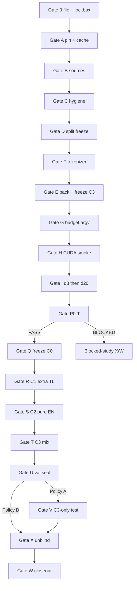

# P4 exhaustive gate-by-gate experiment protocol

**Document type:** Super-granular staged execution protocol (operator bible).  
**Sibling of:** `PROTOCOL-p4-token-share-mix.md` (scientific master). This file **does not override** the master. If they conflict, **master ≫ this file**, and after filing **filed PDF ≫ master ≫ this file**.  
**Study short name:** P4-C3-TOKEN-SHARE  
**Status as of 2026-08-21:** Draft only. **P4 AsPredicted not filed.** No `P4_RUN_ID`. No tokenizer train. No parent. No C1/C2/C3. No `val_bpb_full`. No test. **MUST NOT start Gate A until Gate 0 passes.**  
**This document does not authorize:** training, evaluation, test access, a new registration filing, cloud rental, model release, or any modification of P1.1, P2, or P3 artifacts.  
**Does not amend:** AsPredicted #306780, #306935, #307342; ResearchBox #8735, #8763, #8834.  
**Recommended nanochat pin (file the actual pin in Gate 0):** `92d63d4e8bb4df75c3b71618f31ddde2378b2bcd`.  
**Hook only:** `patches/nanochat-NANOCHAT_DATA_DIR.patch`. **MUST NOT** edit attention, loss, optimizer, or `evaluate_bpb` semantics without prefiling disclosure.

> **C3 is a newly constructed P4 tokenizer-token-share-locked mixture. It is not P3 `B3`, which was a separate pre-frozen equal-document mixture.**  
> **C0 is not Gate 0.** Gate 0 is filing. C0 is the frozen P4 d20 Tagalog parent.

This document is written so that a second experimenter, given only: (i) the filed P4 AsPredicted PDF, (ii) the hashed master protocol, (iii) this gate bible, (iv) the named frozen Tagalog and English archives, and (v) the pinned nanochat commit, can reproduce the artifact **without seeing P4 BPB until Gate X**. Every gate is a **hard stop**. Do not skip a gate because a later gate “looks ready.”

**Unsigned scientific parameters** remain unsigned until they appear in the filed PDF. Recommended values in this file are **not frozen**. Do not treat a recommendation as a filed constant.

---

## 0. How to use this document

### 0.1 Reading order (do not skip)

1. Read §0–§5 on a laptop with **no GPU**. Freeze the claim, the post-P3 disclosure, filing blockers, lockbox, and bans.  
2. Sign the decision register (§5 / master §18) into the AsPredicted form. **Do not file with “decide later.”**  
3. Execute **Gate 0** (file PDF + lockbox acceptance tests) before any P4 data mutation.  
4. Execute **Gates A–C** on CPU (workspace, sources, hygiene).  
5. Execute **Gate D** (split freeze).  
6. Execute **Gate F then Gate E** (tokenizer **before** C3 token-share construction). Alphabetical LOCK letters stay E and F; **operational order is F before the C3 half of E**. See §0.10.  
7. Execute **Gate G** (budget / argv freeze).  
8. Execute **Gate H** on **CUDA NVIDIA** only (d4 smoke, not the parent).  
9. Execute **Gate I** (fresh P4 Tagalog parent d8 then d20).  
10. Execute **Gate P0-T**. Safe output is **only** `PASS` / `BLOCKED` / `TECHNICAL BLOCK`.  
11. If PASS: **Gate Q** (C0 freeze) → **R C1** → **S C2** → **T C3**.  
12. Execute **Gate U** (six child vals + optional C0 EN descriptive + lockbox seal; tests unread).  
13. Execute **Gate V** if Policy A (one C3-only test event). Skip V if Policy B.  
14. Execute **Gate X** (formal unblinding).  
15. Execute **Gate W** (archive, paper, Hub, ResearchBox). **No new P4 science.**

### 0.2 Two naming systems (do not confuse them)

| Name | What it is | Example |
|---|---|---|
| **Gates 0, A–I, P0-T, Q–W, X** | Hard-stop checkpoints | Gate E = pack streams + freeze C3 |
| **Arms C0, C1, C2, C3** | Weight states | C3 = token-share-locked mix continuation |
| **P1.1 Gates A–J / Hub d20** | Finished Tagalog-from-scratch study | **Never** a P4 parent |
| **P2 Gates A–W / arms A0–A3** | Finished EN→TL study | **Never** a P4 parent |
| **P3 Gates 0–W / arms B0–B3** | Finished TL→EN study | **Never** a P4 parent; **B3 is not C3** |

### 0.3 Gate language

Status labels **MUST** be only: `not_started`, `prepared`, `pass`, `blocked`, `technical_stop`, `protocol_stop`, `awaiting_authorization`.

- **MUST** — required for confirmatory P4.  
- **MUST NOT** — forbidden; a violation invalidates the confirmatory label.  
- **SHOULD** — default; dated deviation card if skipped.  
- **MAY** — optional; exploratory unless the PDF already names it.

**Confirmatory** = official `val_bpb_full` after the terminal checkpoint, plus filed contrasts \(R_{\mathrm{TL}}\) and \(A_{\mathrm{EN}}\).  
**Descriptive** = byte shares, fertility, C0 English val, test BPB, in-loop trainer `val_bpb`.  
**Exploratory** = anything not in the PDF; labeled as such; **no** arm selection.  
**Safe progress** = status, hashes, counts, finite/nonfinite, reload_ok; **never** BPB or contrast signs.  
**Lockbox** = mode-600 / encrypted outcomes until Gate X.  
**Technical stop** = hardware/path/integrity fault; not a scientific finding.  
**Protocol stop** = confirmatory label invalidated unless a pre-filed path applies.  
**Clean restart** = from immutable C0, fresh optimizer, full \(N\) steps; quarantine the partial.

### 0.4 What this project is and is not

**This project is:** a **nanochat-only** post-P3, prospectively preregistered, exposure-matched mixture trade-off study. Train a **fresh** Tagalog parent (`base_train` from random init on frozen P1.1/P3-eligible WikiText-TL-39 **train documents**). After P0-T, freeze d20 as **C0** and continue it for one shared phase-two **model-visible token** budget on **C1** extra Tagalog, **C2** pure English, and **C3** a prospectively frozen mixture whose **P4-tokenizer-encoded token share** is locked at a single filed \(q_{\mathrm{TL}}\). Seal dual-language `val_bpb_full`, then (if Policy A) one **C3-only** secondary test.

**This project is not:** P1.1. It is not P2. It is not P3. It is not “P3 B3 fixed.” It is not an amendment of #306780, #306935, or #307342. It is not “load P3 B0 then mix.” It is not a claim that 50/50 documents equal 50/50 exposure. It is not byte balancing. It is not SFT, instruction-tuning, replay, EWC, CORE, FilBench, or chat. It is not HF `Trainer`. It is not a multi-seed population claim. It is not P6-B (byte-balanced mix; later filing). It is not P5 (multi-seed; later filing).

### 0.5 GPU wall

| Work | Host | GPU |
|---|---|---|
| Gate 0, literature, PDF, lockbox dry-run | Laptop | **No** |
| Gates A–G (with F before E-mix) | Mac/CPU | **No** |
| Gate H d4 smoke | CUDA NVIDIA | **Yes** |
| Gate I parent d8 and d20 | CUDA NVIDIA | **Yes** |
| Gate P0-T full Tagalog val | CUDA NVIDIA **only** for official status | **Yes** |
| Gate Q | CPU or CUDA (copy/hash) | **No extra train** |
| Gates R–T | CUDA NVIDIA | **Yes** |
| Gates U, V | CUDA NVIDIA | **Yes** |
| Gates X, W | Laptop | **No** |

**Confirmatory GPU class (recommended, unsigned until PDF):** NVIDIA CUDA, official nanochat attention (FA2/3 as the pin selects, or **unpatched** SDPA). **Proven class in P1.1/P2/P3:** Runpod A40 48 GB Secure Cloud. File a **class**, not a live pod ID.

**Not confirmatory:** Apple MPS; DGX Spark GB10; CPU training or CPU **status** for H/I/P0-T/R/S/T/U/V; any host that requires editing `nanochat/flash_attention.py`. A CPU P0-T run, if it exists, is **diagnostic only** and **MUST NOT** set PASS/BLOCKED.

**Replacement host:** another NVIDIA class is allowed **only if named in the filed PDF**. Otherwise: dated deviation **before Gate H**; no bit-identical claim; **no** numeric “close enough.” MPS/CPU/TPU remain protocol stop for confirmatory GPU gates.

Non-CUDA machines **MAY** perform static Gates 0, A–G, X, W only.

### 0.6 Frozen prior-study facts (historical inputs only — never load weights, never retune P4)

Copy these as **motivation and split identity**. **MUST NOT** re-measure them to “confirm” prior papers. **MUST NOT** use sealed magnitudes to pick \(q_{\mathrm{TL}}\), \(\delta\), mix, depth, or budget.

#### P1.1 (historical)

| Item | Frozen value |
|---|---|
| AsPredicted | #306780 |
| ResearchBox | #8735 |
| Split label | `reconstructed_article_70_15_15` |
| TL train SHA-256 | `2b0474c5700dc1eba14def572aa23cc227e4c59c10c2de3ce6b7bda75d137687` |
| TL val SHA-256 | `4d51644b84d05050bfc8c515079e60f6e437082b6cce2122e9ed00e7b1db2b1c` |
| TL test SHA-256 | `3bd193458f4c494d84dae345548c0c01cb6cd7275e98d6ed39a41d517a093baf` |
| Tagalog BPE SHA-256 | `04436b854e0841025a3dd2b46baaeeea07a7ccc252e9f99a19171306f00bc5a8` |
| Official d20 `val_bpb_full` | 1.172248 (**descriptive reference only**) |
| One P1.1 `test_bpb` | 1.164768 (**MUST NOT** publish as a P4 number) |
| Hub | `pageman/nanochat-filipino-p1-fixed-d20-3x` |
| d20 `model_000294.pt` SHA-256 | `9e30fff3d6effc7c71af92e8488f9375a5d70cf1962ba371bee0e639836dde38` — **never load** |

#### P2 (disclosure only)

| Item | Frozen value |
|---|---|
| AsPredicted | #306935 |
| ResearchBox | #8763 |
| RUN_ID | `p2-20260817T150944Z-de99f8a` |
| Hub | `pageman/nanochat-filipino-p2-en-then-tl` |
| A0 SHA-256 | `bd35a8587b5df72c85e93c440cbd79ec506f712cf618f77c21b5625362272e1d` — **never load** |
| A3 | 50/50-**document** mix; **not** P4 C3 |

#### P3 (design logic only — not P4 evidence)

| Item | Frozen value |
|---|---|
| AsPredicted | #307342 |
| ResearchBox | #8834 |
| RUN_ID | `p3-20260819T192700Z-92d63d4` |
| Gate X | 2026-08-20 |
| Hub | `pageman/nanochat-filipino-p3-tl-then-en` |
| \(C_{\mathrm{tl}}\) | 1.023484 **observed** — **MUST NOT** calibrate P4 |
| \(G_{\mathrm{en}}\) | −1.697955 **observed** — **MUST NOT** calibrate P4 |
| B3 | equal-**document** mix; ≈50% documents, ≈96% English UTF-8 bytes; **not** C3 |
| Mix-order SHA prefix | `b6ae432b…` — **MUST NOT** regenerate as a P4 stream |
| Tokenizer SHA-256 | `04436b854e0841025a3dd2b46baaeeea07a7ccc252e9f99a19171306f00bc5a8` (recommended P4 carry-forward **tokenizer only**, not weights) |

**English splits (P3 freeze, reuse by hash):**

| Split | SHA-256 |
|---|---|
| EN train | `09ae691caebb33a4bb81db4e570f630cac9ede11cb4116b2e08a3dbe08ef775a` |
| EN val | `874dec29844b3d46fc39e5479ee2dc4b3ba37309d9baf3bba4b5654697f3ae3b` |
| EN test | `2bccabc020cbb8d09273cccdc42ed926957b83824ca767c96fb588041b8d434e` |

### 0.7 Environment (MUST, after Gate 0 creates the files)

```bash
# From $NANOCHAT_FILIPINO_ROOT after Gate 0.
source scripts/p4/env.sh          # CPU gates
# source scripts/p4/env.cuda.sh   # CUDA only
# MUST NOT source scripts/p1/env.sh
# MUST NOT source scripts/p2/env.sh
# MUST NOT source scripts/p3/env.sh
```

`scripts/p4/` **does not exist yet**. Creating it is **post-filing Gate A work**, not a scientific choice. Until those files exist, **do not** invent `P4_RUN_ID`, **do not** train, **do not** copy `scripts/p3/env.sh` and rename the prefix.

Public logs use `$NANOCHAT_FILIPINO_ROOT` (never `/Users/<name>/`). HOST SSH cards stay gitignored.

```text
Never source scripts/p1/env.sh.
Never source scripts/p2/env.sh.
Never source scripts/p3/env.sh.
Never load P1.1, P2, or P3 model weights as a P4 parent.
Never use ratio=-1.
Never run python -m nanochat.dataset.
Never write P4 outputs to P1.1, P2, or P3 cache paths.
```

### 0.8 Safe progress vs lockbox

| Root | Operator may see | MUST NOT contain |
|---|---|---|
| `$P4_SAFE_PROGRESS_ROOT` | job id, GPU name, step, file size, SHA-256, `health=pass/block`, `finite/nonfinite`, `P0-T: PASS\|BLOCKED\|TECHNICAL BLOCK`, `seal created`, test **count** | BPB scalars, loss curves, samples, arm rankings, test text, contrast signs |
| `$P4_LOCKBOX_ROOT` | encrypted or mode-600 JSON | Released only at Gate X (or blocked-study path) |

**`meta_*.json` `val_bpb` is in-loop, not `val_bpb_full`.** If operators can `jq` checkpoint metadata, the lockbox is bypassed. **MUST** keep `meta_*.json` in the lockbox or strip `val_bpb` from operator-visible copies. Safe receipt: `{step, bytes, sha256, reload_ok}` only.

### 0.9 Common gate contract (every gate MUST fill this)

Every gate below is specified as:

1. **Purpose** — why the hard stop exists.  
2. **Host / GPU / authorization.**  
3. **Preconditions** — prior gates and hashes.  
4. **Hashed inputs.**  
5. **Operator steps** — numbered; do not reorder.  
6. **Permitted command class** — argv family, not a live pod login.  
7. **Prohibited actions.**  
8. **Expected artifacts** — paths relative to `$NANOCHAT_FILIPINO_ROOT` or `$NANOCHAT_BASE_DIR`.  
9. **Pass / blocked / technical_stop / protocol_stop.**  
10. **Safe vs lockbox outputs.**  
11. **Quarantine after fault.**  
12. **Next gate.**  
13. **Authorization JSON** — human-signed for GPU gates.

**Prohibited at all pre-X gates:** printing BPB; printing contrasts or signs; rankings; “best”; sample text used to infer quality; filenames embedding scalars; paper sentences implying pass/fail of outcomes; chat/issue updates with interpreted outcomes.

### 0.10 Operational order vs LOCK letter names (read this twice)

LOCK.json and the gate ledger use letters **E** (pack + freeze C3) and **F** (tokenizer). P3 could freeze B3 at E **before** F because B3 was a **document-count** mix.

P4 C3 is a **tokenizer-token-share** mix. Token accounting **requires** the frozen P4 tokenizer. Therefore:

```text
LOCK letters:     0 A B C D E F G H I P0-T Q R S T U V X W
Operational order: 0 A B C D F E G H I P0-T Q R S T U V X W
                              ^ ^
                              tokenizer BEFORE C3 construction
```

**MUST NOT** construct C3 at Gate E until Gate F has frozen `tokenizer.pkl` + `token_bytes.pt` hashes.  
If carry-forward tokenizer is filed: Gate F is a **hash-verify** of the P3 artifact, then Gate E builds C3.  
If a fresh P4 tokenizer is filed: Gate F is `tok_train` on Tagalog **train** only, then Gate E builds C3.

Packing **pure** C1/C2 streams (no token-share quota) **MAY** begin at E before F only if C3 construction is deferred until after F. The exhaustive default is: **finish F, then do all of E**.

### 0.11 One exposure clock

Quota is in **P4 Tagalog tokenizer tokens**, no BOS, no padding, no pack, no crop, counted **per training document** then concatenated. Trainer packing **MUST NOT** redefine the quota.

P4 **does not claim byte balancing**. Byte share and document share **MUST** be reported, not optimized. **MUST NOT** add a byte-balanced C4 arm after filing.

### 0.12 Co-primary contrasts (file before any P4 BPB)

\[
R_{\mathrm{TL}}=\mathrm{TL}(C3)-\mathrm{TL}(C2)\le -\delta
\qquad
A_{\mathrm{EN}}=\mathrm{EN}(C3)-\mathrm{EN}(C1)\le -\delta
\]

Official DV:

\[
\mathrm{BPB}=\frac{\overline{\mathrm{NLL}}_{\mathrm{token}}}{\ln 2\cdot \overline{\mathrm{UTF8\ bytes\ per\ evaluated\ token}}}.
\]

Reporting precision: six decimal places. Equality at \(-\delta\) **counts**. **Recommended unsigned:** \(\delta=0.01\). No composite score. “Mitigation” is prohibited in title/abstract/preregistration until after unblinding, and then only if **both** criteria are met, with the narrow filed sentence.

### 0.13 Lineage (the only legal family)

```text
fresh P4 Tagalog initialization
        -> P4 d8 parent (eligibility evidence only)
        -> P4 d20 parent -> P0-T pass -> immutable C0
                                           -> C1 extra Tagalog
                                           -> C2 pure English
                                           -> C3 frozen token-share mix
```

**Hard prohibition:** C1, C2, or C3 **MUST NOT** be used as another child’s parent.

---

## 1. Scientific objective (operator restatement)

After a newly trained, P0-T-eligible Tagalog parent, under the same fixed phase-two model-visible token budget for every child, does a prospectively frozen English–Tagalog mixture with a locked share of **P4-tokenizer-encoded tokens** reduce held-out Tagalog BPB relative to pure English continuation while still improving held-out English BPB relative to extra Tagalog continuation?

| Branch | Stream | Role |
|---|---|---|
| C0 | Frozen P4 TL d20 parent | Immutable parent; 0 additional train tokens at freeze |
| C1 | Extra Tagalog only | Source-language active continuation control |
| C2 | Pure English only | English intervention / pure-stream retention-cost comparator |
| C3 | Pre-frozen token-share-locked EN/TL mix | New mixture intervention |

---

## 2. Authority stack (verbatim)

> Filed P4 registration PDF > dated pre-start execution clarifications > `LOCK.json` > gate ledger and run cards > dated deviation card > exploratory work > chat.

No document may silently override a higher-authority document. Chat **MUST NOT** rewrite sealed numbers or filed constants.

---

## 3. Paths and artifacts (create at Gate 0 / A; do not invent a run ID before filing)

After Gate 0:

```text
docs/papers/p4-token-share-mix/LOCK.json
docs/papers/p4-token-share-mix/PROTOCOL-p4-token-share-mix.md
docs/papers/p4-token-share-mix/PROTOCOL-p4-GATES-EXHAUSTIVE.md
docs/run-cards/p4/<P4_RUN_ID>/
docs/run-cards/p4/<P4_RUN_ID>/deviations/
docs/run-cards/p4/<P4_RUN_ID>/HOST-*.md          # gitignored
manifests/p4/p4_gate_ledger.json
manifests/p4/p4_budget_manifest.json             # filled at G
manifests/p4/p4_mix_manifest.json                # filled at E
manifests/p4/p4_test_access_log.json
scripts/p4/env.sh
scripts/p4/env.cuda.sh
data/cache/<P4_RUN_ID>/                          # NANOCHAT_BASE_DIR
data/cache/<P4_RUN_ID>/safe_progress/
data/cache/<P4_RUN_ID>/lockbox/                  # mode 600
data/cache/<P4_RUN_ID>/SENTINEL_P4_ONLY
```

After later gates (names are binding once scripts exist):

```text
data/cache/<P4_RUN_ID>/c0/frozen/p4-c0-tl-d20/
data/cache/<P4_RUN_ID>/c1/
data/cache/<P4_RUN_ID>/c2/
data/cache/<P4_RUN_ID>/c3/
data/cache/<P4_RUN_ID>/streams/c1_tl/
data/cache/<P4_RUN_ID>/streams/c2_en/
data/cache/<P4_RUN_ID>/streams/c3_mix/
```

**MUST NOT** write into `data/cache/p1-*`, `data/cache/p2-*`, `data/cache/p3-*`, or Hub IDs `nanochat-filipino-p1-fixed-d20-3x`, `nanochat-filipino-p2-en-then-tl`, `nanochat-filipino-p3-tl-then-en`.

---

## 4. Counters (initial 0; append-only)

| Counter | Lawful +1 |
|---|---|
| `test_access_count` | Gate V event (Policy A only) |
| `p4_outcome_access_count` | Gate X release |
| `validation_scalar_access_count` | Gate X (or lockbox decrypt for X officer only) |
| `lockbox_open_events` | Every authorized open |

Write mode 600. Lawful transitions only at named gates. Access log JSONL: `utc`, `actor`, `files`, `purpose`, `counters_after`. **MUST NOT** store BPB in the ledger.

---

## 5. Filing blockers (MUST appear in the filed PDF)

Every scientific F4 item **MUST** appear in the filed AsPredicted PDF, **or** in **one** protocol addendum whose SHA-256 is **embedded in that PDF** (`P4-PREFILING-ADDENDUM-DRAFT.md`). After filing, only non-scientific operational clarifications (paths, host IDs, lockbox mechanics) may be dated. A later “pre-Gate-A addendum” **MUST NOT** change tokenizer policy, \(q_{\mathrm{TL}}\), \(\delta\), P0-T margin, PRNG, seeds, interleave, block size, rounding, tolerance, last-shard rule, Policy A/B, budget/depth, device class, C0 English collection, evaluator config, or terminal-save rule.

Recommended values below are **unsigned** until the PDF (or that one hashed addendum) names them.

| ID | Decision | Recommended | Status |
|---|---|---|---|
| F4-01 | P4 label and scope; post-P3 sentence 1; does not amend #306780/#306935/#307342 | P4-C3-TOKEN-SHARE | Sign in PDF |
| F4-02 | Tokenizer policy | **Carry-forward both** P3 artifacts: `tokenizer.pkl` `04436b854e0841025a3dd2b46baaeeea07a7ccc252e9f99a19171306f00bc5a8` **and** `token_bytes.pt` `a5dbc1c88f6292696108263072d77115718cc2d8357f7ad4859adfa517cc2132`. If either hash is unverified, do not use carry-forward. Sign \(q_{\mathrm{TL}}\) **before Gate F**. | UNRESOLVED BEFORE FILING |
| F4-03 | Exact \(q_{\mathrm{TL}}\) | `0.50` Tagalog **source-content** tokens under carry-forward P3 tokenizer (no BOS/pad/pack/crop). Sign at Gate 0, before F, before fertility. | UNRESOLVED BEFORE FILING |
| F4-04 | Exact \(\delta\) and \(\delta_{\mathrm{P0T}}\) | `0.01` BPB; \(\delta_{\mathrm{P0T}}=\delta\) | UNRESOLVED BEFORE FILING |
| F4-05 | C3 PRNG library + seeds | Python 3 `random.Random` **or** `numpy.random.Generator(PCG64)` — **pick one**; seed 42 for doc-order and interleave (file if independent seeds) | UNRESOLVED BEFORE FILING |
| F4-06 | C3 interleave | Deterministic blocks, \(K_{\mathrm{blk}}=2048\); prefix \(\varepsilon_{\mathrm{path}}=K_{\mathrm{blk}}/D_{\mathrm{phase2}}\) | UNRESOLVED BEFORE FILING |
| F4-07 | Rounding / residual language | Round-half-to-even on TL target; English receives residual so sum \(=D_{\mathrm{phase2}}\) | UNRESOLVED BEFORE FILING |
| F4-08 | Token-share tolerance / quota failure | **Exact integer match** on the **final packed C3 train stream the trainer consumes** (exclude val shard). 0 slack if \(Dq\) integer. Rebuild only on predeclared integrity failure **before** C3 training, no outcomes, new manifest identity. After C3 starts: stop. | UNRESOLVED BEFORE FILING |
| F4-09 | Last-shard / val pack policy | Mix **train** shards from C3 construction; `val.parquet` = byte-identical copy of C2 English val pack. **`val.parquet` is trainer-interface only:** not confirmatory; cannot set a gate; in-loop metrics lockboxed; official DVs remain frozen EN/TL split JSONL at U. | UNRESOLVED BEFORE FILING |
| F4-10 | Child test policy | **A** C3-only one event on EN test `2bccabc0…` and TL test `3bd19345…` | UNRESOLVED BEFORE FILING |
| F4-11 | Parent budget/depth | d8 + d20; C0 = d20; \(T=2048\); \(B=65536\); \(N_{\mathrm{TL0}}=N=294\); \(D_{\mathrm{phase2}}=19{,}267{,}584\) | UNRESOLVED BEFORE FILING |
| F4-12 | Phase-two optimizer | Fresh Muon+AdamW; `load_optimizer=False`; no resume; peak LR \(=0.3\times\) parent peak; warmup 14 | Sign in PDF |
| F4-13 | Named CUDA host **class** | NVIDIA A40 48 GB; do **not** name a live pod. Other NVIDIA class **only if named in the PDF**; else deviation before H; **no** numeric “close enough.” MPS/CPU/TPU = protocol stop for confirmatory GPU gates. | UNRESOLVED BEFORE FILING |
| F4-14 | ResearchBox / AsCollected | **New** box, not #8834; new AsCollected project/version | UNRESOLVED BEFORE FILING |
| F4-15 | C0 English val at U | **Yes — collect once**, descriptive only; excluded from \(R_{\mathrm{TL}}\) and \(A_{\mathrm{EN}}\). Must not remain optional after filing. | UNRESOLVED BEFORE FILING |
| F4-15b | Child train order | **Serial** R → S → T | UNRESOLVED BEFORE FILING |
| F4-16 | Lockbox roles | Operator / custodian / unblinding officer; one-person weak fallback documented | Sign in PDF |
| F4-17 | Related-studies checkboxes | Overlapping observations with #306780, #306935, #307342 (not Independent) | Sign in PDF |
| F4-18 | Reporting grammar | Four conclusion sentences; no mitigation in title pre-X; C3 ≠ B3 | Sign in PDF |
| F4-19 | Random-seed allocation table | See `P4-PREFILING-ADDENDUM-DRAFT.md`. Rec.: train init seed 0 (torch 42 family, **same** for d8 and d20); untrained floor seed **0**; C3 doc-order/interleave **42** via Python `random.Random`; no extra dataloader shuffle; no wrap before \(N\times B\). | UNRESOLVED BEFORE FILING |
| F4-20 | Terminal checkpoint save | Pin `92d63d4`: `--save-every=-1` writes exactly `model_{N:06d}.pt` at last step (P3-verified on this pin). Wrappers refuse a missing terminal file. No contingent alternative. | UNRESOLVED BEFORE FILING |
| F4-21 | P0-T evaluator identity | **CUDA-only for status.** Untrained seed 0; `--device-batch-size=8`; packing `bos_bestfit_buffer1000_one_pass_no_wrap`; \(T=2048\); add-1 byte-unigram train→val UTF-8; floor pass iff \((\mathrm{floor}-\mathrm{trained})\ge\delta_{\mathrm{P0T}}\). CPU eval diagnostic only. | UNRESOLVED BEFORE FILING |
| F4-22 | Official JSONL identity | Byte-identical copies of the six named frozen splits. Hash mismatch = **stop**. **No** cleaning/re-emission of official P4 inputs. | UNRESOLVED BEFORE FILING |

```
┌─────────────────────────────────────────────────────────────────┐
│ UNRESOLVED BEFORE FILING — do not train, do not invent          │
│ P4_RUN_ID, do not start Gate A:                                 │
│ tokenizer policy · q_TL · delta · interleave/PRNG · tolerance · │
│ last-shard policy · test A/B · parent N/depths · CUDA class ·   │
│ deposit IDs                                                     │
└─────────────────────────────────────────────────────────────────┘
```

**AsPredicted related-studies field:** select **Overlapping** for #306780, #306935, and #307342. Do **not** select Independent. P4 does **not** amend them.

**Form sentence 1 (MUST):** P4 is designed after released P3 findings and after the P3 B3 document/byte-share ambiguity were known (P3 Gate X 2026-08-20). It is a post-P3, prospectively preregistered exposure-matched mixture trade-off study. It does not amend AsPredicted #306780, #306935, or #307342.

---

## 6. DAG (hard-stop graph)



Do not draw a path from P3 B3 into C3. Do not draw a path from P3 B0 into C0.

---

# STAGE 0 — FILING AND LOCKBOX (laptop, no GPU)

## Gate 0 — File P4, freeze hashes, install outcome lockbox

**Purpose.** Level-1 instrument. Without this PDF and passing lockbox tests, Gates A+ are wiring only. Gate 0 creates identity. It does **not** create a parent. **C0 is not Gate 0.**

**Host.** Laptop. **GPU: no.** **Authorization:** operator + (if two-person) lockbox custodian.

### 0.G.1 Preconditions

1. Master protocol + this gate bible + satellites exist and have been read.  
2. Every F4-01–F4-18 item is answered in the form or a hashed addendum. **No “decide later.”**  
3. Cheng is **not** a coauthor; cite Cruz & Cheng 2019 for TL-39.  
4. Confirm **no** P4 `tok_train` / `base_train` / `evaluate_bpb` has run.  
5. Confirm no file named `P4_RUN_ID` or `data/cache/p4-*` already contains training outputs.  
6. Confirm this is **not** an amendment filing on #307342.

### 0.G.2 MUST before file

1. Put the **post-P3 disclosure** in sentence 1 of the AsPredicted form (verbatim §5).  
2. Sign tokenizer policy, \(q_{\mathrm{TL}}\), \(\delta\), \(\delta_{\mathrm{P0T}}\), PRNG, \(K_{\mathrm{blk}}\), rounding, tolerance, last-shard policy, test policy A or B, \(N\), depths, CUDA **class**, deposit plan.  
3. State: C3 is not P3 B3; one token-share clock; P4 does not claim byte balancing; one seed; overlapping related studies.  
4. State Hub rule: C0+C1+C2+C3 together or all deferred.  
5. Print / export the PDF. Do not start Gate A on a draft.

### 0.G.3 MUST after file

1. Save PDF to `docs/run-cards/p4/AsPredicted-<P4ID>.pdf` (or gitignored operator archive if the vendor forbids public PDF dump). Record SHA-256, page count, PT timestamps, URL.  
2. Create ResearchBox **new** box (not 8735, not 8763, not 8834). Passcode gitignored.  
3. Create AsCollected **new** project/version for P4 public-data provenance.  
4. Hash the **last pre-filing** master protocol and this gate bible. Freeze those SHA-256s. **Further scientific edits are amendments.**  
5. Copy `LOCK.template.json` → `docs/papers/p4-token-share-mix/LOCK.json`. Fill: `registration_id`, `registration_url`, `protocol_sha256`, `code_commit`, **then** mint `p4_run_id` as `p4-<UTC>Z-<7-char pin>`. **MUST NOT** mint `P4_RUN_ID` before the PDF exists.  
6. Create:
   - `docs/run-cards/p4/<P4_RUN_ID>/`
   - `manifests/p4/` with full gate ledger (all gates 0,A–I,P0-T,Q–W,X; status `not_started`)
   - `scripts/p4/env.sh`, `env.cuda.sh` (reviewed; **not** copies of P1/P2/P3 env with a renamed run ID)
   - `$P4_SAFE_PROGRESS_ROOT` and `$P4_LOCKBOX_ROOT` with **different** Unix permissions
7. Expand `scripts/p4/forbidden_parents.py` to reject at least:
   - P1.1 d20 `9e30fff3d6effc7c71af92e8488f9375a5d70cf1962ba371bee0e639836dde38`
   - P2 A0 `bd35a8587b5df72c85e93c440cbd79ec506f712cf618f77c21b5625362272e1d`
   - **every** P3 Hub `model_*.pt` SHA from `pageman/nanochat-filipino-p3-tl-then-en`
   - any other P1.1/P2/P3 checkpoint discovered in local caches
8. Hash: PDF, master protocol, this bible, pin commit, `scripts/p4/`, configs, seed/allocation table, future `evaluate_bpb.py` stub, analysis/table script, lockbox tests.  
9. Define roles. If one person: document **weak fallback** (encrypted lockbox + time-lock or second-person key).  
10. Run lockbox acceptance tests (dummy data, **no** real val/test text):

| # | Test | Pass |
|---|---|---|
| 1 | Protocol/lock/config/evaluator/analysis hashes agree | |
| 2 | Steward cannot open dummy lockbox result | |
| 3 | Dummy BPB string absent from `safe_progress` and operator stdout | |
| 4 | If opacity selected, job labels do not contain C1/C2/C3 | |
| 5 | Train process cannot resolve test path | |
| 6 | P1.1/P2/P3 weight SHA-256s rejected as parent | |
| 7 | Dummy P0-T emits only PASS/BLOCKED/TECHNICAL BLOCK outside lockbox | |
| 8 | Contrast script refuses until six child dummy val JSON plus optional dummy C0 EN exist | |
| 9 | Dummy test evaluator rejects C1/C2 and rejects missing U seal | |
| 10 | Dummy test evaluator accepts C3 only after U seal | |
| 11 | Release refuses incomplete inventory | |
| 12 | Dummy released hashes match manifest | |
| 13 | Break-glass dummy writes audit JSON without printing dummy BPB | |
| 14 | Mix-construction dummy refuses val/test documents | |
| 15 | Mix-construction dummy refuses to start if tokenizer hash unset | |
| 16 | Env refuses if `scripts/p3/env.sh` was sourced | |
| 17 | `ratio=-1` and `python -m nanochat.dataset` wrappers refuse | |
| 18 | C3 reconstruction from P3 B3 mix-order SHA is refused | |

11. Public pre-outcome snapshot: protocol + LOCK + scripts; **no** test JSONL, **no** `.pt`.  
12. Stage-1 `paper.tex` **MAY** be created with empty result tables (`---`). **MUST NOT** put “mitigation” in the title. Treat like P2’s 16 August PDF: obsolete after Gate X.

### 0.G.4 Pass evidence

- `docs/run-cards/p4/<P4_RUN_ID>/gate-0-filing-lock.json`: AsPredicted ID, URL, PDF SHA-256, `does_not_amend_306780=true`, `does_not_amend_306935=true`, `does_not_amend_307342=true`, `observation_independent_of_306780=false`, `observation_independent_of_306935=false`, `observation_independent_of_307342=false`, `aspredicted_related=overlapping_306780_306935_307342`, `designed_after_p3_gate_x=true`, `p3_gate_x_date=2026-08-20`, `c3_is_not_p3_b3=true`, signed F4 values, roles, lockbox tests, `no_p4_outcomes=true`, `p4_run_id`.  
- `LOCK.json`: immutable hashes and Gate X release condition (`U seal + V event complete` if Policy A; `U seal` if Policy B).  
- `P4_PRE_OUTCOME_AUDIT.md`: F4-01–F4-18 checked.  
- Ledger Gate 0 = `pass`.

### 0.G.5 Stop

| Condition | Stop type |
|---|---|
| Any F4-item is “decide later” | Gate 0 `blocked` |
| Dual “byte or token” exposure language | `protocol_stop` |
| Test text in the training workspace | `protocol_stop` |
| Lockbox tests fail | `blocked` |
| A P4 BPB file already exists | `protocol_stop` |
| `P4_RUN_ID` minted before PDF | `protocol_stop` — discard the ID; file first |
| Filing as an amendment of #307342 | `protocol_stop` |

### 0.G.6 Next

Gate A.

---

# STAGE 1 — PIN AND HYGIENE (CPU)

## Gate A — Source pin and isolated P4 workspace

**Purpose.** Fresh namespace. No P1/P2/P3 inheritance of **env, cache, or weights**. Tokenizer carry-forward, if filed, is a **hash-verified artifact copy**, not an env source.

**Host.** CPU. **GPU: no.**

### A.1 Preconditions

Gate 0 `pass`. `LOCK.json` has `registration_id` and `p4_run_id`. `scripts/p4/env.sh` exists.

### A.2 Hashed inputs

Filed pin (recommended `92d63d4e8bb4df75c3b71618f31ddde2378b2bcd`); `LOCK.json`; `scripts/p4/`.

### A.3 Steps

1. `source scripts/p4/env.sh`. Confirm `P4_RUN_ID` matches LOCK. Confirm `NANOCHAT_BASE_DIR=$NANOCHAT_FILIPINO_ROOT/data/cache/$P4_RUN_ID`.  
2. Checkout filed nanochat commit under `$NANOCHAT_FILIPINO_ROOT/vendor/nanochat` **or** a P4-only clone if the PDF forbids sharing the vendor tree.  
3. `git rev-parse HEAD` must equal the filed pin (or the vendor submodule pin named in LOCK).  
4. Diff vs pin. Allowed: data-root / lockbox plumbing / `NANOCHAT_DATA_DIR` hook. **MUST NOT** change model, optimizer, attention, or BPB semantics.  
5. `mkdir -p data/cache/$P4_RUN_ID` and write `SENTINEL_P4_ONLY` containing `p4_run_id`, pin, UTC.  
6. Scan environment:
   - no `NANOCHAT_BASE_DIR` pointing at `p1-`, `p2-`, or `p3-` cache;
   - no `source scripts/p{1,2,3}/env.sh` in the current shell (`env` dump);
   - `P3_RUN_ID` / `P2_RUN_ID` / `P1_RUN_ID` unset or ignored;
   - `NANOCHAT_DATA_DIR` unset at rest.
7. Confirm no `python -m nanochat.dataset`, `ratio=-1`, HF Trainer in PATH wrappers.  
8. Copy (do not “adapt in place”) P3 evaluator **after filing** into `scripts/p4/evaluate_bpb.py`; strip P3 run-id constants; freeze script SHA in LOCK. **MUST NOT** change the BPB formula.  
9. Install `scripts/p4/forbidden_parents.py` with the Gate 0 reject list.  
10. Write `docs/hub/p4-token-share-mix/` card **stub** (no numbers). **MUST NOT** upload weights.

### A.4 Permitted command class

```text
git checkout <filed pin>
git rev-parse HEAD
git diff --stat <filed pin>
mkdir -p data/cache/$P4_RUN_ID/{safe_progress,lockbox}
python scripts/p4/gate_a_source_pin.py
```

### A.5 MUST NOT

Start `tok_train` or `base_train`. Copy P3 `env.sh` and only rename `P3_` → `P4_`. Point `NANOCHAT_BASE_DIR` at a P3 cache “to save disk.” Load any `.pt`.

### A.6 Receipt

`docs/run-cards/p4/<P4_RUN_ID>/gate-a-source-pin.json`: commit, allowed-diff SHA-256, sentinel path, prohibited-path scan, env-source scan, evaluator SHA, `no_p4_outcomes=true`.

### A.7 Pass / stop

Pass if pin matches, sentinel exists, scans clean.  
`protocol_stop` if P3/P2/P1 env was sourced or a forbidden `.pt` is in the P4 cache.  
`technical_stop` if disk/permission failure; repair and repeat A.

### A.8 Next

Gate B.

---

## Gate B — Named source acquisition

**Purpose.** Exact Tagalog and English **raw / split-file** identity. Copy hashes; **do not re-split**.

**Host.** CPU. **GPU: no.**

### B.1 Preconditions

Gate A `pass`.

### B.2 Hashed inputs (logical paths)

| Split | Logical path | SHA-256 |
|---|---|---|
| TL train | `data/interim/wikitext-tl39/splits/train.jsonl` | `2b0474c5700dc1eba14def572aa23cc227e4c59c10c2de3ce6b7bda75d137687` |
| TL val | `data/interim/wikitext-tl39/splits/val.jsonl` | `4d51644b84d05050bfc8c515079e60f6e437082b6cce2122e9ed00e7b1db2b1c` |
| TL test | `data/processed/wikitext-tl39/test/test.jsonl` | `3bd193458f4c494d84dae345548c0c01cb6cd7275e98d6ed39a41d517a093baf` |
| EN train | `data/interim/wikitext-103/english_train.jsonl` | `09ae691caebb33a4bb81db4e570f630cac9ede11cb4116b2e08a3dbe08ef775a` |
| EN val | `data/interim/wikitext-103/english_val.jsonl` | `874dec29844b3d46fc39e5479ee2dc4b3ba37309d9baf3bba4b5654697f3ae3b` |
| EN test | `data/interim/wikitext-103/english_test.jsonl` | `2bccabc020cbb8d09273cccdc42ed926957b83824ca767c96fb588041b8d434e` |

English raw archive identity (P3 freeze): Hugging Face `Salesforce/wikitext`, config `wikitext-103-raw-v1`, revision SHA `b08601e04326c79dfdd32d625aee71d232d685c3`. Official Merity train/valid/test. The **document-manifest** SHA-256s above are confirmatory identity, not the raw HF archive hash.

### B.3 Steps

1. Locate or download **only** the named Tagalog and English assets. Record URL, config, revision, license, bytes, SHA-256, UTC.  
2. Verify each jsonl SHA-256. **Mismatch = stop.** Do not “close enough.” Do not reshuffle.  
3. `chmod` raw archives and confirmatory jsonl **read-only**.  
4. English **MUST NOT** be P2’s `english_test.jsonl` copied as “train.”  
5. Tagalog: copy **P1.1 frozen split files** with explicit `p11_split_reuse=true` and those files’ SHA-256s. **MUST NOT** rebuild `reconstructed_article_70_15_15`.  
6. Place **test** jsonl outside any directory that will become `NANOCHAT_DATA_DIR` for training. Record test paths in lockbox config **without** mounting them.  
7. Official P4 confirmatory inputs are **byte-identical copies** of the six named frozen JSONLs. **Hash mismatch = stop.** **MUST NOT** clean, LF-normalize, drop, or re-emit official P4 split files. The historical drop-null / \(>200{,}000\)-char rule applies only to a separately named raw-source reconstruction path, **which P4 does not use**.

### B.4 MUST NOT

Re-split. Mix ClimbMix/FineWeb/DCLM/OSCAR. Use P3 B3 packed shards as a P4 source. Start packing.

### B.5 Receipt

`gate-b-raw-assets.json`: one row per artifact (path, bytes, SHA-256, UTC, license), `no_train_or_eval_started=true`, `tests_unmounted=true`.

### B.6 Pass / stop

Pass if all six confirmatory SHAs match.  
`protocol_stop` on hash mismatch or test mounted inside a train path.  
`technical_stop` on download failure; retry with the same identity.

### B.7 Next

Gate C.

---

## Gate C — Hygiene, leakage, lineage

**Purpose.** Clean apparatus before freeze/pack/tok.

**Host.** CPU. **GPU: no.**

### C.1 Checks (all MUST be true)

| ID | Check |
|---|---|
| C-01 | P4 cache = sentinel + allowed raw/split copies only |
| C-02 | No ClimbMix/FineWeb/DCLM/OSCAR/instruction corpora in P4 train-visible paths |
| C-03 | No P1.1/P2/P3 checkpoint in parent candidate list or P4 cache |
| C-04 | Future test inputs absent from tok/train/val roots; not resolvable by a train process (`test.jsonl` path unset) |
| C-05 | No secrets in git (`.env`, SSH, RB passcodes, HOST cards) |
| C-06 | Filed PDF not writable as a “working copy” for silent edits |
| C-07 | P1/P2/P3 Hub not a write target |
| C-08 | Lockbox vs safe-progress permissions pass |
| C-09 | `scripts/p{1,2,3}/env.sh` not sourced |
| C-10 | P3 B3 mix shards not aliased as C3 |
| C-11 | Document-overlap scan: no train/val/test exact-hash collision within language |
| C-12 | Source-revision recorded; permission read-only after freeze |

### C.2 Steps

1. Run `scripts/p4/gate_c_hygiene.py` (to be written at Gate A).  
2. `find` P4 cache for `model_*.pt`, `tokenizer.pkl` from P3 paths, `test.jsonl` inside train dirs.  
3. Confirm `test_access_count=0`, `p4_outcome_access_count=0`, `validation_scalar_access_count=0`.  
4. Confirm gitignore covers lockbox, HOST cards, passcodes.

### C.3 Receipt

`gate-c-hygiene.json`: per-check Boolean, counters, `no_p4_outcomes=true`.

### C.4 MUST NOT

Repair a failed check by moving a P3 weight into P4 “just to hash it.” Repair by **exclusion**.

### C.5 Next

Gate D.

---

# STAGE 2 — SPLITS, TOKENIZER, MIX (CPU)

## Gate D — Document-split freeze

**Purpose.** Freeze IDs before packing/tok/C3/parent. No BPB.

**Host.** CPU. **GPU: no.**

### D.1 Tagalog

1. Confirm F4-02/B identity: `reconstructed_article_70_15_15` reuse.  
2. Freeze document IDs, hashes, UTF-8 bytes, row counts, split SHA-256s.  
3. Exact-document and exact-hash overlap **MUST** be 0 across train/val/test.  
4. Record `split_origin=p11_reuse`.  
5. **MUST NOT** put test JSONL in the train/val data-dir.

### D.2 English

1. Confirm official WT103-raw train/valid/test document manifests.  
2. Freeze hashes. Isolation train/val/test.  
3. `legacy_external_holdout=true` for the test split (same holdout family as P2/P3).  
4. **MUST NOT** copy P2/P3 **packed shards** as identity; jsonl SHA is identity. Packed shards are rebuilt at E from frozen jsonl.

### D.3 Receipt

`gate-d-split-freeze.json` + read-only JSONL (and later parquet). Fields: row counts, UTF-8 byte totals, SHA-256s, overlap=0, `no_bpb=true`.

### D.4 MUST NOT

Reshuffle after this gate. Substitute a “cleaner” Wikipedia dump. Drop documents to chase a future token share.

### D.5 Next

**Gate F** (tokenizer), then Gate E. Do **not** construct C3 yet.

---

## Gate F — Frozen P4 tokenizer (verify or train)

**Purpose.** One BPE for **all** P4 token accounting and **all** P4 BPB. Required **before** C3 construction.

**Host.** CPU. **GPU: no.**

### F.0 Policy fork (filed at Gate 0)

| Policy | What Gate F does |
|---|---|
| **Carry-forward (recommended)** | Copy exact P3 `tokenizer.pkl` **and** `token_bytes.pt`; verify **both** filed SHAs (`04436b85…` and `a5dbc1c8…`). Reusing a tokenizer is **not** reusing P3 weights. If either hash is missing or mismatches, **MUST NOT** use carry-forward. |
| **Fresh P4 tokenizer** | `tok_train` on Tagalog **train** only with the fully locked recipe in the PDF (vocab, seed, command, hash policy). **MUST NOT** feed English, val, test, C3 mix, or P1.1/P2/P3 `tokenizer.pkl`. |

**Status until PDF:** UNRESOLVED. This bible’s command examples assume **carry-forward**.

### F.1 Preconditions

Gate D `pass`. No P4 parent has started.

### F.2 Steps — carry-forward

1. Copy filed tokenizer artifacts into `$NANOCHAT_BASE_DIR/tokenizer/` (or the path `scripts/p4/env.sh` names).  
2. SHA-256 `tokenizer.pkl`; compare to filed digest `04436b854e0841025a3dd2b46baaeeea07a7ccc252e9f99a19171306f00bc5a8`.  
3. SHA-256 `token_bytes.pt`; compare to filed digest `a5dbc1c88f6292696108263072d77115718cc2d8357f7ad4859adfa517cc2132`. **MUST NOT** “freeze whatever is observed.”  
4. `chmod` read-only.  
5. Write-probe: an attempted overwrite **MUST** fail.  
6. Fertility on val UTF-8 (TL and EN) **MAY** be computed **after** C3 is frozen at E, never to retune \(q_{\mathrm{TL}}\) (already signed at Gate 0). If computed at F, store in **lockbox**; release at Gate X as diagnostics, **not** DVs.

### F.3 Steps — fresh tokenizer (only if PDF filed this)

1. `NANOCHAT_DATA_DIR` = **Tagalog train parquets only** (pack train-only shards first if the trainer requires parquet; those shards are **not** C3).  
2. Filed vocab (recommended 32768) and caps.  
3. Run `python -m scripts.tok_train` with the **exact argv in the PDF**.  
4. Save `tokenizer.pkl`, `token_bytes.pt`; SHA-256; read-only.  
5. **MUST NOT** train a second tokenizer after Gate I.

### F.4 Permitted command class (carry-forward)

```text
python scripts/p4/gate_f_tokenizer.py --policy carry_forward --expected-sha 04436b85...
```

### F.5 MUST NOT

Feed English or val/test to `tok_train`. Use fertility to pick \(q_{\mathrm{TL}}\). Swap tokenizer after seeing parent loss. Use P2 English tokenizer.

### F.6 Receipt

`gate-f-tokenizer.json`: policy, artifact hashes, input manifest, `no_p4_bpb=true`.

### F.7 Next

Gate E.

---

## Gate E — Pack pure streams and **pre-freeze C3**

**Purpose.** C3 frozen **before Gate I / any P4 confirmatory BPB**, not merely before Gate T. Pure C1/C2 streams packed. Last-is-val hygiene.

**Host.** CPU. **GPU: no.**

### E.1 Preconditions

Gates D and **F** `pass`. Tokenizer SHA frozen. Split jsonl SHA frozen. **No** parent val has been computed.

### E.2 Hashed inputs

Tokenizer SHA; TL/EN **train** jsonl SHAs; filed \(q_{\mathrm{TL}}\), \(D_{\mathrm{phase2}}\), PRNG id, seeds, \(K_{\mathrm{blk}}\), rounding rule, revisit/truncation, last-shard policy.

**Recommended unsigned integers (do not use until PDF names them):**

| Quantity | Recommended value |
|---|---|
| \(D_{\mathrm{phase2}}\) | \(294 \times 65536 = 19{,}267{,}584\) |
| \(q_{\mathrm{TL}}\) | \(0.50\) |
| \(T_{\mathrm{TL}}^{\star}\) | \(\mathrm{round\_half\_to\_even}(0.5 \times 19267584) = 9{,}633{,}792\) |
| \(T_{\mathrm{EN}}^{\star}\) | \(19{,}267{,}584 - 9{,}633{,}792 = 9{,}633{,}792\) |
| \(K_{\mathrm{blk}}\) | 2048 |
| Seeds | 42 |

### E.3 Steps — pack C1 and C2 (pure)

1. Pack Tagalog **train** and **val** in filed order; val last lexicographically **or** document the packer exactly as P3 E.  
2. Pack English **train** and **val** likewise.  
3. Read-only copies:
   - C1 root = Tagalog train shards only (+ Tagalog val last-shard hygiene as filed);
   - C2 root = English train shards only (+ English val last-shard hygiene as filed).  
4. Record packed shard SHAs. Tests absent.

### E.4 Steps — construct C3 **once** (token-share; see also `P4-MIX-CONSTRUCTION-SPEC.md`)

1. Load eligible EN and TL **training** document lists; verify split SHAs. **Val/test excluded.**  
2. For each document: encode with frozen P4 tokenizer, **no BOS, no padding, no pack, no crop**. Persist `n_tokens`, `n_utf8_bytes`, sha of raw text.  
3. Shuffle each language list with filed PRNG+seed (independent seeds allowed; both filed).  
4. \(T_{\mathrm{TL}}^{\star}=\mathrm{round\_half\_to\_even}(q_{\mathrm{TL}} D_{\mathrm{phase2}})\); \(T_{\mathrm{EN}}^{\star}=D_{\mathrm{phase2}}-T_{\mathrm{TL}}^{\star}\).  
5. Walk each language list cyclically; append tokens; **truncate last document** of a language at a token boundary to hit the integer quota; record offset. Skip empty encodings. **MUST NOT** skip documents to chase a byte share.  
6. Interleave into one stream with the filed **block schedule** (recommended: blocks of \(K_{\mathrm{blk}}\) tokens alternating so prefix \(|\hat q_{\mathrm{TL}}(t)-q_{\mathrm{TL}}|\le\varepsilon_{\mathrm{path}}\)). Do **not** leave the stream as “mixed randomly.” Do **not** tune interleave to reduce future loss.  
7. Pack for nanochat under the filed last-shard policy. Mix **train** shards from C3 construction; **val.parquet** = byte-identical copy of English val pack used by C2 (hash match). **`val.parquet` is not a confirmatory validation set, cannot determine a gate, must not leak in-loop metrics to the safe operator, and does not replace the two full frozen JSONL evaluations at U.**  
8. Write `manifests/p4/p4_mix_manifest.json` with **all** required keys (schema `schemas/p4_mix_manifest.template.json`). Compute `full_stream_sha256` over packed **train** shards in sorted order. Also store `language_origin_mask_sha256` (or block-schedule digest).  
9. **Trainer-consumed audit (MUST pass):** on the exact final packed C3 **train** stream after all trainer-relevant preprocessing, excluding the val shard: language-origin token totals **MUST** equal filed \(T_{\mathrm{TL}}^{\star}\) and \(T_{\mathrm{EN}}^{\star}\); the first \(N\times B\) tokens **MUST** be a single nonwrapping pass (no hidden wrap/revisit before budget exhaustion). Record revisits, truncation offsets, unique-document proportions, and document-vs-block crossings as **descriptive**.  
10. `chmod` mix + manifest read-only. Write-probe **MUST** fail.  
11. Pass condition: packed-stream origin totals match targets exactly (filed tolerance = exact integer); `tagalog_share_by_tokens` equals \(q_{\mathrm{TL}}\) after rounding; last shard is the nonconfirmatory val copy as filed; tests absent; no wrap before \(N\times B\).  
12. Record byte share and document share as **descriptive**. **MUST NOT** rebuild because byte share “looks like P3 B3” or “looks too English.”  
13. A second construction is allowed **only** if the original fails a **predeclared technical integrity check**, under a documented rebuild rule that **does not inspect outcomes**. New construction ⇒ **new manifest identity**.

### E.5 Proof C3 is not P3 B3 (receipt must restate)

| Axis | P3 B3 | P4 C3 |
|---|---|---|
| Treatment | 50/50 **documents** | Locked **P4-tokenizer token share** \(q_{\mathrm{TL}}\) |
| Manifest | P3 mix-order SHA `b6ae432b…` | New `p4_mix_manifest.json` / `full_stream_sha256` |
| Parent | P3 B0 | Fresh P4 C0 (does not exist yet at E — that is intended) |
| Label | B3 | C3 |

**MUST NOT** copy P3 B3 shards and relabel them C3.

### E.6 Permitted command class

```text
python scripts/p4/gate_e_shards.py          # C1/C2 packs
python scripts/p4/gate_e_c3_mix.py          # token-share mix; refuses if tok SHA unset
```

### E.7 MUST NOT

Rebalance after fertility. Wait until after P0-T to freeze C3. Use val/test documents. Inspect loss or BPB (none exist yet; do not create them to “check the mix”). Start Gate I before E `pass`.

### E.8 Receipt

`gate-e-packed-streams-and-c3-freeze.json`, `p4_mix_manifest.json`, `p4_outcome_access_count=0`, `c3_frozen_before_parent_val=true`, realized token/byte/document shares **without** BPB.

### E.9 Next

Gate G.

---

# STAGE 3 — BUDGET AND COMMAND FREEZE (CPU)

## Gate G — Budget, hyperparameter, and command freeze

**Purpose.** Integers and argv **immutable** before any CUDA confirmatory run.

**Host.** CPU. **GPU: no.**

### G.1 Compute (record; do not silently change)

| Quantity | Definition | Recommended if carry-forward tok + PDF freeze |
|---|---|---|
| \(T_{\mathrm{TL,train}}\) | Sum of P4 BPE tokens over Tagalog **train** docs, no BOS, no pack, no crop | Record at G; **SHOULD** match P3 if tok carried forward |
| \(N_{\mathrm{TL0}}\) | Filed, **or** \(\lceil 3 T_{\mathrm{TL,train}}/B\rceil\) if PDF says “use Gate G integer” | **294** |
| \(B\) | tokens / step | 65536 |
| \(T\) | context | 2048 |
| \(D_{\mathrm{actual,TL0}}\) | \(N_{\mathrm{TL0}}\times B\) | \(19{,}267{,}584\) |
| \(N_{\mathrm{phase2}}\) | filed | **294** |
| \(D_{\mathrm{phase2}}\) | \(N_{\mathrm{phase2}}\times B\) | \(19{,}267{,}584\) |
| Warmup parent | Filed; **MUST** be \(< N_{\mathrm{TL0}}\) | 14 |
| Warmup phase-2 | Filed; **MUST** be \(< N_{\mathrm{phase2}}\) | 14 |
| Phase-2 LR | Filed | \(0.3\times\) parent peak |
| C3 quotas | from E / \(q_{\mathrm{TL}}\) | \(9{,}633{,}792\) / \(9{,}633{,}792\) if \(q=0.5\) |

**Recommended PDF language:** freeze \(N_{\mathrm{TL0}}=294\) **and** require Gate G equality under carry-forward tokenizer. If Gate G integer differs **and** the PDF said “use Gate G integer,” file a deviation **before** Gate I. If the PDF froze 294 regardless, Gate G **MUST** match or **protocol_stop**.

### G.2 Freeze commands (write exact argv into `gate-g-budget-command-freeze.json`)

**Parent TL0 d8 and d20** (class; fill filed integers):

```text
python -m scripts.base_train \
  --device-type=cuda \
  --depth={8|20} \
  --max-seq-len=2048 \
  --window-pattern=SSSL \
  --device-batch-size=8 \
  --total-batch-size=65536 \
  --num-iterations=$N_TL0 \
  --warmup-steps=14 \
  --eval-every=-1 \
  --core-metric-every=-1 \
  --sample-every=-1 \
  --save-every=-1 \
  --model-tag=p4-tl0-d{8|20} \
  --run=p4-tl0-d{8|20}
```

Terminal checkpoint only. On pin `92d63d4e8bb4df75c3b71618f31ddde2378b2bcd`, `--save-every=-1` writes exactly one official `model_{N:06d}.pt` at the last step (P3-verified). **MUST** use that argv. Wrappers **MUST** refuse if the terminal file is absent. **MUST NOT** leave the save rule contingent.

**Children C1/C2/C3** via wrapper that refuses non-C0 parents and refuses optimizer resume:

```text
python scripts/p4/continue_from_frozen.py \
  --init-from $NANOCHAT_BASE_DIR/c0/frozen/p4-c0-tl-d20 \
  --init-step $N_TL0 \
  --expected-sha <C0 sha> \
  --allowed-model-tag=p4-c{1,2,3}-... \
  -- \
  --device-type=cuda \
  --depth=20 \
  --max-seq-len=2048 \
  --window-pattern=SSSL \
  --device-batch-size=8 \
  --total-batch-size=65536 \
  --num-iterations=$N_phase2 \
  --warmup-steps=14 \
  --eval-every=-1 \
  --core-metric-every=-1 \
  --sample-every=-1 \
  --resume-from-step=-1 \
  --model-tag=<allowed>
```

Wrapper **MUST** set `load_optimizer=False` / refuse `--resume-from-step` other than `-1`. Fresh pinned **Muon+AdamW**.

**Evaluator (class):** full split; \(T=2048\); BOS-best-fit packing as P3; stdout to lockbox.

**Test wrapper (if Policy A):** C3 SHA must match U seal; reject C1/C2 paths; require `test_access_count=0` going in.

### G.3 Cost estimate (descriptive; not a stop rule)

Record expected GPU-hours for H + I(d8) + I(d20) + R + S + T + U + V on the filed class. **MUST NOT** shrink \(N\) because the estimate is large.

### G.4 MUST NOT

`ratio=-1`; implicit N; warmup \(\ge N\); unlogged argv edits; use P3 magnitudes to pick \(N\) or \(q_{\mathrm{TL}}\).

### G.5 Receipt

`gate-g-budget-command-freeze.json` + `manifests/p4/p4_budget_manifest.json`. **No BPB visible.**

### G.6 Next

Gate H. **MUST NOT** skip H and start I.

---

# STAGE 4 — CUDA SMOKE

## Gate H — Official CUDA smoke (not the parent)

**Purpose.** Path works. **MUST NOT** start confirmatory TL0 / C0.

**Host.** CUDA NVIDIA. **GPU: yes.** **Authorization: MUST** (`gate-h-authorization.json`).

### H.1 Preconditions

Gate G `pass`. Mix frozen. Tokenizer frozen. Tests unmounted.

### H.2 Preflight (all MUST)

1. `uname` is not Darwin for this gate.  
2. `torch.cuda.is_available()` is true.  
3. `nvidia-smi`: GPU **class** matches PDF (recommended A40 48 GB). Record name, driver, VRAM, CUDA version.  
4. Disk free \(\ge\) filed threshold (SHOULD: enough for d20 parent + three children + val caches; record bytes).  
5. Code commit = pin.  
6. Data/tokenizer hashes = LOCK/E/F.  
7. No stray `base_train` process.  
8. `NANOCHAT_DATA_DIR` = Tagalog **train** pack (smoke path), **not** C3, **not** test.  
9. Model tag **MUST** be `p4-smoke-d4-*`, **never** `p4-c0-*`, `p4-tl0-*`, `p4-c1-*`, `p4-c2-*`, `p4-c3-*`.

### H.3 Execution

1. Redirect **full** stdout/stderr to lockbox `gate-h-smoke-full.log` mode 600.  
2. Operator-visible: start UTC, exit code, `finite`, `reload_ok`.  
3. d4 only, 30 iterations, warmup **3**, `--eval-every=-1 --core-metric-every=-1 --sample-every=-1`.  
4. Safe telemetry: `health=pass` if loss **below same-run init** **without** printing the loss curve to the author; or `finite` + `reload_ok` if the PDF files that weaker rule.  
5. Delete or quarantine the smoke checkpoint so it cannot be loaded as a parent. **MUST NOT** keep smoke weights in the C0 directory.

### H.4 Permitted command class

Same family as `scripts/p3/gate_h_smoke.sh` with P4 env, tag `p4-smoke-tl-d4`, data-dir Tagalog train.

### H.5 MUST NOT

Mac MPS; Spark unless a **new labeled P4 smoke** is filed; attention patch; reuse P2/P3 smoke checkpoint; print BPB; start d8/d20.

### H.6 Receipt

`gate-h-cuda-smoke.json`: hardware, pin, command SHA, `finite`, `reload_ok`, `below_init` if filed, `no_confirmatory_training=true`, smoke ckpt **quarantined**.

### H.7 Next

Gate I.

---

# STAGE 5 — PARENT

## Gate I — Fresh P4 Tagalog parent d8 and d20

**Purpose.** Fresh Tagalog parents. **No English train token.** **Not** P3 B0.

**Host.** CUDA. **GPU: yes.** **Authorization: MUST.**

### I.1 Preconditions

Gate H `pass`. C3 mix frozen (E). Tokenizer frozen (F). Budget frozen (G). Tests unmounted. Forbidden-parent scanner in place.

### I.2 Preflight

1. Tokenizer SHA = Gate F.  
2. Tagalog train SHA = Gate D.  
3. Output dirs for `p4-tl0-d8` and `p4-tl0-d20` **empty**.  
4. P1/P2/P3 SHAs **rejected** if present in `--init` (there is no `--init`; random init).  
5. Tests unmounted.  
6. `NANOCHAT_DATA_DIR` = Tagalog train pack **only**.  
7. Explicit `gate-i-authorization.json`.

### I.3 Steps

1. Train d8 for **exactly** \(N_{\mathrm{TL0}}\) steps. Terminal checkpoint only (not min in-loop val).  
2. Train d20 for **exactly** \(N_{\mathrm{TL0}}\) steps. Terminal checkpoint only.  
3. Metrics/samples → lockbox. Safe: step, `health`, checkpoint bytes, SHA, `reload_ok`.  
4. Copy both ckpts to local `data/cache/$P4_RUN_ID/`; verify SHA; read-only.  
5. **MUST NOT** rank d8 vs d20 from in-loop. **MUST NOT** early-stop. **MUST NOT** start English continuation. **MUST NOT** start C1/C2/C3.  
6. Optional Hub staging **MAY** begin after d20 exists (Gate W still requires all four weights together for public release). **MUST NOT** publish C0 alone as “the P4 model.”

### I.4 Model tags

`p4-tl0-d8`, `p4-tl0-d20`. **Not** `p3-tl0-*`. **Not** `p4-c0-*` until Gate Q copy.

### I.5 Receipt

`gate-i-tl0-d8.json`, `gate-i-tl0-d20.json`: step, SHA-256, size, `tokens_seen=N_TL0*B`, `test_access=0`, **no BPB field**.

### I.6 Fault

Nonfinite loss / missing ckpt: **stop**, quarantine, `technical_stop`. **MUST NOT** change LR/N and still call it TL0. Clean restart of **that depth** from random init with the **same** argv is allowed if no outcomes were accessed.

### I.7 Next

Gate P0-T. **MUST NOT** freeze C0 until P0-T PASS.

---

## Gate P0-T — Tagalog parent eligibility

**Purpose.** Both depths beat both Tagalog floors **before any child token**. Blocks lucky-deep-parent stories.

**Host.** CUDA NVIDIA. **GPU: yes. Authoritative status is CUDA-only.** **Authorization: MUST.**

### P0-T.1 Evaluate (outputs → **lockbox only**)

For TL0 d8 **and** d20 **final** ckpts, **on the filed CUDA class:**

1. Full P4 Tagalog val `val_bpb_full` (P4 tokenizer, packing `bos_bestfit_buffer1000_one_pass_no_wrap`, stride `non_overlapping_T_official_bos_bestfit`, \(T=2048\), `--device-batch-size=8`, full split).  
2. Untrained same-depth, same tokenizer, same val; **untrained seed = 0** (`torch.manual_seed` and `torch.cuda.manual_seed`).  
3. Byte-unigram: add-1 on **P4 Tagalog train UTF-8**, score **Tagalog val UTF-8** (script SHA frozen at Gate A).

Each trained depth **MUST** beat (i) and (ii) by \(\ge\delta_{\mathrm{P0T}}\) (closed: \((\mathrm{floor}-\mathrm{trained})\ge\delta_{\mathrm{P0T}}\)). **Recommended unsigned:** \(\delta_{\mathrm{P0T}}=\delta=0.01\).

A CPU evaluation, if run, is **diagnostic only** and **MUST NOT** alter P0-T status.

**MUST NOT** use English val to pass/fail P0-T.  
**MUST NOT** use P1.1 1.172248 as a floor.  
**MUST NOT** use P2 A2 or P3 B0/B1 Tagalog val as a floor.  
**MUST NOT** evaluate C0 English here (that is Gate U descriptive).

### P0-T.2 Automated rule (no human discretion)

| Condition | Safe emit |
|---|---|
| Both depths beat both floors by filed margin | `P0-T: PASS` |
| Either depth fails either floor | `P0-T: BLOCKED` — **MUST NOT** run R/S/T |
| Hash/eval crash | `P0-T: TECHNICAL BLOCK` — no scalars on safe log |

### P0-T.3 Blinding

Lockbox holds all scalars and gaps. Safe file `gate-p0-t-status.json` = status + seal hash of lockbox JSON **only**.

If **BLOCKED**: Gate X/W **blocked-study path** **MAY** release P0-T scalars (children will not exist).  
If **PASS**: P0-T scalars wait for **Gate X**.  
If **TECHNICAL BLOCK**: repair evaluator/hash; **MUST NOT** peek scalars to decide.

### P0-T.4 Receipt

Lockbox `gate-p0-t-eligibility.json` (full). Safe `gate-p0-t-status.json` (Boolean/status only).

### P0-T.5 Next

PASS → Gate Q.  
BLOCKED → skip Q–V; blocked-study X/W.  
TECHNICAL BLOCK → do not proceed; deviation card.

---

## Gate Q — Immutable C0 freeze

**Purpose.** Only legal child parent = P4 TL0 **d20** final. **0 additional train tokens.**

**Host.** CPU or CUDA (copy). **No extra train.**

### Q.1 Preconditions

P0-T `PASS`. d20 SHA = Gate I.

### Q.2 Steps

1. Copy d20 `model_*.pt` to `data/cache/$P4_RUN_ID/c0/frozen/p4-c0-tl-d20/`.  
2. SHA match Gate I (source host and local if both exist).  
3. Read-only. Permissions are **not** lineage; SHA is.  
4. Record architecture, step, tokenizer SHA, pin, `p0_t_status=PASS`, `additional_train_tokens=0`.  
5. Child wrappers: `--load` C0; `load_optimizer=False`; **MUST NOT** `--resume` parent optimizer.  
6. **MUST NOT** parent = d8, P1.1, P2 A0–A3, P3 B0–B3, C1, C2, or C3.  
7. Write whitelist path into `gate-q-c0-freeze.json`.

### Q.3 Receipt

`gate-q-c0-freeze.json`: C0 SHA, `immutable=true`, `additional_train_tokens=0`, whitelist, `load_optimizer=false`.

### Q.4 Next

Gate R. **MUST NOT** start S or T first unless the PDF filed parallel R/S/T **after** C0 freeze with **no shared writable cache** (recommended: serial).

---

# STAGE 6 — MATCHED CHILDREN (CUDA)

Shared child preflight (R, S, T each **MUST**):

1. C0 SHA = Gate Q.  
2. P4 tokenizer SHA = Gate F.  
3. Fresh optimizer (`load_optimizer=False`; `--resume-from-step=-1`).  
4. Exact Gate G argv (`N`, `B`, `T`, warmup, LR fraction).  
5. Empty output tag.  
6. Tests unmounted.  
7. Data-dir last shard hashed; language identity matches the arm.  
8. Operator-visible `meta` stripped or lockboxed.  
9. Explicit human authorization JSON for **that** arm.  
10. Forbidden-parent SHA check on C0.  
11. **MUST NOT** use another child’s directory as `--init-from`.

Partial child after technical failure: **quarantine**; default **clean restart from immutable C0** with fresh optimizer and the **full** phase-two budget. No outcome-informed arm/budget change. (P3 Gate S lesson as **procedure**, not as P4 evidence.)

Recommended serial order: **R then S then T**.

---

## Gate R — C1 extra-Tagalog control

**Purpose.** Matched non-English continuation. **Without C1, \(A_{\mathrm{EN}}\) is not identified.**

**Host.** CUDA. **Authorization: MUST.**

### R.1 Stream

`NANOCHAT_DATA_DIR` = **C1 Tagalog train only** (not val as train, not test, not English, not C3 mix).

### R.2 Train

Exactly \(N_{\mathrm{phase2}}\) steps from C0. Tag `p4-c1-extra-tl-d20`. Safe log: steps, health, SHA. Metrics → lockbox.

### R.3 Receipt

`gate-r-c1.json`: C0 SHA, C1 SHA, `D_phase2`, stream id, `reload_ok`, `test_access=0`, **no BPB**.

### R.4 MUST NOT

Start S on the same GPU without C1 hash snapshot **unless** PDF filed isolated parallel hosts. Use C1 as parent of C2/C3. Print samples as quality evidence.

### R.5 Next

Gate S.

---

## Gate S — C2 pure-English intervention

**Purpose.** First English **train** token on this parent. Pure-stream comparator for \(R_{\mathrm{TL}}\).

**Host.** CUDA. **Authorization: MUST.**

### S.1 Preconditions

Gate R `pass` (serial default); C1 read-only; **not** a parent.

### S.2 Stream

`NANOCHAT_DATA_DIR` = **English train only**. **MUST NOT** Tagalog train, C3, or test in the data-dir.

### S.3 Train

Same C0, tokenizer, \(N\), \(B\), \(T\), opt as C1 except data. Tag `p4-c2-en-d20`.

If a missing-stream / wrong-path is detected **before step 0**: block, repair, re-preflight; continue after hash proof (technical incident).  
If the wrong stream is used **after any official child step**: stop; quarantine; default **no** resume; clean restart from C0 (deviation + quarantine manifest).

### S.4 Receipt

`gate-s-c2.json`: hashes, stream, budget, `test_access=0`, **no BPB**.

### S.5 Next

Gate T.

---

## Gate T — C3 token-share-locked mix

**Purpose.** Filed trade-off arm. **Not mitigation during execution.**

**Host.** CUDA. **Authorization: MUST.**

### T.1 Preconditions

R and S `pass` (serial default); C1/C2 read-only; Gate E mix SHA **unchanged**; tokenizer SHA unchanged; C0 SHA unchanged.

### T.2 Stream

Train **only** on frozen C3 packed input for exact \(D_{\mathrm{phase2}}\). Tag `p4-c3-mix-d20`.

If token-share mismatch is discovered **before** C3 training: stop; rebuild only under frozen construction if a predeclared integrity failure applies; new manifest identity; **MUST NOT** inspect BPB (none yet for C3).  
If mismatch is discovered **after** C3 begins: stop; **no** automatic resume; assess `protocol_stop`.

### T.3 Receipt

`gate-t-c3.json`: mix manifest SHA, `full_stream_sha256`, realized token/byte/document shares (from E, not retuned), C3 SHA, `test_access=0`, **no BPB**, `not_mitigation_during_execution=true`.

### T.4 MUST NOT

Call C3 “fixed B3” in logs. Continue from C1 or C2. Change \(q_{\mathrm{TL}}\) because training loss “looks English.”

### T.5 Next

Gate U. **MUST NOT** test at T.

---

# STAGE 7 — PROTECTED MEASUREMENT

## Gate U — Six child validations + C0 English descriptive + lockbox seal

**Purpose.** Official `evaluate_bpb` on **val only**. Compute \(R_{\mathrm{TL}}\) and \(A_{\mathrm{EN}}\) **once** after all six **child** cells. Tests unread.

**Host.** CUDA. **Authorization: MUST.**

### U.1 Preconditions

C0/C1/C2/C3 SHA reloadable; children all from C0; evaluator/tok/val hashes = LOCK; tests unmounted; `test_access_count=0`; mix manifest hash matches E.

### U.2 Order (lockbox files)

| # | Ckpt | Split | Role | Output |
|---|---|---|---|---|
| 1 | C1 | English val | primary child | `c1_en_val_bpb_full.json` |
| 2 | C1 | Tagalog val | primary child | `c1_tl_val_bpb_full.json` |
| 3 | C2 | English val | primary child | `c2_en_val_bpb_full.json` |
| 4 | C2 | Tagalog val | primary child | `c2_tl_val_bpb_full.json` |
| 5 | C3 | English val | primary child | `c3_en_val_bpb_full.json` |
| 6 | C3 | Tagalog val | primary child | `c3_tl_val_bpb_full.json` |
| 7 | C0 | English val | descriptive (**filed: collect once**) | `c0_en_val_bpb_full.json` |

Copy **C0 Tagalog** from the P0-T lockbox into the seal (not a new confirmatory look at U unless the PDF files a repeat). **MUST NOT** add an untrained-English confirmatory cell. **MUST NOT** use C0 English in \(R_{\mathrm{TL}}\) or \(A_{\mathrm{EN}}\).

### U.3 Seal script (MUST be frozen at Gate 0 / A)

1. Require the six child files **plus** `c0_en_val_bpb_full.json`; matching ckpt/input/eval/tok hashes.  
2. \(R_{\mathrm{TL}}=\mathrm{TL}(C3)-\mathrm{TL}(C2)\); \(A_{\mathrm{EN}}=\mathrm{EN}(C3)-\mathrm{EN}(C1)\). Recompute inside lockbox.  
3. C3 row + Gate E shares; `not_mitigation=true` unless **after X** both criteria met **and** the paper uses the narrow sentence.  
4. Write immutable `p4-validation-seal.json` in lockbox.  
5. Six-decimal cells.  
6. Safe: `six Gate U child val outputs complete; validation seal created; P4 test access = 0` (+ C0 EN descriptive if filed).  
7. `test_access_count` remains 0 at commit.

### U.4 MUST NOT

Print BPB to stdout; rank arms; rerun a cell because a number was surprising (you cannot know this yet — do not peek); touch test; compute a test contrast; use in-loop `meta.val_bpb`.

### U.5 Receipt

Lockbox seal + safe `gate-u-status.json` (hashes/status/counters only).

### U.6 Next

Policy A → Gate V. Policy B → Gate X.

---

## Gate V — Exactly one C3-only secondary test event (Policy A)

**Purpose.** After U, exactly one authorized touch: filed English test + filed Tagalog test on **C3 only**.

**Host.** CUDA. **Separate authorization MUST.**

Skip this entire gate if Policy B was filed. Then `test_access_count` remains 0.

### V.1 Preconditions

U seal exists; `test_access_count=0`; C3 SHA matches seal; test wrapper rejects C1/C2; raw text not in normal workspace; Policy A in LOCK.

Named holdouts:

- EN WT103-raw test SHA `2bccabc020cbb8d09273cccdc42ed926957b83824ca767c96fb588041b8d434e`  
- TL P1.1 `test.jsonl` SHA `3bd193458f4c494d84dae345548c0c01cb6cd7275e98d6ed39a41d517a093baf`

### V.2 Execution

1. Log `manifests/p4/p4_test_access_log.json` (P4 ledger, **not** P1.1/P2/P3).  
2. Evaluate C3 English test → lockbox.  
3. Evaluate C3 Tagalog test → lockbox.  
4. Set `test_access_count=1`, `component_evaluations=2`, `authorized_touches=1`.  
5. **MUST NOT** test C1/C2; **MUST NOT** second C3 read; **MUST NOT** echo test text; **MUST NOT** revise \(R_{\mathrm{TL}}\)/\(A_{\mathrm{EN}}\); **MUST NOT** cite P1.1 `1.164768` or P2/P3 Gate V as P4.

### V.3 Strong default (recommended in LOCK)

**Do not unblind U scalars until V is also in the lockbox** (Gate X).

### V.4 Receipt

Lockbox `gate-v-test.json`. Safe: `one authorized C3-only test event completed`.

### V.5 Next

Gate X.

---

## Gate X — Formal P4 unblinding

**Purpose.** Single timestamped release of **all** planned P4 scalars.

**Host.** Laptop. **GPU: no.**

### X.1 Preflight (status / provenance **only** — do **not** open scalars)

| Check | Required state |
|---|---|
| Prerequisite gates | `pass` or documented lawful stop |
| C0/C1/C2/C3 hashes | Match locked manifests |
| C3 mix manifest | Target and stream hash match |
| U before V | Timestamp order (if A) |
| Test counter at U | 0 |
| After V if A | 1 |
| After U if B | still 0; V skipped with filed reason |
| Tested branch | C3 only (if A) |
| C1/C2 test records | Absent |
| Outcome access before X | 0 |
| Safe logs | No scalar leakage |
| Incidents | Recorded and quarantined/resolved |
| Source | Matches LOCK or deviation card |
| Break-glass | None, or documented |

### X.2 Actions

1. Write `P4_UNBLINDING_EVENT.json`: UTC, releaser, condition, artifact list, SHA-256s, `raw_test_still_restricted=true`.  
2. Release **simultaneously:** P0-T scalars, six val cells, \(R_{\mathrm{TL}}\), \(A_{\mathrm{EN}}\), C3 share table, C3 tests if A, C0 EN if collected.  
3. Increment `p4_outcome_access_count` and `validation_scalar_access_count` once.  
4. Run **pre-frozen** table/paper script. **MUST NOT** add metrics.  
5. Grammar (`P4-REPORTING-GRAMMAR.md`): both / only-\(R\) / only-\(A\) / neither; one-seed; post-P3; C3 is not B3; tests secondary; no CI/\(p\); no “P3 B3 fixed”; no “confirms P3.”  
6. “Mitigation” **MAY** appear **only if both co-primary criteria are met**, and only: “A measured reduction in the P3-style relative Tagalog retention cost within this frozen P4 apparatus, not a general mitigation of catastrophic forgetting.”

### X.3 Receipt

Released bundle SHA = lockbox manifest. `LOCK.json` `unblinding_status=gate_x_unblinded`.

### X.4 Next

Gate W.

---

# STAGE 8 — CLOSE-OUT

## Gate W — Archive, paper, ResearchBox, code, Hub, site

**Purpose.** Audit trail. **No new P4 computation.** Public surfaces without new science.

**Host.** Laptop. **GPU: no.**

### W.1 Archive

`docs/run-cards/p4/<P4_RUN_ID>/p4_closeout_manifest.json` + `SHA256SUMS`: every artifact role, bytes, SHA-256, UTC. Exclude: raw tests, secrets, SSH, `.env`, optimizer states unless PDF says otherwise. Re-hash downloads before use.

### W.2 ResearchBox

**New** box: protocol, PDF, code, non-sensitive receipts, sealed JSON (after X), paper. **No** `test.jsonl`. **No** passcode in git. Dear Reader: not P3; C3 ≠ B3.

### W.3 GitHub

Subtree `scripts/p4/`, `docs/p4/`, `docs/papers/p4-token-share-mix/`, `docs/run-cards/p4/`, `results/p4/`, `docs/hub/p4-token-share-mix/` on `pageman/nanochat-filipino`. **MUST NOT** mix into `results/p1`, `results/p2`, `results/p3` seals. **MUST NOT** commit HOST SSH cards. Trainer logs caption: **in-loop BPB is not the primary DV**.

### W.4 Hub

Provisional id: `pageman/nanochat-filipino-p4-token-share-mix`.  
If weights released: **C0+C1+C2+C3 together** + tokenizer + `meta`. Never C3 alone. Never write onto P1/P2/P3 Hub IDs. Card: post-P3, one-seed, not chat, C3 is not B3. Or **all deferred** with dated reason.

### W.5 Paper (same pipeline as P1.1/P2/P3)

1. Fill `docs/papers/p4-token-share-mix/paper.tex` from **released** seals only (placeholders become six-decimal cells).  
2. Embedded `thebibliography`; no `.bib`.  
3. `bash docs/papers/p4-token-share-mix/build.sh` (create at W if not created as Stage-1): tectonic PDF + pandoc md/txt/html/docx + `inject_css.py`.  
4. Check decimals against seal. Margin-safe hashes (`xurl`/`\path`).  
5. **MUST NOT** say P4 confirmed P3. **MUST NOT** put “mitigation” in the title unless both criteria met **and** the narrow sentence is used in the body.  
6. ResearchGate upload is an operator step after PDF SHA is recorded.

### W.6 Infra

Stop GPU pods after local + external hash verification. Terminate volumes only when storage is no longer needed. **MUST NOT** leave confirmatory processes running “in case we want another val.”

### W.7 Reporting substitutions

| Required | Prohibited |
|---|---|
| Designed after P3 unblinding; locked before P4 outcomes | Independently confirmed P3 |
| Pattern observed/not observed, one seed | Universal mixture law |
| C3 predeclared token-share trade-off | C3 mitigates (unless filed **and** both met, narrow sentence) |
| C3 tests secondary | Tests are a C3−C2 causal contrast |
| Byte share descriptive | “50/50 documents = 50/50 tokens” |
| Fresh parent | “P3 B3 fixed” |

### W.8 Next

None. P4 confirmatory process is closed. Byte-balanced mix is **P6-B** (new filing). Multi-seed is **P5** (new filing). **MUST NOT** add C4.

---

## Deviation / break-glass

Template: `P4-DEVIATION-TEMPLATE.md`. Every event: `P4_BREAK_GLASS_<UTC>.json` plus a human card.

| Incident | Immediate safe action | Official trajectory continue? | Record |
|---|---|---|---|
| Missing stream / wrong path before step 0 | Block, repair, re-preflight | Yes, after hash proof | Technical incident card |
| Wrong stream after any official child step | Stop; quarantine output | Default **no**; clean restart from C0 | Deviation + quarantine manifest |
| Parent SHA mismatch | Stop | No until resolved; else protocol_stop | Integrity report |
| Token-share mismatch **before** C3 training | Stop; rebuild only under frozen construction | Yes if no outcomes observed | Rebuild card + new manifest identity |
| Token-share mismatch **after** C3 begins | Stop | No automatic resume; assess protocol_stop | Incident report |
| Missing CUDA / non-NVIDIA | Block | No | Host preflight card |
| Nonfinite loss / ckpt failure | Stop and quarantine | No automatic tuning | Technical stop card |
| Crash before terminal ckpt | Resume **as filed** if PDF allows identical argv restart | No N/LR change | Deviation card |
| Unauthorised val/test access | Protocol stop | No | Access incident report |
| Lockbox scalar leakage | Protocol stop / disclosure | No silent continuation | Leakage report |
| Surprising number after X | Report as observed | **MUST NOT** rerun val/test | Paper grammar |
| Surprising number before X | You should not know it | Protocol stop if peeked | Leakage report |

Public run cards **MUST** omit SSH, passcodes, and lockbox plaintext.

---

## Readiness checklist (Gate A starts only if all true)

| # | Assertion | ☐ |
|---|---|---|
| 1 | P4 filed as post-P3 prospective; no false independence; C3 ≠ B3 | |
| 2 | F4-01–F4-18 resolved in PDF | |
| 3 | LOCK, pin, evaluator, commands, analysis frozen | |
| 4 | Isolated from P1.1/P2/P3 weights and env | |
| 5 | Tokenizer frozen **before** C3 construction | |
| 6 | C3 identity frozen before any P4 BPB | |
| 7 | Raw tests restricted | |
| 8 | P0-T emits only PASS/BLOCKED/TECHNICAL BLOCK before X (unless blocked path) | |
| 9 | Safe logs have no BPB/loss/samples/rankings; `meta.val_bpb` cannot leak | |
| 10 | U requires six child vals + lockbox seal; test_access=0 at U | |
| 11 | V is C3-only (or skipped under B) and requires U seal | |
| 12 | X release condition tested with dummy data | |
| 13 | Break-glass template exists | |
| 14 | No P4 tok/train/eval/test has run | |
| 15 | `P4_RUN_ID` minted **after** PDF | |
| 16 | Hub rule understood: four weights together or all deferred | |

---

## Definition of done

P4 is complete iff: the filed design ran without unlogged material deviation; P0-T was PASS or an honest BLOCKED report; C1/C2/C3, U, and V (or lawful B skip) followed the filed path; `P4_UNBLINDING_EVENT.json` exists; results are reported with post-P3 and one-seed limits, C3 ≠ B3, and no silent amendment of #307342; and the archive is deposited **without** raw test text or secrets.

---

## Absolute hard stops (copy)

| ID | Prohibited |
|---|---|
| HS-01 | P4 compute before form + lockbox freeze |
| HS-02 | Claiming P4 independent of P3 / “P3 B3 fixed” |
| HS-03 | P1.1/P2/P3 weights as parent |
| HS-04 | Changing \(q_{\mathrm{TL}}\), \(\delta\), or C3 after any P4 BPB |
| HS-05 | Viewing P4 BPB/samples/rankings before X |
| HS-06 | Raw test in ordinary workspace or train |
| HS-07 | Testing C1 or C2 (unless Policy C fully filed **before** Gate 0 — default prohibited) |
| HS-08 | Rerunning official val/test because surprising |
| HS-09 | SFT/replay/EWC/CORE/tokenizer-swap in confirmatory table |
| HS-10 | Dual exposure clock (“token or byte”) |
| HS-11 | Adding C4 byte-balanced arm after filing |
| HS-12 | `ratio=-1` or `python -m nanochat.dataset` |
| HS-13 | Sourcing `scripts/p{1,2,3}/env.sh` |
| HS-14 | MPS/TPU/CPU for official confirmatory GPU gates |
| HS-15 | Inventing `P4_RUN_ID` before the PDF |
| HS-16 | Constructing C3 before tokenizer freeze |
| HS-17 | Using P3 \(C_{\mathrm{tl}}\) / \(G_{\mathrm{en}}\) / B3 cells / Gate V as P4 calibration |
| HS-18 | Releasing C3 Hub weights without C0+C1+C2 |

---

## Operator one-page cheat sheet (not a substitute for the gates)

```text
DO NOT TRAIN. Sign F4 register into PDF (or one hashed addendum). File. Then mint P4_RUN_ID.
A pin + p4 env only
B byte-identical six jsonl (mismatch = stop; no reclean)
C hygiene
D freeze splits (no reshuffle)
F tokenizer FIRST (carry-forward: BOTH pkl + token_bytes hashes)
E AFTER F: pack C1/C2 + C3 token-share mix; packed-stream origin audit; chmod RO
G freeze N/B/D/argv; save-every=-1 terminal ckpt on this pin
H CUDA d4 smoke, tag p4-smoke-*, not parent
I d8 then d20 Tagalog from scratch; lockbox metrics
P0-T CUDA-only Boolean (CPU diagnostic must not set status)
Q copy d20 → C0 RO
R C1 extra TL from C0
S C2 pure EN from C0  (quarantine + clean restart if wrong stream)
T C3 frozen mix from C0
U six child vals + C0 EN descriptive + seal; test_access=0; no stdout BPB
V C3-only tests once (Policy A)
X unblind all at once
W paper.tex from seals → build.sh; Hub four weights; new RB
```

**E depends on F.** Do not execute E-mix alphabetically before F.

---

## What this protocol does not claim

This protocol does not claim that P4 has been filed, trained, or unblinded. It does not authorize GPU rental or Hub upload. It does not amend P1.1, P2, or P3. It does not treat P3 B3 as a P4 arm. It does not claim that 50/50 documents equal 50/50 exposure. It does not claim byte balancing. It does not claim a general bilingual optimum, a universal mitigation of catastrophic forgetting, a chat or CORE result, a multi-seed population effect, or that P4 confirms P3. It does not allow \(q_{\mathrm{TL}}\) or \(\delta\) to be chosen after fertility, loss, validation BPB, samples, or tests. It does not use P3 sealed magnitudes as P4 success targets. Until the decision register is signed into an AsPredicted PDF, **no confirmatory P4 token may be consumed**.

---

## Internal consistency audit (author)

| Check | Result |
|---|---|
| C3 defined by exactly one exposure clock | Yes: P4-tokenizer tokens |
| Tokenizer before C3 construction | Yes: operational F before E |
| No P3 result decides a P4 parameter | Yes: P3 used only as motivation; \(\delta\)/\(q\) unsigned rec. from *family*, not P3 magnitudes |
| P4 does not amend P3 | Yes |
| C1/C2/C3 share one fresh immutable P4 parent | Yes |
| All official children same \(D_{\mathrm{phase2}}\) | Yes |
| C3 frozen before any P4 confirmatory BPB | Yes: Gate E before I/U |
| Full validation seals before any test | Yes |
| Pre-X output contains no scalar outcomes | Yes |
| Fresh P4 ledger/lockbox/cache | Yes |
| Proposed test C3-only | Yes if Policy A signed |
| “Mitigation” conditional and narrow | Yes |
| Scripts not pretended to exist | Yes: Gate A creates `scripts/p4/` after filing |
