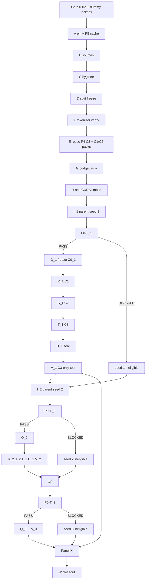

# P5 exhaustive gate-by-gate experiment plan

**Document type:** Super-granular staged execution plan (draft operator bible).  
**Study short name:** `P5-P4-MULTI-SEED`  
**Working title:** Predeclared multi-seed panel of the P4 token-share-locked English–Tagalog mixture after a fresh Tagalog parent.  
**Status as of 2026-08-22:** **Draft only. P5 AsPredicted not filed.** No `P5_RUN_ID`. No tokenizer copy into a P5 cache. No parent. No child. No `val_bpb_full`. No test. **MUST NOT start Gate A until Gate 0 passes.**  
**This document does not authorize:** training, evaluation, test access, a new registration filing, cloud rental, model release, or any modification of P1.1, P2, P3, or P4 artifacts.  
**Does not amend:** AsPredicted #306780, #306935, #307342, **#307591**; ResearchBox #8735, #8763, #8834, **#8869**.  
**Recommended nanochat pin (file the actual pin in Gate 0):** `92d63d4e8bb4df75c3b71618f31ddde2378b2bcd` (identical to P4).  
**Hook only:** `patches/nanochat-NANOCHAT_DATA_DIR.patch`. **MUST NOT** edit attention, loss, optimizer, or `evaluate_bpb` semantics.

> **C3 is still a P4-identical tokenizer-token-share-locked mixture. It is not P3 `B3`. It is not a new mix. It is not a byte-balanced arm.**  
> **C0 is not Gate 0.** Gate 0 is filing. Each seed has its own frozen P5 d20 Tagalog parent \(C0_s\).  
> **P4 seed 0 is historical disclosure, not a P5 confirmatory cell.**

This plan is written so a second experimenter, given only: (i) the filed P5 AsPredicted PDF, (ii) the hashed P5 protocol addendum, (iii) this plan, (iv) the named frozen Tagalog and English archives plus the **P4 C3 packed-stream hashes**, and (v) the pinned nanochat commit, can reproduce the **entire panel** without seeing any P5 BPB until **one** panel Gate X.

Every gate is a **hard stop**. Do not skip a gate because a later gate “looks ready.” Do not start seed 2’s parent because seed 1’s smoke “looked fine.” Do not unblind seed 1 because you are curious whether to continue.

**Unsigned scientific parameters** remain unsigned until they appear in the filed PDF (or one hashed addendum whose SHA is printed in that PDF). Recommended values in this file are **not frozen**.

---

## 0. How to use this document

### 0.1 What P5 is (one paragraph)

P5 is the **post-P4, outcome-informed, prospectively filed multi-seed panel of the P4 apparatus**. It repeats, for every predeclared unused model-initialization seed, the P4 branch geometry C0 / C1 / C2 / C3 under the **same** tokenizer, the **same** frozen splits, the **same** packed C3 token-share stream (\(q_{\mathrm{TL}}=0.50\), \(9{,}633{,}792\) TL + \(9{,}633{,}792\) EN source-content tokens), the **same** budgets (\(N=294\), \(B=65{,}536\), \(D_{\mathrm{phase2}}=19{,}267{,}584\)), the **same** \(\delta=0.01\), the **same** CUDA evaluator, the **same** validation-first lockbox, and the **same** C3-only secondary-test policy. The **only** intended scientific difference from P4 is the **parent model-initialization seed** and the descendants that grow from that parent. All seeds are named **before filing**. All eligible seeds are run **to completion**. There is **no early stop**, no replacement seed, and **one** panel unblinding after the last seed’s Gate V.

### 0.2 Why this is P5 (not P6-A, not a second P4)

P4’s own closeout already named the next slot: *“Multi-seed is **P5** (new filing).”* A later informal note recommended a *single* unused seed as P5 and deferred the panel to P6-A. **This plan follows the P4 reservation:** P5 *is* the panel. A one-seed “just seed 1” study would answer a weaker recurrence question and would still leave the program one-seed-plus-one. If you later prefer the narrower study, file that as a different short name; do not silently shrink this panel after seeing the first P5 parent loss.

P5 **is not** an amendment of #307591. P5 **is not** a re-analysis of P4 lockbox files. P5 **is not** “run seed 0 again.” P4 seed 0 already exists, is unblinded, and **MUST** be disclosed as known. It **MUST NOT** be imported as a P5 confirmatory cell (that would mix a previously selected, already-seen trajectory into a “predeclared” panel).

### 0.3 Reading order (do not skip)

1. Read §0–§6 on a laptop with **no GPU**. Freeze the claim, the post-P4 disclosure, the seed panel, lockbox, and bans.  
2. Sign the decision register (§6) into the AsPredicted form **and** one hashed addendum. **Do not file with “decide later” on \(K\), the seed list, or the unblinding rule.**  
3. Execute **Gate 0** (file PDF + dummy lockbox tests) before any P5 data mutation.  
4. Execute **shared Gates A–C** (workspace, sources, hygiene).  
5. Execute **shared Gate D** (split freeze — hash-verify the same six JSONLs as P4).  
6. Execute **shared Gate F then Gate E** (tokenizer verify, then **reuse** the P4 C3 stream by hash; do not rebuild unless the rebuild is byte-identical).  
7. Execute **shared Gate G** (budget / argv freeze — identical to P4).  
8. Execute **shared Gate H** once (d4 Tagalog-path CUDA smoke of the P5 wrappers; not a parent; not per-seed).  
9. For each filed seed \(s\) **in the filed order**, with **no peeking of that seed’s or any other seed’s BPB**:  
   execute **I\(_s\)** → **P0-T\(_s\)** → **Q\(_s\)** → **R\(_s\)** → **S\(_s\)** → **T\(_s\)** → **U\(_s\)** → **V\(_s\)**.  
10. After **every** filed seed has a lawful terminal state (U+V complete, or a predeclared ineligible-parent stop), execute **one panel Gate X**.  
11. Execute **Gate W** (archive, paper, Hub, ResearchBox). **No new P5 science.**

### 0.4 Two naming systems plus a third (do not confuse them)

| Name | What it is | Example |
|---|---|---|
| **Gates 0, A–I, P0-T, Q–W, X** | Hard-stop checkpoints | Shared E = reuse/freeze the C3 stream |
| **Replica suffixes \(_s\)** | The same scientific gate, once per seed | `I_2` = Gate I for seed 2 |
| **Arms \(C0_s, C1_s, C2_s, C3_s\)** | Weight states of seed \(s\) | \(C3_2\) = seed-2 mix child |
| **P4 arms C0–C3** | Finished one-seed study #307591 | **Never** a P5 parent |
| **P3 arms B0–B3** | Finished TL→EN study | **Never** a P5 parent; **B3 is not C3** |

### 0.5 Gate language

Status labels **MUST** be only: `not_started`, `prepared`, `pass`, `blocked`, `technical_stop`, `protocol_stop`, `awaiting_authorization`, `ineligible_parent` (P0-T\(_s\) BLOCKED only).

- **MUST** — required for confirmatory P5.  
- **MUST NOT** — forbidden; a violation invalidates the confirmatory label.  
- **SHOULD** — default; dated deviation card if skipped.  
- **MAY** — optional; exploratory unless the PDF already names it.

**Confirmatory (per seed):** official `val_bpb_full` after that seed’s terminal checkpoints, plus that seed’s \(R_{\mathrm{TL}}^{(s)}\) and \(A_{\mathrm{EN}}^{(s)}\).  
**Confirmatory (panel):** the predeclared count table over eligible seeds; not a mean, not a CI, unless the PDF separately files an estimator (this plan **recommends against** filing a CI at \(K=3\)).  
**Descriptive:** byte shares, fertility, \(C0_s\) English val, C3-only test BPB, in-loop trainer `val_bpb`.  
**Historical disclosure:** P4 released cells and P4 \(R_{\mathrm{TL}}\), \(A_{\mathrm{EN}}\). Known at design time. **MUST NOT** become P5 success targets or a new \(\delta\).  
**Safe progress:** status, hashes, counts, finite/nonfinite, reload_ok, `P0-T_s: PASS|BLOCKED|TECHNICAL BLOCK`, `seal created`, test **count**. **Never** BPB, contrast signs, or “seed 1 looks like P4.”  
**Lockbox:** mode-600 / encrypted outcomes until **panel** Gate X.  
**Technical stop:** hardware/path/integrity fault; not a scientific finding.  
**Protocol stop:** confirmatory label invalidated unless a pre-filed path applies.  
**Clean restart (per seed):** from that seed’s immutable \(C0_s\), fresh optimizer, full \(N\) steps; quarantine the partial.  
**Ineligible parent:** that seed’s P0-T BLOCKED. Children of that seed **MUST NOT** run. The seed **MUST NOT** be replaced. Remaining filed seeds **MUST** still run.

### 0.6 What this project is and is not

**This project is:** a nanochat-only, post-P4, prospectively preregistered **multi-seed replication of the P4 token-share trade-off**. For each unused filed initialization seed, train a **fresh** Tagalog parent on the frozen P1.1/P3/P4-eligible WikiText-TL-39 train documents; after P0-T, freeze d20 as immutable \(C0_s\); continue it for one shared phase-two model-visible token budget on C1 extra Tagalog, C2 pure English, and C3 the **P4-frozen** token-share mix; seal dual-language `val_bpb_full`; then one C3-only secondary test **per seed**. Report a three-way classification **per seed** and a **count table** across the panel.

**This project is not:** P1.1. It is not P2. It is not P3. It is not P4. It is not “P4 seed 0 plus two optional extras.” It is not an amendment of #306780, #306935, #307342, or #307591. It is not “load P4 C0 then mix.” It is not a claim that 50/50 documents equal 50/50 exposure. It is not byte balancing (that remains **P6-B**). It is not a ratio sweep. It is not SFT, replay, EWC, CORE, FilBench, or chat. It is not HF `Trainer`. It is not a population effect, a confidence interval, or an optimal-ratio result. It is not permission to add seed 4 after seeing seeds 1–3.

### 0.7 GPU wall

| Work | Host | GPU | How many times |
|---|---|---|---|
| Gate 0, literature, PDF, dummy lockbox | Laptop | **No** | Once |
| Shared Gates A–G | Mac/CPU | **No** | Once |
| Shared Gate H d4 smoke | CUDA NVIDIA | **Yes** | **Once** (not per seed) |
| Gate I\(_s\) parent d8 and d20 | CUDA NVIDIA | **Yes** | Once **per seed** |
| Gate P0-T\(_s\) | CUDA NVIDIA **only** for official status | **Yes** | Once **per seed** |
| Gate Q\(_s\) | CPU or CUDA (copy/hash) | **No extra train** | Once **per seed** |
| Gates R\(_s\)–T\(_s\) | CUDA NVIDIA | **Yes** | Once **per seed** |
| Gates U\(_s\), V\(_s\) | CUDA NVIDIA | **Yes** | Once **per seed** |
| Panel Gate X, Gate W | Laptop | **No** | Once |

**Confirmatory GPU class (file in the PDF):** NVIDIA CUDA, recommended **A40 48 GB** Secure Cloud (the proven P1.1–P4 class). File a **class**, not a live pod ID.

**Not confirmatory:** Apple MPS; DGX Spark GB10; CPU training or CPU **status** for H / I\(_s\) / P0-T\(_s\) / R–T\(_s\) / U\(_s\) / V\(_s\); any host that requires editing `nanochat/flash_attention.py`.

**Replacement host:** another NVIDIA class is allowed **only if named in the filed PDF**. Otherwise: dated deviation **before Gate H**; no bit-identical claim; **no** numeric “close enough.”

**Rough GPU cost (recommended \(K=3\)):** about **\(3\times\)** one P4 confirmatory GPU campaign (three parents + nine children + three U packages + three C3-only V events), plus one shared d4 smoke. Do not start Gate H until that budget is accepted in writing in the run card.

### 0.8 Frozen prior-study facts (historical inputs — never load weights, never retune P5)

Copy these as **motivation, split identity, and mix identity**. **MUST NOT** re-measure them to “confirm” prior papers. **MUST NOT** use sealed magnitudes to pick \(K\), seeds, \(q_{\mathrm{TL}}\), \(\delta\), mix, depth, or budget.

#### P4 (the apparatus being replicated — known at P5 design time)

| Item | Frozen value |
|---|---|
| AsPredicted | **#307591** — https://aspredicted.org/if84km.pdf |
| ResearchBox | **#8869** (passcode-protected; **not** Make Public) |
| AsCollected | **#2471** (`NANOCHAT-FILIPINO-P4`) |
| RUN_ID | `p4-20260821T060032Z-92d63d4` |
| Pin | `92d63d4e8bb4df75c3b71618f31ddde2378b2bcd` |
| Parent init seed | **0** (nanochat `compute_init` / torch 42 family on this pin) |
| \(q_{\mathrm{TL}}\) | `0.50` source-content tokens |
| \(\delta=\delta_{\mathrm{P0T}}\) | `0.01` BPB; equality counts |
| \(N\), \(B\), \(D_{\mathrm{phase2}}\) | 294; 65,536; 19,267,584 |
| C3 quotas | TL `9633792` / EN `9633792` |
| Mix-manifest SHA-256 | `f203c615266bc8c33c358c1de397715791cae33536a9743c8a6bf8cd543cb107` |
| Tokenizer SHA-256 | `04436b854e0841025a3dd2b46baaeeea07a7ccc252e9f99a19171306f00bc5a8` |
| `token_bytes.pt` SHA-256 | `a5dbc1c88f6292696108263072d77115718cc2d8357f7ad4859adfa517cc2132` |
| Hub | `pageman/nanochat-filipino-p4-token-share-mix` — **never write onto this ID** |
| Released co-primary (historical) | \(R_{\mathrm{TL}}\approx-1.316637\); \(A_{\mathrm{EN}}\approx-1.375277\); **both observed** |
| P4 C0 SHA-256 | `34e06964…` — **never load** |
| P4 C1 SHA-256 | `87b9f551…` — **never load** |
| P4 C2 SHA-256 | `0787aed0…` — **never load** |
| P4 C3 SHA-256 | `eef9a4e1…` — **never load** |

**MUST** put in sentence 1 of the P5 AsPredicted form that these P4 results were known when P5 was designed.  
**MUST NOT** set a new \(\delta\) from those magnitudes.  
**MUST NOT** treat “come within 0.1 of P4” as a success rule.

#### P1.1 / P2 / P3 (split and tokenizer identity only)

| Item | Frozen value |
|---|---|
| TL train SHA-256 | `2b0474c5700dc1eba14def572aa23cc227e4c59c10c2de3ce6b7bda75d137687` |
| TL val SHA-256 | `4d51644b84d05050bfc8c515079e60f6e437082b6cce2122e9ed00e7b1db2b1c` |
| TL test SHA-256 | `3bd193458f4c494d84dae345548c0c01cb6cd7275e98d6ed39a41d517a093baf` |
| EN train SHA-256 | `09ae691caebb33a4bb81db4e570f630cac9ede11cb4116b2e08a3dbe08ef775a` |
| EN val SHA-256 | `874dec29844b3d46fc39e5479ee2dc4b3ba37309d9baf3bba4b5654697f3ae3b` |
| EN test SHA-256 | `2bccabc020cbb8d09273cccdc42ed926957b83824ca767c96fb588041b8d434e` |
| P1.1 / P2 / P3 weights | **never load** |
| P3 B3 | equal-**document** mix; **not** C3 |

### 0.9 Environment (MUST, after Gate 0 creates the files)

```bash
# From $NANOCHAT_FILIPINO_ROOT after Gate 0.
source scripts/p5/env.sh          # CPU gates
# source scripts/p5/env.cuda.sh   # CUDA only
# MUST NOT source scripts/p1/env.sh
# MUST NOT source scripts/p2/env.sh
# MUST NOT source scripts/p3/env.sh
# MUST NOT source scripts/p4/env.sh   # P4 is a read-only spec, not a live env
```

`scripts/p5/` **does not exist yet**. Creating it is **post-filing Gate A work**, not a scientific choice. Until those files exist, **do not** invent `P5_RUN_ID`, **do not** train, **do not** copy `scripts/p4/env.sh` and only rename the prefix.

```text
Never source scripts/p1/env.sh, scripts/p2/env.sh, scripts/p3/env.sh, or scripts/p4/env.sh.
Never load P1.1, P2, P3, or P4 model weights as a P5 parent.
Never use ratio=-1.
Never run python -m nanochat.dataset.
Never write P5 outputs to P1.1, P2, P3, or P4 cache paths.
Never write onto Hub IDs nanochat-filipino-p1-fixed-d20-3x, …-p2-en-then-tl, …-p3-tl-then-en, …-p4-token-share-mix.
```

### 0.10 Shared lockbox vs per-seed lockbox

| Root | Operator may see | MUST NOT contain |
|---|---|---|
| `$P5_SAFE_PROGRESS_ROOT` | job id, GPU name, seed id, step, file size, SHA-256, health, finite/nonfinite, `P0-T_s` status word, `seal created`, test **count** | BPB, loss curves, samples, arm rankings, “looks like P4”, contrast signs |
| `$P5_LOCKBOX_ROOT/shared/` | dummy tests, tokenizer/mix hash receipts | Released only at panel X |
| `$P5_LOCKBOX_ROOT/seed-$s/` | encrypted or mode-600 JSON for that seed | Released only at **panel** X (not at the end of that seed) |

**`meta_*.json` `val_bpb` is in-loop, not `val_bpb_full`.** Keep `meta_*.json` in the seed lockbox or strip `val_bpb` from operator-visible copies. Safe receipt: `{seed, step, bytes, sha256, reload_ok}` only.

**Hard rule:** finishing seed 1’s Gate V does **not** authorize opening seed 1’s seal. The officer who would be tempted to “just check whether both criteria recurred before paying for seed 2” is the reason this rule exists.

### 0.11 Common gate contract (every gate MUST fill this)

1. **Purpose**  
2. **Host / GPU / authorization**  
3. **Preconditions**  
4. **Hashed inputs**  
5. **Operator steps** (numbered; do not reorder)  
6. **Permitted command class**  
7. **Prohibited actions**  
8. **Expected artifacts**  
9. **Pass / blocked / technical_stop / protocol_stop** (and `ineligible_parent` where named)  
10. **Safe vs lockbox outputs**  
11. **Quarantine after fault**  
12. **Next gate**  
13. **Authorization JSON** for GPU gates

**Prohibited at all pre–panel-X gates:** printing BPB; printing contrasts or signs; rankings; “best seed”; “seed 1 replicated P4”; sample text used to infer quality; filenames embedding scalars; paper sentences implying pass/fail of outcomes; chat/issue updates with interpreted outcomes; **opening any seed seal before panel X**.

### 0.12 Operational order vs LOCK letters

LOCK.json and the gate ledger keep letters **E** (pack / freeze C3 identity) and **F** (tokenizer). Operational order is still **F before E**, as in P4, because C3 is token-share-locked.

```text
LOCK letters:      0 A B C D E F G H  then I_s P0-T_s Q_s R_s S_s T_s U_s V_s  then X W
Operational order: 0 A B C D F E G H  then I_s P0-T_s Q_s R_s S_s T_s U_s V_s  then X W
```

P5’s Gate E default is **hash-identical reuse** of the P4 packed C3 train shards and origin mask, plus hash-identical reuse of the P4 C1/C2 packs. Rebuild is allowed **only** if the produced artifacts hash identically to the filed P4 references. A non-identical rebuild is a **new treatment** and is a protocol stop for this study.

### 0.13 One exposure clock (unchanged from P4)

Quota is in **P4/P5 Tagalog tokenizer tokens**, no BOS, no padding, no pack, no crop, counted **per training document** then concatenated. Trainer packing **MUST NOT** redefine the quota. P5 **does not claim byte balancing**. **MUST NOT** add a byte-balanced C4 arm.

### 0.14 Co-primary contrasts (per seed; file before any P5 BPB)

\[
R_{\mathrm{TL}}^{(s)}=\mathrm{TL}(C3_s)-\mathrm{TL}(C2_s)\le -\delta
\qquad
A_{\mathrm{EN}}^{(s)}=\mathrm{EN}(C3_s)-\mathrm{EN}(C1_s)\le -\delta
\]

Official DV (unchanged):

\[
\mathrm{BPB}=\frac{\overline{\mathrm{NLL}}_{\mathrm{token}}}{\ln 2\cdot \overline{\mathrm{UTF8\ bytes\ per\ evaluated\ token}}}.
\]

Reporting precision: six decimal places. Equality at \(-\delta\) **counts**. **Recommended:** \(\delta=0.01\) (P4-identical). No composite score. No “average \(R\) across seeds” as a primary estimand unless the PDF files it (this plan **does not** recommend filing a mean).

### 0.15 Lineage (the only legal family, per seed)

```text
fresh P5 Tagalog initialization with filed seed s
        -> P5 d8 parent_s (eligibility evidence only)
        -> P5 d20 parent_s -> P0-T_s pass -> immutable C0_s
                                              -> C1_s extra Tagalog
                                              -> C2_s pure English
                                              -> C3_s frozen P4 token-share mix (same packed stream as P4)
```

**Hard prohibitions:**

- \(C1_s\), \(C2_s\), or \(C3_s\) **MUST NOT** parent another child, including a child of a different seed.  
- \(C0_s\) **MUST NOT** parent a child of seed \(s'\neq s\).  
- P4 C0/C1/C2/C3 **MUST NOT** appear in any `--load` / `--init`.  
- Seed \(s\) **MUST NOT** be started before seed \(s_{\mathrm{prev}}\) has a lawful terminal state **or** a documented technical pause that does not depend on outcomes. Recommended serial order: **seed 1, then 2, then 3**. Parallel seeds are allowed **only if** the PDF files isolated caches, isolated lockboxes, and **no shared writable directory**, and still forbids opening any seal until panel X.

---

## 1. Scientific objective (operator restatement)

After P4 observed both co-primary token-share patterns in **one** initialization (seed 0), do those same two filed patterns recur in **each** of \(K\) predeclared unused initializations, under a P4-identical treatment?

| Branch | Stream | Role |
|---|---|---|
| \(C0_s\) | Frozen P5 TL d20 parent, seed \(s\) | Immutable parent of seed \(s\); 0 additional train tokens at freeze |
| \(C1_s\) | Extra Tagalog only | Source-language active continuation control |
| \(C2_s\) | Pure English only | English intervention / pure-stream retention-cost comparator |
| \(C3_s\) | **P4-frozen** token-share-locked EN/TL mix | Same mixture intervention as P4 |

Panel question (confirmatory): **for how many eligible seeds are both criteria met, how many meet only \(R_{\mathrm{TL}}\), how many meet only \(A_{\mathrm{EN}}\), how many meet neither, and how many are P0-T ineligible?**

---

## 2. Authority stack

> Filed P5 registration PDF > hashed P5 addendum named in that PDF > dated pre-start execution clarifications > `LOCK.json` > gate ledger and run cards > dated deviation card > exploratory work > chat.

No document may silently override a higher-authority document. Chat **MUST NOT** rewrite sealed numbers or filed constants. This plan **does not override** a future filed PDF.

P4 documents (`PROTOCOL-p4-token-share-mix.md`, `PROTOCOL-p4-GATES-EXHAUSTIVE.md`, `P4-PREFILING-ADDENDUM-DRAFT.md`) are **read-only specification references**. They are SHA-bound. **MUST NOT** edit them to “make P5 easier.”

---

## 3. Recommended seed panel (unsigned until the PDF)

| Role | Integer | Why |
|---|---:|---|
| P4 historical parent init | **0** | Already used and unblinded. **Not** a P5 confirmatory cell. |
| P5 confirmatory parent init | **1, 2, 3** | First three unused non-negative integers on this pin’s trainer seed interface. |
| Untrained P0-T floor (every seed) | **0** | Floor definition, not a treatment. Same as P4 F4-21. |
| C3 document-order / interleave | **42** | Treatment identity. **Do not re-randomize per model seed.** |
| Gate H smoke | **0** | Nonconfirmatory. Once. |

**Recommended \(K=3\).** File \(K\) and the exact list. **MUST NOT** file “at least 2, maybe 3.” **MUST NOT** file “stop if the first two both recur.”

**How the trainer consumes the parent seed (MUST verify at Gate A, before I_1):** on pin `92d63d4`, P4 used the pin-default `compute_init` / torch 42-family path with allocation-table seed **0**. P5 **MUST** name the **exact argv or env** that sets parent init to \(s\) (for example `--seed $s` or the pin’s documented `compute_init` argument) in the hashed addendum. If the pin’s actual knob is not a raw `--seed`, file the knob, not a wish. **If seed 1 cannot be shown unused, stop and pick the next unused integer; do not guess.**

**Same seed for d8 and d20 of that replica.** Depth is not selected by seed. d20 is **not** a second draw.

**Children have no new model-init seed.** They load \(C0_s\) and construct a **fresh** optimizer (`load_optimizer=False`; `--resume-from-step=-1`).

### 3.1 No-early-stop law (file this verbatim)

1. The seed list is closed at Gate 0.  
2. Every listed seed is executed to a lawful terminal state (U+V, or ineligible-parent X-path for that seed only).  
3. **MUST NOT** add a seed after any P5 outcome exists.  
4. **MUST NOT** drop a seed because a parent “looks worse” in-loop.  
5. **MUST NOT** open any seed lockbox before panel Gate X.  
6. **MUST NOT** use P4’s released magnitudes as a stopping rule.  
7. A technical_stop on seed \(s\) is repaired or clean-restarted with the **same** \(s\); it is not a license to skip to \(s+1\) and abandon \(s\).

### 3.2 P0-T failure is not a replacement event

If P0-T\(_s\) is BLOCKED: record `ineligible_parent` for seed \(s\); **skip** Q\(_s\)–V\(_s\); **do not** introduce seed 4; **do** continue remaining filed seeds; at panel X, report that seed as ineligible rather than as nonrecurrence of the trade-off.

If P0-T\(_s\) is TECHNICAL BLOCK: repair the evaluator/hash; **MUST NOT** peek scalars to decide whether the parent “probably passed.”

---

## 4. Paths and artifacts (create at Gate 0 / A; do not invent a run ID before filing)

After Gate 0:

```text
docs/papers/p5-multi-seed-p4/LOCK.json
docs/papers/p5-multi-seed-p4/P5-GATES-EXHAUSTIVE-PLAN.md   # this file; hash at filing
docs/papers/p5-multi-seed-p4/P5-PREFILING-ADDENDUM.md      # to be written; SHA in PDF
docs/run-cards/p5/<P5_RUN_ID>/
docs/run-cards/p5/<P5_RUN_ID>/seed-1/
docs/run-cards/p5/<P5_RUN_ID>/seed-2/
docs/run-cards/p5/<P5_RUN_ID>/seed-3/
docs/run-cards/p5/<P5_RUN_ID>/deviations/
docs/run-cards/p5/<P5_RUN_ID>/HOST-*.md                    # gitignored
manifests/p5/p5_gate_ledger.json
manifests/p5/p5_budget_manifest.json
manifests/p5/p5_mix_identity.json                         # P4 mix hashes, not a new mix
manifests/p5/p5_test_access_log.json
scripts/p5/env.sh
scripts/p5/env.cuda.sh
data/cache/<P5_RUN_ID>/                                   # NANOCHAT_BASE_DIR
data/cache/<P5_RUN_ID>/shared/{tokenizer,streams,splits,holdouts}
data/cache/<P5_RUN_ID>/seed-1/{c0,base_checkpoints,lockbox,safe_progress}
data/cache/<P5_RUN_ID>/seed-2/...
data/cache/<P5_RUN_ID>/seed-3/...
data/cache/<P5_RUN_ID>/SENTINEL_P5_ONLY
```

Mint `p5_run_id` as `p5-<UTC>Z-<7-char pin>` **only after** the PDF exists.

**MUST NOT** write into `data/cache/p1-*`, `p2-*`, `p3-*`, `p4-*` except **read-only** hash-verification of P4 tokenizer / streams / splits.

---

## 5. Counters (initial 0; append-only)

| Counter | Lawful +1 |
|---|---|
| `test_access_count[s]` | Gate V\(_s\) event (Policy A only); one per seed |
| `test_access_count_panel` | Sum of per-seed V events; expected \(K_{\mathrm{eligible}}\) |
| `p5_outcome_access_count` | **Panel** Gate X only (once) |
| `validation_scalar_access_count` | **Panel** Gate X only (once) |
| `lockbox_open_events` | Every authorized open |

**MUST NOT** increment `p5_outcome_access_count` at the end of seed 1.  
Write mode 600. Access log JSONL: `utc`, `actor`, `seed` or `shared`, `files`, `purpose`, `counters_after`. **MUST NOT** store BPB in the ledger.

---

## 6. Filing blockers (MUST appear in the filed PDF or one hashed addendum)

| ID | Decision | Recommended value to file |
|---|---|---|
| F5-01 | Identity; post-P4 sentence 1; does not amend #306780/#306935/#307342/**#307591** | `P5-P4-MULTI-SEED` |
| F5-02 | Tokenizer | **Carry-forward both** P3/P4 artifacts; same two SHA-256s as P4. If either unverified, stop. |
| F5-03 | \(q_{\mathrm{TL}}\) | **0.50** source-content tokens. **Do not retune.** |
| F5-04 | \(\delta\), \(\delta_{\mathrm{P0T}}\) | **0.01**; equality counts; six decimals. **Do not retune from P4 magnitudes.** |
| F5-05 | C3 identity | **Reuse P4 packed train stream + origin mask by SHA.** Rebuild only if byte-identical. Mix-manifest `f203c615…`. Quotas 9,633,792 / 9,633,792. Doc-order/interleave seed **42**. |
| F5-06 | Panel | \(K=3\); seeds **1, 2, 3** in that order; P4 seed 0 historical only |
| F5-07 | Unblinding | **One panel Gate X after all seeds’ V (or ineligible stop).** No seed-level X. |
| F5-08 | Early-stop | **Forbidden.** No replacement seeds. |
| F5-09 | Test | Policy A **per eligible seed**: one C3-only event after that seed’s U. C1/C2 never tested. Same holdout SHAs as P4. |
| F5-10 | Parent budget | d8 eligibility only; d20 = only \(C0_s\); \(T=2048\); \(B=65536\); \(N=294\); \(D=19{,}267{,}584\) |
| F5-11 | Optimizer | Fresh Muon+AdamW; `load_optimizer=False`; peak LR \(=0.3\times\) parent; warmup 14 |
| F5-12 | CUDA class | NVIDIA A40 48 GB; do not name a live pod |
| F5-13 | C0 English val | Yes — once **per seed** at U\(_s\); descriptive; excluded from contrasts |
| F5-14 | Child order | Serial R\(_s\) → S\(_s\) → T\(_s\) **within** each seed; serial seeds 1 → 2 → 3 |
| F5-15 | Related studies | **Overlapping** #306780, #306935, #307342, **#307591**. Not Independent. |
| F5-16 | Reporting | Per-seed four-way grammar + panel count table. No CI/\(p\) unless separately filed (recommend: none). |
| F5-17 | Hub | New ID. Per seed C0+C1+C2+C3 together, or all twelve together. Never C3 alone. Never write onto the P4 Hub ID. |
| F5-18 | Terminal save | `--save-every=-1` → `model_{N:06d}.pt`. Wrappers refuse a missing terminal file. |
| F5-19 | P0-T evaluator | CUDA-only status; untrained floor seed **0**; same packing/stride/batch as P4 F4-21 |
| F5-20 | Split identity | Byte-identical copies of the six P4 JSONLs. Hash mismatch = stop. |
| F5-21 | Deposit | **New** ResearchBox (not #8869). **New** AsCollected project/version. |
| F5-22 | Parent-seed argv | Exact pin knob that sets init to \(s\), verified unused for \(s\in\{1,2,3\}\) |

**Form sentence 1 (MUST):**

> P5 is designed after released P4 findings (AsPredicted #307591; Gate X 2026-08-21; both co-primary criteria observed in one initialization). It is a post-P4, prospectively preregistered multi-seed panel of the P4 token-share apparatus. It does not amend AsPredicted #306780, #306935, #307342, or #307591. It is not an independent confirmation of P4. It is not a population effect.

**Related-studies field:** Overlapping for #306780, #306935, #307342, **#307591**. Do **not** select Independent.

---

## 7. DAG



Do not draw a path from P4 C0 into any \(C0_s\). Do not draw a path from an opened seed-1 seal into seed 2.

---

# STAGE 0 — FILING AND LOCKBOX (laptop, no GPU)

## Gate 0 — File P5, freeze hashes, install the panel lockbox

**Purpose.** Level-1 instrument. Without this PDF and passing dummy lockbox tests, Gates A+ are wiring only. Gate 0 creates identity. It does **not** create a parent. **C0 is not Gate 0.**

**Host.** Laptop. **GPU: no.**

### 0.1 Preconditions

1. This plan + a completed `P5-PREFILING-ADDENDUM.md` exist and have been read.  
2. Every F5-01–F5-22 item is answered. **No “decide later” on \(K\) or the seed list.**  
3. Confirm **no** P5 `tok_train` / `base_train` / `evaluate_bpb` has run.  
4. Confirm no `data/cache/p5-*` already contains training outputs.  
5. Confirm this is **not** an amendment filing on #307591.  
6. Confirm P4 weights are **not** staged as P5 parents.

### 0.2 MUST before file

1. Put the **post-P4 disclosure** in sentence 1 (verbatim §6).  
2. Name \(K\), the seed list, the no-early-stop law, and the one-panel-X rule.  
3. Sign tokenizer, \(q_{\mathrm{TL}}\), \(\delta\), C3 identity-by-hash, test Policy A per seed, \(N\), CUDA class, Hub-together, C3 ≠ B3.  
4. State overlapping related studies including **#307591**.  
5. Print / export the PDF. Do not start Gate A on a draft.

### 0.3 MUST after file

1. Save PDF to `docs/run-cards/p5/AsPredicted-<P5ID>.pdf`. Record SHA-256, pages, PT timestamps, URL.  
2. Create a **new** ResearchBox (not 8869). Passcode gitignored. **Not** Make Public.  
3. Create a **new** AsCollected project/version.  
4. Hash this plan, the addendum, and any master protocol. Freeze those SHA-256s. **Further scientific edits are amendments.**  
5. Copy a LOCK template → `docs/papers/p5-multi-seed-p4/LOCK.json`. Fill registration fields, **then** mint `p5_run_id`.  
6. Create run-card tree, `manifests/p5/` ledger (shared gates + every `*_s` row), `scripts/p5/env.sh` and `env.cuda.sh` (reviewed; **not** a renamed P4 env).  
7. Create `$P5_SAFE_PROGRESS_ROOT` and `$P5_LOCKBOX_ROOT` with **different** Unix permissions.  
8. Expand `scripts/p5/forbidden_parents.py` to reject **at least**:
   - P1.1 d20 `9e30fff3…`
   - P2 A0 `bd35a858…` and all P2 children
   - P3 B0–B3
   - **P4 C0 `34e06964…`, C1 `87b9f551…`, C2 `0787aed0…`, C3 `eef9a4e1…`**
   - any path under `data/cache/p4-` used as `--load`
   - any `C1_*` / `C2_*` / `C3_*` used as a later parent
9. Run dummy lockbox tests (encrypt/decrypt round-trip of synthetic JSON; **no real BPB**).  
10. Run dummy C3-test wrapper: refuses C1/C2 tags; refuses a second touch on the same seed.

### 0.4 Pass / stop

Pass if PDF exists, hashes frozen, lockbox dummies pass, `p5_run_id` minted after the PDF, counters are 0.  
`protocol_stop` if any P5 train token already exists or if the form omitted the seed list.

### 0.5 Next

Gate A.

---

# STAGE 1 — PIN AND HYGIENE (CPU, once)

## Gate A — Source pin and isolated P5 workspace

**Purpose.** Fresh namespace. No P1/P2/P3/**P4** inheritance of **env, cache, or weights**. Tokenizer and C3-stream carry-forward are **hash-verified artifact copies**, not an env source.

**Host.** CPU. **GPU: no.**

### A.1 Steps

1. `source scripts/p5/env.sh`. Confirm `P5_RUN_ID` matches LOCK. Confirm `NANOCHAT_BASE_DIR=$NANOCHAT_FILIPINO_ROOT/data/cache/$P5_RUN_ID`.  
2. Checkout pin `92d63d4e8bb4df75c3b71618f31ddde2378b2bcd` under `vendor/nanochat`.  
3. `git rev-parse HEAD` must equal the filed pin.  
4. Diff vs pin. Allowed: data-root / lockbox plumbing / `NANOCHAT_DATA_DIR` hook / a documented `--seed` passthrough **if the pin does not already expose it**. **MUST NOT** change model, optimizer, attention, or BPB semantics. If a seed passthrough **requires** a pin edit, that edit **MUST** be in the hashed addendum **before filing**, not invented at A.  
5. `mkdir -p` shared + `seed-{1,2,3}` trees. Write `SENTINEL_P5_ONLY`.  
6. Scan environment: no `scripts/p{1,2,3,4}/env.sh` sourced; `NANOCHAT_DATA_DIR` unset at rest; no P4 cache as `NANOCHAT_BASE_DIR`.  
7. Copy P4 evaluator into `scripts/p5/evaluate_bpb.py`; strip P4 run-id constants; freeze script SHA. **MUST NOT** change the BPB formula.  
8. Confirm the parent-seed argv for \(s=1,2,3\) against the pin (dry `compute_init` or a unit test that does **not** train). Record the unused-seed proof in `gate-a-source-pin.json`.  
9. Install `forbidden_parents.py` with the Gate 0 reject list including **all four P4 confirmatory SHAs**.  
10. Write `docs/hub/p5-p4-multi-seed/` card **stub** (no numbers). **MUST NOT** upload weights.

### A.2 MUST NOT

Start `tok_train` or `base_train`. Copy P4 `env.sh` and only rename `P4_` → `P5_`. Point `NANOCHAT_BASE_DIR` at the P4 cache “to save disk.” Load any `.pt`.

### A.3 Receipt

`gate-a-source-pin.json`: commit, allowed-diff SHA, sentinel, env scan, evaluator SHA, seed-knob proof, `no_p5_outcomes=true`.

### A.4 Next

Gate B.

---

## Gate B — Named source acquisition

**Purpose.** Exact Tagalog and English split-file identity. Copy hashes; **do not re-split.**

**Host.** CPU. **GPU: no.**

### B.1 Hashed inputs (identical to P4)

| Split | SHA-256 |
|---|---|
| TL train | `2b0474c5700dc1eba14def572aa23cc227e4c59c10c2de3ce6b7bda75d137687` |
| TL val | `4d51644b84d05050bfc8c515079e60f6e437082b6cce2122e9ed00e7b1db2b1c` |
| TL test | `3bd193458f4c494d84dae345548c0c01cb6cd7275e98d6ed39a41d517a093baf` |
| EN train | `09ae691caebb33a4bb81db4e570f630cac9ede11cb4116b2e08a3dbe08ef775a` |
| EN val | `874dec29844b3d46fc39e5479ee2dc4b3ba37309d9baf3bba4b5654697f3ae3b` |
| EN test | `2bccabc020cbb8d09273cccdc42ed926957b83824ca767c96fb588041b8d434e` |

### B.2 Steps

1. Locate the six frozen JSONLs already used by P4. Prefer **byte-identical copies** into `$P5_RUN_ID/shared/splits` and `shared/holdouts`.  
2. Verify each SHA-256. **Mismatch = stop.**  
3. `chmod` read-only.  
4. Place **test** jsonl outside any future `NANOCHAT_DATA_DIR`.  
5. **MUST NOT** clean, LF-normalize, drop, or re-emit official files.

### B.3 MUST NOT

Re-split. Use P3 B3 or P4 **weights**. Start packing. Mount tests.

### B.4 Receipt

`gate-b-raw-assets.json`: path, bytes, SHA, UTC, `tests_unmounted=true`, `p4_jsonl_reuse=true`.

### B.5 Next

Gate C.

---

## Gate C — Hygiene, leakage, lineage

**Purpose.** Clean apparatus before freeze/reuse.

**Host.** CPU. **GPU: no.**

### C.1 Checks (all MUST be true)

| ID | Check |
|---|---|
| C-01 | P5 cache = sentinel + allowed raw/split/tokenizer/stream copies only |
| C-02 | No ClimbMix/FineWeb/DCLM/OSCAR/instruction corpora |
| C-03 | No P1.1/P2/P3/**P4** checkpoint in any parent-candidate or `--load` path |
| C-04 | Test inputs absent from tok/train/val roots |
| C-05 | No secrets in git |
| C-06 | Filed PDF not writable as a silent working copy |
| C-07 | P1/P2/P3/**P4** Hub IDs not write targets |
| C-08 | Lockbox vs safe-progress permissions pass |
| C-09 | `scripts/p{1,2,3,4}/env.sh` not sourced |
| C-10 | P3 B3 shards not aliased as C3 |
| C-11 | P4 C3 shards, if present, are **read-only copies** with matching SHAs, not a writable alias that a later process can mutate |
| C-12 | Document-overlap scan: no train/val/test exact-hash collision within language |
| C-13 | Counters all 0 |
| C-14 | No seed lockbox contains real BPB yet |

### C.2 Receipt

`gate-c-hygiene.json`: per-check Boolean, `no_p5_outcomes=true`.

### C.3 Next

Gate D.

---

# STAGE 2 — SPLITS, TOKENIZER, MIX IDENTITY (CPU, once)

## Gate D — Document-split freeze

**Purpose.** Freeze IDs before tokenizer verify / stream reuse. No BPB.

**Host.** CPU. **GPU: no.**

### D.1 Steps

1. Confirm P1.1 `reconstructed_article_70_15_15` reuse for Tagalog; `split_origin=p11_reuse`.  
2. Confirm official WT103-raw manifests for English; `legacy_external_holdout=true` on the test split.  
3. Freeze row counts, UTF-8 bytes, SHA-256s. Overlap train/val/test **MUST** be 0 within language.  
4. **MUST NOT** reshuffle. **MUST NOT** drop documents to chase a token share.

### D.2 Receipt

`gate-d-split-freeze.json`: counts, SHAs, overlap=0, `no_bpb=true`.

### D.3 Next

**Gate F**, then Gate E.

---

## Gate F — Frozen tokenizer (verify only)

**Purpose.** One BPE for **all** P5 token accounting and **all** P5 BPB. Required before C3 identity is accepted.

**Host.** CPU. **GPU: no.**

### F.1 Steps (carry-forward — the only recommended fork)

1. Copy P3/P4 `tokenizer.pkl` and `token_bytes.pt` into `$P5_RUN_ID/shared/tokenizer/`.  
2. SHA-256 must equal `04436b854e0841025a3dd2b46baaeeea07a7ccc252e9f99a19171306f00bc5a8` and `a5dbc1c88f6292696108263072d77115718cc2d8357f7ad4859adfa517cc2132`.  
3. `chmod` read-only. Write-probe **MUST** fail.  
4. **MUST NOT** train a new tokenizer. A new tokenizer is a different study.  
5. Fertility, if computed, goes to the **shared lockbox** and is released only at panel X as a diagnostic, never to retune \(q_{\mathrm{TL}}\).

### F.2 Receipt

`gate-f-tokenizer.json`: policy `carry_forward_p3_p4_both_artifacts`, both hashes, `no_p5_bpb=true`.

### F.3 Next

Gate E.

---

## Gate E — Accept the P4 C3 stream (and C1/C2 packs) by hash

**Purpose.** The P5 treatment **is** the P4 treatment. C3 is frozen **before any P5 parent** and **before any P5 BPB**.

**Host.** CPU. **GPU: no.**

### E.1 Preconditions

D and F `pass`. **No** P5 parent has started. **No** P5 val has been computed.

### E.2 Default path — reuse

1. Copy P4 packed streams into `$P5_RUN_ID/shared/streams/{c1_tl,c2_en,c3_mix}/` (or hardlink after hash).  
2. Verify **every** P4 C3 train parquet SHA and `val.parquet` identity against P4 `gate-e-packed-streams-and-c3-freeze.json`:

| File | SHA-256 (P4 freeze) |
|---|---|
| `c3_mix/train_00000.parquet` | `249e2c5e9d06bf17fe14e03c02e622c9e68d90ba337e1e6e33c237fc723252f5` |
| `c3_mix/train_00001.parquet` | `d24fe7f933abeb38b277b099385518718d2d57e330e5f9b5fd8b1a534e43444e` |
| `c3_mix/train_00002.parquet` | `a56a729a0e3c7fd2d1e2e99236a4225bf9a86e55d6d97153063de9d6455fa523` |
| `c3_mix/train_00003.parquet` | `4adbf8f9afcc9870f46f6298ac22f3691ec073d2f452f73aa65322e3ff6331de` |
| C3 `val.parquet` (trainer-interface; = C2 EN val pack) | `b20942ae71823fa52ec0f8d019a76960059798958716184d923f646f64cc648f` |

3. Verify C1 and C2 pack receipts against P4 `gate-e-c1-c2-pack.json` (byte-identical).  
4. Verify mix-manifest SHA `f203c615266bc8c33c358c1de397715791cae33536a9743c8a6bf8cd543cb107`.  
5. Verify origin-mask / language-origin audit: achieved TL = 9,633,792; achieved EN = 9,633,792 on packed **train** shards only.  
6. Write `manifests/p5/p5_mix_identity.json` with `reuse=true`, every shard SHA, `q_tl=0.50`, `not_a_new_mix=true`, `p4_run_id=p4-20260821T060032Z-92d63d4`.  
7. `chmod` streams read-only. Write-probe **MUST** fail.  
8. **MUST NOT** re-shuffle with a new seed “because the model seed is new.” That would add a second treatment.

### E.3 Rebuild path (discouraged; lawful only if byte-identical)

If a P4 shard file is missing locally, you **MAY** rebuild with P4’s Gate E algorithm (Python `random.Random`, seed 42, \(K_{\mathrm{blk}}=2048\), round-half-to-even, last-document truncate, C3 `val.parquet` = C2 English val pack). **Pass iff every SHA matches the table above.** Any mismatch = **stop**. Do not “accept a new mix and call it P5.”

### E.4 MUST NOT

Tune interleave. Skip documents to chase byte share. Use val/test documents. Regenerate P3 B3. Build a second mix because P4 BPB “was large.” Inspect any BPB (none exists yet for P5; do not open P4 lockbox either).

### E.5 Receipt

`gate-e-mix-identity.json`: reuse/rebuild, shard SHAs, quotas, `full_stream_sha256`, `no_p5_bpb=true`.

### E.6 Next

Gate G.

---

## Gate G — Budget and command freeze

**Purpose.** Freeze argv **before** smoke and before any parent. Identical to P4 F4-11 / F4-12 / F4-20.

**Host.** CPU. **GPU: no.**

### G.1 File these exact integers

| Quantity | Value |
|---|---|
| \(T\) | 2048 |
| \(B\) | 65,536 |
| \(N_{\mathrm{TL0}}=N\) | 294 |
| \(D_{\mathrm{phase2}}\) | 19,267,584 |
| Child peak LR | \(0.3\times\) parent peak |
| Child warmup | 14 |
| `--save-every` | `-1` (terminal only) |
| `--resume-from-step` | `-1` |
| `load_optimizer` | `False` |

### G.2 Steps

1. Write `manifests/p5/p5_budget_manifest.json` with the table above plus the **per-seed parent argv** that injects \(s\).  
2. Freeze wrapper SHAs for `gate_i_tl0.sh`, `continue_from_frozen.py`, `gate_{r,s,t}_*.sh`.  
3. Confirm \(N_{\mathrm{TL0}}=294\) under the carry-forward tokenizer (token-budget identity, not a new measurement of BPB).  
4. **MUST NOT** change \(N\) after seeing a d8 smoke loss.

### G.3 Receipt

`gate-g-budget-command-freeze.json`.

### G.4 Next

Gate H.

---

# STAGE 3 — ONE CUDA SMOKE (not a parent, not per-seed)

## Gate H — d4 Tagalog-path CUDA smoke

**Purpose.** Prove the P5 wrappers, pin, hook, and A40-class attention path run. **Not** TL0. **Not** C0. **Not** seed 1.

**Host.** CUDA NVIDIA, filed class. **Authorization: MUST.**

### H.1 Preconditions

G `pass`. Mix identity frozen. Tests unmounted. Forbidden-parent scanner in place.

### H.2 Steps

1. Write `gate-h-authorization.json` (smoke only; `authorizes_gate_i=false`).  
2. Run the P4-analog d4 Tagalog-path smoke: 30 steps, warmup 3, eval/sample/core-metric off, tag `p5-smoke-tl-d4`, seed **0** if the trainer seeds.  
3. Accept `finite` + `reload_ok`. Quarantine the smoke checkpoint.  
4. **MUST NOT** print BPB. **MUST NOT** start `p5-tl0-*`. **MUST NOT** start any child.  
5. **MUST NOT** repeat smoke once per seed.

### H.3 Receipt

`gate-h-cuda-smoke.json`: hardware, pin, command SHA, `finite`, `reload_ok`, `no_confirmatory_training=true`, smoke quarantined.

### H.4 Next

Gate I\(_1\).

---

# STAGE 4 — PER-SEED REPLICA LOOP

The following gates are **scientific clones of P4 Gates I–V**, executed once per filed seed. Replace `s` with `1`, then `2`, then `3`. **Do not reorder seeds. Do not open seals.**

Shared preflight before **every** `I_s`:

1. Shared F/E/G/H `pass`.  
2. Tests unmounted.  
3. `p5_outcome_access_count=0`.  
4. No prior seed’s lockbox has been decrypted.  
5. Output dirs for `p5-s${s}-tl0-d8` and `p5-s${s}-tl0-d20` are **empty**.  
6. Explicit `gate-i-s${s}-authorization.json`.

---

## Gate I_s — Fresh P5 Tagalog parent d8 and d20, seed \(s\)

**Purpose.** Fresh Tagalog parents for seed \(s\). **No English train token.** **Not** P4 C0. **Not** P3 B0.

**Host.** CUDA. **Authorization: MUST.**

### I_s.1 Steps

1. Set the filed parent-init knob to \(s\). Confirm it is **not** 0. Confirm d8 and d20 will use the **same** \(s\).  
2. `NANOCHAT_DATA_DIR` = Tagalog train pack **only**.  
3. Train d8 for **exactly** 294 steps. Terminal checkpoint only. Tag `p5-s${s}-tl0-d8`.  
4. Train d20 for **exactly** 294 steps. Terminal checkpoint only. Tag `p5-s${s}-tl0-d20`.  
5. Metrics/samples → `$P5_LOCKBOX_ROOT/seed-$s/`. Safe: step, health, bytes, SHA, `reload_ok`.  
6. Copy both ckpts into `data/cache/$P5_RUN_ID/seed-$s/base_checkpoints/`; verify SHA; read-only.  
7. **MUST NOT** rank d8 vs d20. **MUST NOT** early-stop. **MUST NOT** start English. **MUST NOT** start children. **MUST NOT** load P4 weights “to warm-start.”

### I_s.2 Fault

Nonfinite / missing ckpt: **stop**, quarantine, `technical_stop`. Clean restart of **that depth** from random init with the **same** \(s\) and the **same** argv is allowed if no outcomes were accessed. **MUST NOT** switch to seed \(s+1\).

### I_s.3 Receipt

`gate-i-s${s}-tl0-d8.json`, `gate-i-s${s}-tl0-d20.json`: step, SHA, size, `tokens_seen=294*65536`, `seed=$s`, `test_access=0`, **no BPB field**.

### I_s.4 Next

Gate P0-T\(_s\). **MUST NOT** freeze \(C0_s\) until P0-T\(_s\) PASS.

---

## Gate P0-T_s — Tagalog parent eligibility for seed \(s\)

**Purpose.** Both depths of seed \(s\) beat both Tagalog floors **before any child token of seed \(s\)**.

**Host.** CUDA NVIDIA. Authoritative status is CUDA-only. **Authorization: MUST.**

### P0-T_s.1 Evaluate (outputs → seed lockbox only)

For TL0 d8 **and** d20 **final** ckpts of seed \(s\), on the filed CUDA class:

1. Full Tagalog val `val_bpb_full` (P5 tokenizer = P4 tokenizer; packing `bos_bestfit_buffer1000_one_pass_no_wrap`; stride `non_overlapping_T_official_bos_bestfit`; \(T=2048\); `--device-batch-size=8`; full split).  
2. Untrained same-depth, same tokenizer, same val; **untrained seed = 0** (`torch.manual_seed` + `torch.cuda.manual_seed`). **Not** seed \(s\).  
3. Byte-unigram: add-1 on Tagalog **train UTF-8**, score Tagalog **val UTF-8** (script SHA frozen at Gate A).

Each trained depth **MUST** beat both floors by \(\ge 0.01\) BPB (closed: \((\mathrm{floor}-\mathrm{trained})\ge\delta_{\mathrm{P0T}}\)).

**MUST NOT** use English val to pass/fail.  
**MUST NOT** use P1.1 1.172248, P4 C0 TL, or P4 P0-T gaps as floors.  
**MUST NOT** evaluate \(C0_s\) English here.

### P0-T_s.2 Automated rule

| Condition | Safe emit |
|---|---|
| Both depths beat both floors | `P0-T_s: PASS` |
| Either depth fails either floor | `P0-T_s: BLOCKED` — **MUST NOT** run R/S/T of this seed |
| Hash/eval crash | `P0-T_s: TECHNICAL BLOCK` — no scalars on safe log |

A CPU evaluation, if run, is diagnostic only and **MUST NOT** set status.

### P0-T_s.3 Blinding

Lockbox holds all scalars and gaps. Safe file = status + seal hash of lockbox JSON **only**.

If BLOCKED: this seed is `ineligible_parent`. Skip Q_s–V_s. **Do not** replace the seed. Proceed to the next filed seed (or to panel X if this was the last seed).  
If PASS: scalars wait for **panel** X.  
If TECHNICAL BLOCK: repair; do not peek.

### P0-T_s.4 Next

PASS → Q_s. BLOCKED → next seed (or panel X). TECHNICAL BLOCK → stop that seed’s science until repaired.

---

## Gate Q_s — Immutable \(C0_s\) freeze

**Purpose.** Only legal child parent for seed \(s\) = that seed’s TL0 **d20** final. **0 additional train tokens.**

**Host.** CPU or CUDA (copy). **No extra train.**

### Q_s.1 Steps

1. Copy d20 `model_*.pt` to `data/cache/$P5_RUN_ID/seed-$s/c0/frozen/p5-s${s}-c0-tl-d20/`.  
2. SHA match Gate I_s (source host and local).  
3. Read-only. SHA is lineage, not permissions.  
4. Record architecture, step, tokenizer SHA, pin, `p0_t_status=PASS`, `additional_train_tokens=0`, `seed=$s`.  
5. Child wrappers: `--load` **this** \(C0_s\); `load_optimizer=False`; `--resume-from-step=-1`.  
6. **MUST NOT** parent = d8, P4 C0–C3, P1.1, P2, P3, or any other seed’s C0/C1/C2/C3.  
7. Write whitelist path into `gate-q-s${s}-c0-freeze.json`.

### Q_s.2 Next

Gate R_s. **MUST NOT** start S_s or T_s first (serial default).

---

## Shared child preflight (R_s, S_s, T_s each MUST)

1. \(C0_s\) SHA = Q_s.  
2. Tokenizer SHA = F.  
3. Fresh optimizer.  
4. Exact Gate G argv.  
5. Empty output tag.  
6. Tests unmounted.  
7. Data-dir last shard hashed; language identity matches the arm.  
8. Operator-visible `meta` stripped or lockboxed.  
9. Explicit human authorization JSON for **that seed and that arm**.  
10. Forbidden-parent SHA check on \(C0_s\) (rejects P4 C0).  
11. **MUST NOT** `--init-from` another child’s directory.

Partial child after technical failure: quarantine; default **clean restart from immutable \(C0_s\)** with fresh optimizer and the **full** 294-step budget. No outcome-informed arm/budget change. **MUST NOT** switch seeds.

---

## Gate R_s — \(C1_s\) extra-Tagalog control

**Purpose.** Without \(C1_s\), \(A_{\mathrm{EN}}^{(s)}\) is not identified.

**Host.** CUDA. **Authorization: MUST.**

### R_s.1 Steps

1. `NANOCHAT_DATA_DIR` = **shared C1 Tagalog train pack only**.  
2. Train exactly 294 steps from \(C0_s\). Tag `p5-s${s}-c1-tl-d20`.  
3. Safe: steps, health, SHA. Metrics → seed lockbox.  
4. Receipt `gate-r-s${s}-c1.json`: C0 SHA, C1 SHA, `D_phase2`, stream id, `reload_ok`, `seed=$s`, `test_access=0`, **no BPB**.

### R_s.2 MUST NOT

Use \(C1_s\) as a parent. Print samples as quality evidence. Start S_s on the same writable cache without a C1 hash snapshot (serial default: finish R first).

### R_s.3 Next

Gate S_s.

---

## Gate S_s — \(C2_s\) pure-English intervention

**Purpose.** First English **train** token on parent \(C0_s\). Comparator for \(R_{\mathrm{TL}}^{(s)}\).

**Host.** CUDA. **Authorization: MUST.**

### S_s.1 Steps

1. Preconditions: R_s `pass`; C1_s read-only; **not** a parent.  
2. `NANOCHAT_DATA_DIR` = **shared C2 English train pack only**.  
3. Same \(C0_s\), tokenizer, \(N\), \(B\), \(T\), opt as C1 except data. Tag `p5-s${s}-c2-en-d20`.  
4. Wrong stream **before** step 0: block, repair, re-preflight.  
5. Wrong stream **after** any official child step: stop; quarantine; default **no** resume; clean restart from \(C0_s\).

### S_s.2 Receipt

`gate-s-s${s}-c2.json`: hashes, stream, budget, `test_access=0`, **no BPB**.

### S_s.3 Next

Gate T_s.

---

## Gate T_s — \(C3_s\) on the **same** P4 mix stream

**Purpose.** Filed trade-off arm for seed \(s\). **Not mitigation during execution.**

**Host.** CUDA. **Authorization: MUST.**

### T_s.1 Steps

1. Preconditions: R_s and S_s `pass`; C1/C2 read-only; Gate E mix SHA **unchanged**; tokenizer SHA unchanged; \(C0_s\) SHA unchanged.  
2. `NANOCHAT_DATA_DIR` = **shared C3 mix pack**. Tag `p5-s${s}-c3-mix-d20`.  
3. Train exactly 294 steps from \(C0_s\). Fresh optimizer.  
4. If token-share mismatch is discovered **before** step 0: stop; rebuild only under the byte-identical rule; **MUST NOT** inspect BPB.  
5. If mismatch is discovered **after** C3 begins: stop; `protocol_stop`.  
6. **MUST NOT** call C3 “fixed B3.” **MUST NOT** continue from C1 or C2. **MUST NOT** change \(q_{\mathrm{TL}}\).

### T_s.2 Receipt

`gate-t-s${s}-c3.json`: mix identity SHA, `full_stream_sha256`, C3 SHA, `test_access=0`, `not_mitigation_during_execution=true`, **no BPB**.

### T_s.3 Next

Gate U_s. **MUST NOT** test at T.

---

## Gate U_s — Six child validations + \(C0_s\) English + seed seal

**Purpose.** Official `evaluate_bpb` on **val only** for seed \(s\). Compute \(R_{\mathrm{TL}}^{(s)}\) and \(A_{\mathrm{EN}}^{(s)}\) **once** after all six **child** cells. Tests unread. **Seal stays closed.**

**Host.** CUDA. **Authorization: MUST.**

### U_s.1 Order (seed lockbox files)

| # | Ckpt | Split | Role |
|---|---|---|---|
| 1 | \(C1_s\) | English val | primary child |
| 2 | \(C1_s\) | Tagalog val | primary child |
| 3 | \(C2_s\) | English val | primary child |
| 4 | \(C2_s\) | Tagalog val | primary child |
| 5 | \(C3_s\) | English val | primary child |
| 6 | \(C3_s\) | Tagalog val | primary child |
| 7 | \(C0_s\) | English val | descriptive; collect once |

Copy \(C0_s\) Tagalog from the P0-T_s lockbox into the seal (not a new confirmatory look unless the PDF files a repeat). **MUST NOT** use \(C0_s\) English in the contrasts.

### U_s.2 Seal script (frozen at Gate 0 / A)

1. Require the six child files **plus** `c0_en_val_bpb_full.json`; matching hashes.  
2. Compute \(R_{\mathrm{TL}}^{(s)}\) and \(A_{\mathrm{EN}}^{(s)}\) **inside the lockbox**.  
3. Write immutable `p5-s${s}-validation-seal.json` in `$P5_LOCKBOX_ROOT/seed-$s/`.  
4. Six-decimal cells.  
5. Safe emit only: `six Gate U_s child val outputs complete; validation seal created; P5 seed s test access = 0`.  
6. `test_access_count[s]` remains 0.  
7. **MUST NOT** print BPB. **MUST NOT** compare seed \(s\) to P4. **MUST NOT** open the seal. **MUST NOT** start seed \(s+1\)’s science because “U finished” *and then peek*. Starting seed \(s+1\) after a **closed** U_s+V_s is the intended path.

### U_s.3 Next

Policy A → V_s.

---

## Gate V_s — Exactly one C3-only secondary test event for seed \(s\)

**Purpose.** After U_s, exactly one authorized touch: filed English test + filed Tagalog test on **\(C3_s\) only**.

**Host.** CUDA. **Separate authorization MUST.**

### V_s.1 Preconditions

U_s seal exists; `test_access_count[s]=0`; \(C3_s\) SHA matches seal; wrapper rejects C1/C2 and rejects every other seed’s C3; raw text not in the train workspace.

Holdouts (unchanged):

- EN test `2bccabc020cbb8d09273cccdc42ed926957b83824ca767c96fb588041b8d434e`  
- TL test `3bd193458f4c494d84dae345548c0c01cb6cd7275e98d6ed39a41d517a093baf`

### V_s.2 Execution

1. Append `manifests/p5/p5_test_access_log.json` (`seed=$s`, purpose=`gate_v_c3_only`).  
2. Evaluate \(C3_s\) English test → seed lockbox.  
3. Evaluate \(C3_s\) Tagalog test → seed lockbox.  
4. Set `test_access_count[s]=1`, `component_evaluations=2`, `authorized_touches=1` for this seed. Increment `test_access_count_panel` by 1.  
5. **MUST NOT** test C1/C2. **MUST NOT** second C3 read. **MUST NOT** echo test text. **MUST NOT** revise the sealed contrasts. **MUST NOT** unblind.

### V_s.3 Receipt

Lockbox `gate-v-s${s}-test.json`. Safe: `one authorized C3-only test event completed for seed s`.

### V_s.4 Next

If a later filed seed remains: Gate I of that seed.  
If this was the last filed seed (or all remaining seeds are already ineligible): **panel Gate X**.

**MUST NOT** treat V_s as a license to open U_s.

---

# STAGE 5 — ONE PANEL UNBLINDING

## Gate X — Formal P5 panel unblinding

**Purpose.** Single timestamped release of **all** planned P5 scalars for **all** seeds.

**Host.** Laptop. **GPU: no.**

### X.1 Preflight (status / provenance **only** — do **not** open scalars)

| Check | Required state |
|---|---|
| Shared 0, A–H | `pass` |
| Every filed seed | lawful terminal: V_s `pass` **or** `ineligible_parent` |
| No extra seed | ledger has only {1,2,3} |
| Each eligible seed C0–C3 hashes | match locked manifests |
| C3 mix identity | still the P4 hashes |
| For each eligible seed: U before V | timestamp order |
| `test_access_count[s]` at U_s | 0 |
| After V_s | 1 |
| Tested branch | \(C3_s\) only |
| C1/C2 test records | absent |
| `p5_outcome_access_count` | 0 |
| Safe logs | no scalar leakage, no “looks like P4” |
| Incidents | recorded / quarantined |
| Break-glass | none, or documented |

### X.2 Actions

1. Write `P5_UNBLINDING_EVENT.json`: UTC, releaser, condition, **all** seed artifact lists, SHA-256s, `raw_test_still_restricted=true`, `early_stop=false`.  
2. Release **simultaneously** for every eligible seed: P0-T scalars, six val cells, \(R_{\mathrm{TL}}^{(s)}\), \(A_{\mathrm{EN}}^{(s)}\), C3 share table (shared), C3 tests, \(C0_s\) EN.  
3. Release ineligible-parent P0-T scalars with the BLOCKED label (no fake contrasts).  
4. Increment `p5_outcome_access_count` and `validation_scalar_access_count` **once**.  
5. Run the **pre-frozen** table script. **MUST NOT** add metrics. **MUST NOT** compute a t-test unless the PDF filed one (this plan files none).  
6. Apply the grammar in §8.  
7. “Mitigation” **MAY** appear **only if** the PDF’s narrow sentence is used, and only as a **within-seed** statement when **both** of that seed’s criteria are met — never as a panel-level “P5 mitigates forgetting.”

### X.3 Receipt

Released bundle SHA = lockbox manifest. `LOCK.json` `unblinding_status=gate_x_unblinded`.

### X.4 Next

Gate W.

---

# STAGE 6 — CLOSE-OUT

## Gate W — Archive, paper, ResearchBox, code, Hub

**Purpose.** Audit trail. **No new P5 computation.**

**Host.** Laptop. **GPU: no.**

### W.1 Archive

`p5_closeout_manifest.json` + `SHA256SUMS` for every artifact role. Exclude: raw tests, secrets, SSH, `.env`, optimizer states unless the PDF says otherwise. Re-hash downloads before use. Super-exhaustive local copy of GPU artifacts **before** powering down pods (stop, do not terminate, until hashes match).

### W.2 ResearchBox

**New** box (not #8869): protocol, PDF, code, non-sensitive receipts, sealed JSON (after X), paper. **No** `test.jsonl`. **No** passcode in git. Dear Reader: post-P4 panel; not an amendment of #307591; C3 ≠ B3; P4 seed 0 is historical.

### W.3 GitHub

Subtree `scripts/p5/`, `docs/p5/`, `docs/papers/p5-multi-seed-p4/`, `docs/run-cards/p5/`, `results/p5/`, `docs/hub/p5-p4-multi-seed/` on `pageman/nanochat-filipino`. **MUST NOT** mix into `results/p4` seals. **MUST NOT** commit HOST cards.

### W.4 Hub

Provisional id: `pageman/nanochat-filipino-p5-p4-multi-seed`.  
If weights released: **per eligible seed, C0+C1+C2+C3 together** (or all eligible seeds together) + tokenizer + meta. Never C3 alone. Never a single seed’s C3 as “the P5 model.” Never write onto the P4 Hub ID. Or **all deferred** with dated reason.

### W.5 Paper

1. Fill `docs/papers/p5-multi-seed-p4/paper.tex` from **released** seals only.  
2. Methods must state: post-P4 disclosure; \(K\); seed list; no early stop; P4-identical treatment; P4 seed 0 excluded from the confirmatory panel.  
3. Results: per-seed four-way sentence **and** the count table.  
4. Same build pipeline as P1.1/P2/P3/P4.  
5. **MUST NOT** say P5 confirmed P4 as a law. **MUST NOT** say P5 confirmed P3. **MUST NOT** put “mitigation” in the title.

### W.6 Infra

Stop GPU pods after local + external hash verification. **Do not terminate** until the volume is expendable. **MUST NOT** leave trainers running “in case we want seed 4.”

### W.7 Next

None. P5 confirmatory process is closed. Byte-balanced mix remains **P6-B**. A still-larger predeclared panel, if ever desired, is a **new** filing with its own closed seed list — it **MUST NOT** be “P5 plus seed 4.”

---

## 8. Reporting grammar (post–panel-X only)

### 8.1 Per eligible seed (copy P4’s four sentences, seed-tagged)

| Condition | Allowed sentence |
|---|---|
| Both \(\le-\delta\) | Under this preregistered token-share-locked mixture, P5 seed \(s\) observed lower Tagalog BPB than pure English continuation and lower English BPB than extra Tagalog continuation in the stated apparatus. |
| Only \(R_{\mathrm{TL}}^{(s)}\) | Seed \(s\): the specified mixture improved Tagalog retention relative to pure English continuation but did not meet the preregistered English-acquisition criterion. |
| Only \(A_{\mathrm{EN}}^{(s)}\) | Seed \(s\): the specified mixture improved English acquisition relative to extra Tagalog continuation but did not meet the preregistered Tagalog-retention criterion. |
| Neither | Seed \(s\): the specified mixture did not meet either preregistered trade-off criterion. |

Always append: this is one initialization in a predeclared panel; not a CI; C3 is not P3 B3; P5 does not amend #307591.

### 8.2 Ineligible seed

> P5 seed \(s\) did not pass P0-T and is reported as an ineligible parent. No child contrasts exist for this seed. The seed was not replaced.

### 8.3 Panel (primary panel claim)

Fill and publish this table; it **is** the panel result:

| Cell | Count (file \(K=3\)) |
|---|---|
| Eligible seeds | \(K_{\mathrm{elig}}\) |
| Both criteria met | \(k_{\mathrm{both}}\) |
| Only \(R_{\mathrm{TL}}\) | \(k_R\) |
| Only \(A_{\mathrm{EN}}\) | \(k_A\) |
| Neither | \(k_{\mathrm{none}}\) |
| Ineligible parent | \(k_{\mathrm{inelig}}\) |

Allowed panel sentence:

> Across the \(K\) predeclared unused initializations, both co-primary P4 criteria were met in \(k_{\mathrm{both}}\) of \(K_{\mathrm{elig}}\) eligible seeds (\(k_{\mathrm{inelig}}\) ineligible). This is a recurrence count in a closed panel, not a population effect, not a confidence interval, and not an optimal-ratio result.

**If \(k_{\mathrm{both}}=K_{\mathrm{elig}}=K\):** “In all \(K\) predeclared unused initializations, the P4 token-share mixture pattern recurred.”  
**If \(0<k_{\mathrm{both}}<K_{\mathrm{elig}}\):** “The P4 two-component pattern recurred in some but not all predeclared unused initializations.”  
**If \(k_{\mathrm{both}}=0\):** “The P4 two-component pattern did not recur in any eligible unused initialization in this closed panel.”

Always append: P4 seed 0 is a previously released historical cell, not a P5 confirmatory cell; C3 is not B3; tests are secondary; no silent amendment of #307591.

### 8.4 Forbidden language

- “P5 confirms P4” / “P5 independently confirms P4”  
- “P5 confirms P3” / “P3 B3 fixed”  
- “50/50 is optimal” / “mixture solves catastrophic forgetting”  
- “the population effect of token share is …”  
- Any CI, \(p\)-value, or random-effects model **unless filed at Gate 0** (not recommended at \(K=3\))  
- Dropping a seed from the table  
- Adding “exploratory seed 4”  
- Averaging first and treating the mean as the primary claim  
- Presenting one seed’s C3 as a bilingual model  
- Using test BPB as co-primary  
- Using P4’s released \(R_{\mathrm{TL}}\) / \(A_{\mathrm{EN}}\) as a numeric target or a new \(\delta\)
- Calling this study outcome-independent
- Calling a one-seed peek “interim P5”

**Mitigation (narrow, optional, per seed only):** only if **both** of that seed’s criteria are met, and only: “A measured reduction in the P3-style relative Tagalog retention cost within this frozen P5 replica of the P4 apparatus, not a general mitigation of catastrophic forgetting.” **MUST NOT** appear in the title. **MUST NOT** be claimed for the panel as a whole unless every eligible seed met both criteria **and** the paper still uses the count table as the primary panel claim.

---

## 9. Minute-by-minute operator calendar (after filing)

This is the intended serial schedule. Times are **order-of-magnitude A40 hours**, not promises. Do not compress by unblinding early.

### Day −1 (laptop)

1. Read this plan and the hashed addendum aloud against the PDF.  
2. Confirm F5-01–F5-22 are in the PDF or addendum.  
3. Confirm no `data/cache/p5-*` train outputs exist.  
4. File. Save PDF. Hash everything. Mint `P5_RUN_ID`.  
5. Dummy lockbox + dummy C3-test refuse tests.  
6. **Stop.** Do not “just copy the tokenizer tonight.”

### Day 0 (CPU, shared A–G)

1. Gate A pin + seed-knob proof.  
2. Gate B six JSONL hashes.  
3. Gate C hygiene including **P4 SHA reject list**.  
4. Gate D split freeze.  
5. Gate F tokenizer both hashes.  
6. Gate E copy/verify P4 C1/C2/C3 packs; write `p5_mix_identity.json`.  
7. Gate G freeze argv.  
8. **Stop.** Authorization JSON for H only.

### Day 0 evening (CUDA, shared H)

1. Gate H d4 smoke. Quarantine.  
2. **Stop.** Authorization JSON for I_1 only.

### Seed 1 block (CUDA)

1. I_1 d8 then d20, seed **1**.  
2. P0-T_1. Safe emit PASS/BLOCKED/TECHNICAL BLOCK only.  
3. If BLOCKED: card `ineligible_parent`; skip to seed 2.  
4. If PASS: Q_1 freeze.  
5. R_1 → S_1 → T_1 (serial).  
6. U_1 seal (closed).  
7. V_1 C3-only. `test_access_count[1]=1`.  
8. **Do not open the seal. Do not compute a ‘preview contrast.’**  
9. Power down the pod overnight if idle (stop, do not terminate) **or** keep it only if seed 2 is authorized to start immediately.

### Seed 2 block (CUDA)

Repeat the seed 1 block with \(s=2\). Same mix. Same tokenizer. New empty output tags. New authorization JSONs.

### Seed 3 block (CUDA)

Repeat with \(s=3\).

### Panel close (laptop)

1. Gate X preflight (hashes/counters only).  
2. One unblinding event.  
3. Frozen table script. Grammar.  
4. Gate W archive / paper / Hub / ResearchBox.  
5. Super-exhaustive local pull; then **stop** pods (do not terminate).

**Do not** insert a “seed 1 paper draft” between seed 1 and seed 2.

---

## 10. Exact per-seed artifact names

Use these names so a second operator can find things without chat.

```text
p5-s{s}-tl0-d8/model_000294.pt
p5-s{s}-tl0-d20/model_000294.pt
p5-s{s}-c0-tl-d20/model_000294.pt          # freeze copy of d20
p5-s{s}-c1-tl-d20/model_000294.pt
p5-s{s}-c2-en-d20/model_000294.pt
p5-s{s}-c3-mix-d20/model_000294.pt
lockbox/seed-{s}/c{1,2,3}_{en,tl}_val_bpb_full.json
lockbox/seed-{s}/c0_en_val_bpb_full.json
lockbox/seed-{s}/p5-s{s}-validation-seal.json
lockbox/seed-{s}/gate-v-s{s}-test.json
```

Shared (not per-seed):

```text
shared/tokenizer/tokenizer.pkl
shared/tokenizer/token_bytes.pt
shared/streams/c1_tl/*.parquet
shared/streams/c2_en/*.parquet
shared/streams/c3_mix/*.parquet
shared/splits/{en,tl}/{train,val}.jsonl
shared/holdouts/{en,tl}/test.jsonl          # unmounted from train
```

---

## 11. Scripts to create at Gate A (post-filing wiring, not science)

Clone the *structure* of `scripts/p4/`, not the live env. Required P5-only wrappers:

| Script | Duty |
|---|---|
| `scripts/p5/env.sh` / `env.cuda.sh` | P5 paths only; refuse if `P4_RUN_ID` is exported as the active base |
| `scripts/p5/forbidden_parents.py` | Reject P1.1/P2/P3/**P4 C0–C3** SHAs and cross-seed parents |
| `scripts/p5/gate_f_tokenizer.py` | Verify both carry-forward hashes |
| `scripts/p5/gate_e_mix_identity.py` | Reuse/verify P4 shard SHAs; refuse a non-identical rebuild |
| `scripts/p5/gate_g_budget.py` | Freeze argv + per-seed init knob |
| `scripts/p5/gate_h_smoke.sh` | One d4 smoke; quarantine |
| `scripts/p5/gate_i_tl0.sh` | Requires `--seed-id` ∈ {1,2,3}; refuses 0 |
| `scripts/p5/gate_p0t.sh` | CUDA status; untrained floor seed 0; lockbox per seed |
| `scripts/p5/gate_q_c0_freeze.py` | Freeze `p5-s{s}-c0-tl-d20` |
| `scripts/p5/continue_from_frozen.py` | `--load` only that seed’s C0; `load_optimizer=False` |
| `scripts/p5/gate_{r,s,t}_*.sh` | Serial children; shared streams; unique tags |
| `scripts/p5/evaluate_bpb.py` | Formula-identical to P4 |
| `scripts/p5/gate_u_seal.py` | Per-seed seal; no stdout scalars |
| `scripts/p5/gate_v_c3_test.py` | C3-only; per-seed counter; refuse C1/C2/other seeds |
| `scripts/p5/gate_x_preflight.py` | Panel-level; no scalar open |
| `scripts/p5/gate_x_unblind.py` | One event; count table |
| `scripts/p5/fill_p5_tables.py` | Frozen columns only |
| `scripts/p5/dummy_lockbox.py` / `dummy_c3_test.py` | Gate 0 acceptance |

**MUST NOT** source these from a running `scripts/p4/env.sh`. P4 scripts may be read as references.

---

## 12. Deviation / break-glass (panel-aware)

Template: copy `docs/papers/p4-token-share-mix/P4-DEVIATION-TEMPLATE.md` into a P5-named file **after filing** (wiring). Every event: `P5_BREAK_GLASS_<UTC>.json` plus a human card.

| Incident | Immediate safe action | Continue confirmatory? | Record |
|---|---|---|---|
| Missing stream / wrong path before step 0 | Block, repair, re-preflight | Yes, after hash proof | Technical incident |
| Wrong stream after any official child step | Stop; quarantine | Default **no**; clean restart from **that** \(C0_s\) | Deviation + quarantine |
| Parent SHA mismatch | Stop | No until resolved | Integrity report |
| Token-share mismatch **before** C3_s step 0 | Stop; rebuild only if byte-identical to P4 | Yes if no outcomes | Rebuild card |
| Token-share mismatch **after** C3_s starts | Stop | `protocol_stop` | Integrity report |
| P0-T_s BLOCKED | Skip children of \(s\) | Other seeds **yes** | `ineligible_parent` card; **no replacement seed** |
| P0-T_s TECHNICAL BLOCK | Repair evaluator | Not until repaired | No scalar peek |
| Operator opens seed-1 seal before seed 3 V | **Protocol stop for the panel confirmatory label** | Remaining compute may finish as **descriptive only** | Break-glass; do not pretend the panel is still fully blinded |
| Desire to “just add seed 4” after X | Refuse | New filing only | Not a deviation — a different study |
| Desire to stop after seed 1 both-met (if someone peeked) | Already a protocol stop if they peeked; if they did **not** peek, **keep going** | Must finish the panel | No-early-stop card |

---

## 13. Dummy lockbox tests (Gate 0; do these before A)

1. Create a synthetic JSON `{ "bpb": 9.999999, "seed": 1 }` — **not** a real measurement.  
2. Encrypt or mode-600 write into a temp lockbox.  
3. Prove the safe-progress reader **cannot** print `9.999999`.  
4. Decrypt only via the officer path; prove the access log gained one row.  
5. Prove `gate_v` dummy refuses tag `p5-s1-c1-tl-d20`.  
6. Prove `gate_v` dummy refuses a second touch when `test_access_count[1]=1`.  
7. Prove `forbidden_parents.py` rejects a fake `--load` of P4 C0 SHA `34e06964…`.  
8. Destroy the synthetic JSON. **MUST NOT** leave `9.999999` in any future paper stub.

---

## 14. AsPredicted one-page draft (unsigned; copy after you sign the addendum)

**Title:** P5: multi-seed panel of the P4 token-share mix after fresh TL parents (nanochat, TL-39 / WikiText-103)

**Q1 (data collection):** No data for P5 exist yet. P4 #307591 has been released and is disclosed below.

**Q2 (hypothesis):** After each newly initialized P5 Tagalog parent passes P0-T and is frozen as \(C0_s\), a P4-identical source-content-token-share mixture with \(q_{\mathrm{TL}}=0.50\) produces \(R_{\mathrm{TL}}^{(s)}=\mathrm{TL}(C3_s)-\mathrm{TL}(C2_s)\le -0.01\) and \(A_{\mathrm{EN}}^{(s)}=\mathrm{EN}(C3_s)-\mathrm{EN}(C1_s)\le -0.01\) on full validation BPB. The panel result is the count of eligible seeds in which both, one, or neither criterion is met. P4 seed 0 is historical and is not a P5 cell.

**Q3 (dependent variable):** Official `val_bpb_full` as in P4. Six-decimal BPB. Equality at \(-\delta\) counts. Tests are C3-only, secondary, one event per eligible seed.

**Q4 (conditions):** Seeds **1, 2, 3**. Per seed: C0 / C1 extra-TL / C2 pure-EN / C3 P4-frozen mix. Shared: pin `92d63d4…`, tokenizer hashes `04436b85…` / `a5dbc1c8…`, mix-manifest `f203c615…`, \(N=294\), \(B=65536\), \(D=19267584\), \(\delta=0.01\), NVIDIA A40 class. No early stop. One panel unblinding.

**Q5 (analyses):** Per-seed four-way grammar; panel count table. No CI, no \(p\), no random-effects model, no seed dropping, no extra seed.

**Q6 (more):** Overlapping #306780, #306935, #307342, **#307591**. Does not amend them. C3 is not P3 B3. Not byte balancing. Not mitigation in the title. Hashed addendum SHA printed here: `<fill at filing>`.

**Sentence 1:** paste §6 form sentence.

---

## 15. What a later study still is (so P5 stays thin)

| Later slot | Construct | Why not P5 |
|---|---|---|
| Single unused seed only | Weaker recurrence | This plan already reserved P5 as the **panel** |
| P6-B | Byte-share-locked mix | Changes the exposure clock |
| Ratio sweep | Dose / optimality | Changes \(q_{\mathrm{TL}}\) |
| Mitigation / SFT / EWC / replay | New intervention | New objective |
| “P5 + seed 4” after seeing P5 | Optional stopping | Invalid |

---

## 16. Hard bans (print next to the GPU)

```text
Do not file with “K to be decided.”
Do not start Gate A before the PDF.
Do not source scripts/p4/env.sh.
Do not load P4 C0, C1, C2, or C3.
Do not rebuild C3 unless every SHA matches P4.
Do not re-shuffle C3 because the model seed is new.
Do not retune q_TL, delta, N, or D.
Do not use seed 0 as a P5 confirmatory parent.
Do not skip a filed seed.
Do not add a seed after any P5 outcome.
Do not open any seed seal until panel Gate X.
Do not print BPB before panel X.
Do not test C1 or C2.
Do not write onto the P4 Hub ID.
Do not amend #307591.
Do not call C3 “fixed B3.”
Do not call P5 an independent confirmation of P4.
```

---

## 17. What this plan does not do

It does not claim P5 has been filed. It does not authorize GPU rental. It does not authorize Gate A. It does not amend P1.1, P2, P3, or P4. It does not treat P4 seed 0 as a P5 cell. It does not treat P3 B3 as a P5 arm. It does not claim byte balancing. It does not claim a population effect. It does not allow \(q_{\mathrm{TL}}\) or \(\delta\) to be chosen after fertility, loss, validation BPB, samples, tests, or P4 magnitudes. Until the decision register is signed into an AsPredicted PDF, **no confirmatory P5 token may be consumed.**
