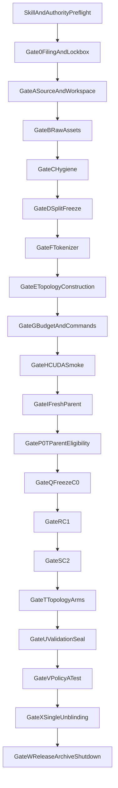

# P6-M Schedule-Topology Study: Exhaustive Skill-Mediated Gate Plan

## Planning status and fixed assumptions

This is an operational and implementation plan, not authority to begin confirmatory work. P6-M currently has no filed PDF, SHA-bound addendum, `LOCK.json`, or authoritative gate receipt. Until Gate 0 is completed, every scientific choice below is a proposal.

The proposed preregistration target selected for this plan is:

- One fresh parent-initialization seed: `4`, unused by P4 seed `0` and P5 seeds `{1,2,3}`.
- One fresh Tagalog parent `C0`; no prior-study checkpoint may be loaded.
- Two pure sibling controls from `C0`: `C1` extra Tagalog and `C2` pure English.
- Four mixed sibling continuations from the same `C0`:
  - `M-fine`: the P4-style fine alternating topology.
  - `M-coarse`: deterministic large alternating language blocks.
  - `M-blocked`: one filed language-order block, proposed as all Tagalog quota followed by all English quota. This estimates that exact ordered topology, not a direction-free “blocking effect.”
  - `M-rand`: deterministic pseudorandom ordering of fixed-size language blocks with exact quotas.
- Same P4 source-content token quotas, tokenizer, parent type, phase-two budget, depth, evaluator, and parent-to-child optimizer reset policy across all sibling arms.
- Primary evidence: preregistered validation contrasts among the four topology arms, with C1/C2 contextual contrasts. No P5 recurrence count and no population inference.
- Policy A at Gate V: exactly one predesignated topology, proposed `M-fine`, receives one restricted-test event. All controls and other topology arms remain validation-only. The test is secondary and excluded from topology classification.
- No P6-M claim about downstream tasks, all Philippine languages, mitigation, optimality, Cruz–Cheng validation, or Cheng catastrophic-forgetting methods.

## Installed-skill verification and loading contract

Before any P6-M session, run `[scripts/validate_p6m_cursor_skills.mjs](/Users/paulpajo/Projects/nanochat-filipino/scripts/validate_p6m_cursor_skills.mjs)`. The required receipt is:

- `status: pass`
- `skills: 17`
- `manual_skills: 6`
- `references: 4`

The skills are installed under `[.cursor/skills/](/Users/paulpajo/Projects/nanochat-filipino/.cursor/skills/)`, and the persistent safety rule is installed at `[.cursor/rules/nanochat-p6m-safety.mdc](/Users/paulpajo/Projects/nanochat-filipino/.cursor/rules/nanochat-p6m-safety.mdc)`.

At the start of every P6-M work session:

1. Read `[nanochat-filipino-study/SKILL.md](/Users/paulpajo/Projects/nanochat-filipino/.cursor/skills/nanochat-filipino-study/SKILL.md)` to route the request to P6-M and identify the current gate.
2. Read `[P6M-GENERIC-OPERATING-BOUNDARY.md](/Users/paulpajo/Projects/nanochat-filipino/.cursor/skills/_shared/P6M-GENERIC-OPERATING-BOUNDARY.md)`.
3. Read `[P6M-GATE-ROUTING.md](/Users/paulpajo/Projects/nanochat-filipino/.cursor/skills/_shared/P6M-GATE-ROUTING.md)`.
4. Read the current filed PDF, matching SHA-bound addendum, `LOCK.json`, and current gate receipt in that authority order.
5. Load the gate-specific skill named below before inspecting commands, artifacts, or outcomes.
6. If the skill conflicts with the filed gate plan, stop and follow the filed authority. A skill routes and constrains work; it does not replace the deterministic gate oracle.

Manual-only skills must be explicitly named and loaded at their authorized boundary:

- `[nanochat-c3-only-test](/Users/paulpajo/Projects/nanochat-filipino/.cursor/skills/nanochat-c3-only-test/SKILL.md)`: Gate V only.
- `[nanochat-panel-count](/Users/paulpajo/Projects/nanochat-filipino/.cursor/skills/nanochat-panel-count/SKILL.md)`: filing review and Gate X; in P6-M its role is to prevent a P5-style count analysis.
- `[nanochat-git-public-subtree](/Users/paulpajo/Projects/nanochat-filipino/.cursor/skills/nanochat-git-public-subtree/SKILL.md)`: authorized public Git write only.
- `[nanochat-hub-weights](/Users/paulpajo/Projects/nanochat-filipino/.cursor/skills/nanochat-hub-weights/SKILL.md)`: authorized Gate W Hub release only.
- `[nanochat-researchbox-bingo](/Users/paulpajo/Projects/nanochat-filipino/.cursor/skills/nanochat-researchbox-bingo/SKILL.md)`: authorized Gate W deposit only.
- `[nanochat-closeout-archive](/Users/paulpajo/Projects/nanochat-filipino/.cursor/skills/nanochat-closeout-archive/SKILL.md)`: Gate W archive and shutdown only.

Repository-discovery safeguards:

- The installed `.cursor` package is currently untracked. Before Gate 0 is treated as reproducible, add the 17 skills, four references, one rule, and validator to the study's pinned Git state so a later checkout loads the same protocol layer.
- Add the validator to CI or a deterministic pre-Gate-0 check. A manual pass in one workstation session is not durable evidence.
- Create `manifests/p6/p6_gate_skill_registry.json` before filing. For every proposed gate it must name the gate-specific `SKILL.md`, deterministic script path, receipt schema, manual/automatic invocation mode, and required authority files.
- The six manual skills must appear as explicit authorization checkpoints in the gate registry; do not rely on ambient discovery.
- Extend the validator to check rule frontmatter, closing YAML delimiters, shared-reference readability, registry coverage, and existence of every registered deterministic gate script before the P6 source pin is accepted.

## Authority, state, and evidence architecture

Create a single machine-readable gate ledger whose statuses are limited to:

- `not_started`
- `prepared`
- `awaiting_authorization`
- `running`
- `pass`
- `blocked`
- `technical_stop`
- `protocol_stop`

Every transition must contain:

- UTC timestamp.
- Previous and next status.
- Gate and arm identifiers.
- Authority PDF/addendum SHA.
- Input-manifest SHA.
- Script SHA.
- Exact argv hash.
- Safe output only.
- Receipt path and receipt SHA.
- Whether any protected scalar was accessed.
- Operator authorization identifier when required.

Use this proposed state flow, subject to the filed gate plan:

No later gate may be marked pass merely because its artifacts appear to exist. Each gate passes only through its deterministic acceptance script and receipt.

## Pre-Gate minus 2: skill integrity and session safety

Corresponding skills:

- `nanochat-filipino-study`
- `nanochat-study-identity`
- `nanochat-gate-spine`

Steps:

1. Run the portable skill validator and preserve its JSON output in the future P6-M run card.
2. Confirm that all 17 `SKILL.md` files and four shared references resolve inside `.cursor/skills/`.
3. Confirm the always-applied safety rule is active.
4. State the active study as `P6-M schedule-topology mechanism study`.
5. State that the current phase is pre-filing and therefore no GPU, protected evaluation, public deposit, or scientific execution is authorized.
6. Search the active shell environment for `P1`, `P2`, `P3`, `P4`, and `P5` run variables. A contaminated shell is discarded rather than repaired in place.
7. Create a clean-session receipt containing only paths, hashes, versions, and safe statuses.

Hard stop:

- Missing skill, missing authority, wrong workspace root, or unresolved prior-study environment produces `protocol_stop` before any study files are scaffolded.

## Pre-Gate minus 1: scientific design and preregistration drafting

Corresponding skills:

- `[nanochat-new-study-from-prior](/Users/paulpajo/Projects/nanochat-filipino/.cursor/skills/nanochat-new-study-from-prior/SKILL.md)`
- `[nanochat-study-identity](/Users/paulpajo/Projects/nanochat-filipino/.cursor/skills/nanochat-study-identity/SKILL.md)`
- `[nanochat-gate-spine](/Users/paulpajo/Projects/nanochat-filipino/.cursor/skills/nanochat-gate-spine/SKILL.md)`
- `[nanochat-lockbox-blinding](/Users/paulpajo/Projects/nanochat-filipino/.cursor/skills/nanochat-lockbox-blinding/SKILL.md)`
- `[nanochat-paper-lock-build](/Users/paulpajo/Projects/nanochat-filipino/.cursor/skills/nanochat-paper-lock-build/SKILL.md)`

Proposed directories:

- `scripts/p6/`
- `docs/p6/`
- `docs/papers/p6-m-schedule-topology/`
- `docs/run-cards/p6/`
- `docs/hub/p6-m-schedule-topology/`
- `manifests/p6/`
- `results/p6/`

Steps:

1. Copy only reusable P5 script structure into P6-owned paths; do not copy outcomes, P5 LOCK fields, IDs, checkpoints, release commits, scalar tables, or claims.
2. Rename environment variables, tags, paths, and receipts to P6 identifiers, then manually audit every replacement.
3. Do not mint the P6 run ID before filing. Use an explicit placeholder in templates.
4. Draft the filed question: holding the P4 source-content token quotas and all named non-topology factors fixed, do preregistered schedule topologies change bilingual validation BPB contrasts?
5. Freeze the proposed arm set: C1, C2, M-fine, M-coarse, M-blocked, and M-rand from one common fresh C0.
6. Freeze seed `4` before parent initialization.
7. Define each topology algorithm exactly:
  - M-fine: exact P4-compatible block size, alternation rule, document order, and schedule digest policy.
  - M-coarse: exact block size and sequence. The block size must be a filed integer, not “large.”
  - M-blocked: exact order `TL then EN`; state that direction is part of the treatment.
  - M-rand: exact PRNG library/version, seed, base block size, permutation method, quota repair rule, and digest.
8. Freeze the same source document order per language across all mixed arms. Only the cross-language schedule may vary.
9. Freeze exact phase-two token totals per language. Every mixed arm must have the same integer TL and EN totals.
10. Freeze no-wrap, last-shard, truncation, packing, BOS, and padding policies.
11. Freeze the parent-to-child optimizer policy as fresh child optimizer state (`load_optimizer=False`).
12. Separately freeze a technical mid-run recovery policy. A lawful infrastructure recovery may restore the same child’s optimizer, scheduler, scaler, RNG, stream cursor, and step from a prespecified recovery checkpoint; this is not P8-M because the optimizer is not carried from parent to child. Recovery is allowed only after a documented infrastructure fault and no protected scalar access.
13. Freeze exact recovery checkpoint cadence or explicitly prohibit mid-arm resume. Do not leave this ambiguous.
14. Freeze primary validation contrasts before any BPB:
  - For each non-fine topology, `Delta_TL(tau) = TL_BPB(M-tau) - TL_BPB(M-fine)`.
  - For each non-fine topology, `Delta_EN(tau) = EN_BPB(M-tau) - EN_BPB(M-fine)`.
  - Contextual retention contrast for each topology: `R_TL(tau) = TL_BPB(M-tau) - TL_BPB(C2)`.
  - Contextual acquisition contrast for each topology: `A_EN(tau) = EN_BPB(M-tau) - EN_BPB(C1)`.
15. State whether topology conclusions use directional thresholds, raw fixed contrasts, or both. One seed does not support population inference, p-values, or confidence intervals.
16. Freeze Policy A: one M-fine restricted-test event only, after validation sealing; test values are secondary and excluded from the topology result.
17. Freeze Gate X code and output schema before filing.
18. Draft a result-free paper skeleton. Methods, authority, limitations, and table shells are permitted; result values are not.
19. Draft a SHA-bound addendum and exhaustive gate plan. Embed their SHA-256 values in the filing.
20. Add the Cheng claim boundary verbatim in substance:
  - WikiText-TL-39 is a Cruz–Cheng resource lineage.
  - P6-M is not Cheng’s catastrophic-forgetting protocol.
  - BPB is not downstream classification accuracy.
  - Tagalog is not all Philippine languages.
21. Define authorship separately from citation. Do not infer coauthorship or endorsement.
22. Run dummy lockbox tests with synthetic values and synthetic files only.

Pre-filing design review must reject:

- An undefined coarse block size.
- An undefined blocked direction.
- A random arm without deterministic replay.
- Different within-language document orders among mixed arms.
- Any prior-study checkpoint parent.
- Any plan to choose a topology after observing validation.
- A P5-style `k_both` primary result.

## Gate 0: filing, lockbox, and immutable authority

Corresponding skills:

- `nanochat-gate-spine`
- `nanochat-lockbox-blinding`
- `nanochat-study-identity`
- `nanochat-deposit-split`
- manual `nanochat-panel-count`

Steps:

1. File a new P6-M preregistration; do not reuse a P1.1–P5 registration.
2. Download the filed PDF to `docs/run-cards/p6/` and compute SHA-256.
3. Verify the PDF contains the addendum and gate-plan hashes.
4. Make immutable working copies of the filed PDF, matching addendum, and gate plan.
5. Mint `P6_RUN_ID=p6-<UTC>-<pdf_sha8>` only after the PDF hash is known.
6. Create P6 `LOCK.json` containing study identity, authority hashes, run ID, seed, arm labels, topology policy hashes, tokenizer policy, evaluator hash placeholder, test policy, and all gate statuses.
7. Initialize protected-access counters to zero.
8. Create a mode-0700 lockbox under `data/cache/$P6_RUN_ID/lockbox/`.
9. Create a public-safe status directory separate from the lockbox.
10. Ensure lockbox paths, passcodes, credentials, raw tests, and protected result files are ignored by Git and excluded from release manifests.
11. Run dummy P0-T, validation seal, Policy A test, and Gate X scripts using synthetic data.
12. Confirm dummy output cannot be mistaken for real P6 output by path, run ID, or manifest.
13. Write `gate-0-filing-lock.json` with hashes and safe statuses only.
14. Mark Gate 0 pass only through its acceptance script.

Hard stop:

- A PDF/addendum/plan SHA mismatch means the implementation authority is unavailable. Do not reconstruct it from memory.

## Gate A: source pin, isolated workspace, and release skeleton

Corresponding skills:

- `nanochat-new-study-from-prior`
- `nanochat-study-identity`
- `nanochat-bpb-eval`
- `nanochat-git-public-subtree` for review only; no push without explicit authorization.

Steps:

1. Pin the nanochat source commit and record the full SHA.
2. Include `.cursor/skills/`, `.cursor/rules/nanochat-p6m-safety.mdc`, and `scripts/validate_p6m_cursor_skills.mjs` in that pinned source state.
3. Run the enhanced skill validator in the pinned checkout and archive its receipt.
4. Freeze `manifests/p6/p6_gate_skill_registry.json`; reject Gate A if any proposed gate lacks a skill, deterministic script, receipt schema, or authority reference.
5. Pin Python, Torch, CUDA, container image, evaluator, packing code, and relevant library versions.
6. Complete P6-only `env.sh` and `env.cuda.sh`.
7. Make startup refuse P1.1–P5 active run variables and cache roots.
8. Extend `forbidden_parents.py` with hashes and path patterns for all prior confirmatory checkpoints.
9. Copy the evaluator without changing its formula; hash it.
10. Freeze exact evaluator argv for validation and restricted test.
11. Create `RELEASE_MANIFEST.json` before training with logical entries for:
  - C0.
  - C1.
  - C2.
  - M-fine.
  - M-coarse.
  - M-blocked.
  - M-rand.
  - `tokenizer.pkl`.
  - `token_bytes.pt`.
12. Under the selected arm profile, record expected weightish-object count `9`; derive the runtime assertion from manifest entries rather than hard-coding a glob count.
13. Leave artifact hashes pending until each object is produced; never add an unplanned object after outcome access.
14. Create destination manifests for GitHub, Hub, ResearchBox, AsCollected, private archive, and excluded artifacts.
15. Write Gate A source-pin, skill-registry, validator, and script-hash receipts.

## Gates B through D: source assets, hygiene, and split freeze

Corresponding skills:

- `nanochat-study-identity`
- `nanochat-mix-identity`
- `nanochat-lockbox-blinding`

Gate B steps:

1. Acquire only the filed English and Tagalog raw resources.
2. Verify full train/validation/test file hashes without reading protected test contents into chat.
3. Record source URLs, acquisition timestamps, licenses, and local immutable paths.
4. Keep test data physically or logically outside tokenizer, packer, and trainer allowlists.

Gate C steps:

1. Refuse nanochat default datasets and unfiled corpora.
2. Scan for TLUnified, Chavacano, P11-X/P12-X assets, or accidental generic cache roots.
3. Verify train and validation data are disjoint under the filed document-identity rule.
4. Verify no test file appears under any glob consumed by packing or training.
5. Write a hygiene receipt; do not expose sample text unnecessarily.

Gate D steps:

1. Freeze train/validation/test document membership and hashes.
2. Verify lineage against the permitted P1.1/P4 resource identities.
3. Record order policy separately from membership.
4. Mark split objects immutable.
5. Write `gate-d-split-freeze.json`.

## Gate F: tokenizer carry-forward

Corresponding skills:

- `nanochat-bpb-eval`
- `nanochat-study-identity`

Steps:

1. Copy the filed P4/P5 tokenizer pair into the P6 cache.
2. Verify `tokenizer.pkl` and `token_bytes.pt` hashes against authority.
3. Resolve symlinks and verify the actual regular files consumed on the host.
4. Record tokenizer library versions and deserialization smoke status.
5. Prohibit tokenizer retraining, vocabulary changes, English-fed tokenizer training, and outcome-driven fertility adjustments.
6. Fill the tokenizer entries in the release manifest with hashes.

## Gate E: topology construction and identity proof

Corresponding skill:

- `[nanochat-mix-identity](/Users/paulpajo/Projects/nanochat-filipino/.cursor/skills/nanochat-mix-identity/SKILL.md)`

Steps:

1. Pack C1 and C2 pure streams using the filed policies.
2. Compute the exact phase-two budget, proposed carry-forward value `294 × 65,536 = 19,267,584` model-visible tokens, subject to filing.
3. Compute exact mixed-arm quotas, proposed `9,633,792` TL and `9,633,792` EN tokens at `q_TL=0.50`.
4. Generate one canonical ordered token stream per language before cross-language scheduling.
5. Verify all four mixed arms consume the same within-language streams and exact totals.
6. Construct M-fine using the filed P4-compatible schedule.
7. Construct M-coarse using the filed coarse block size and deterministic alternation.
8. Construct M-blocked as the filed TL-then-EN schedule.
9. Construct M-rand by deterministically permuting fixed-size language blocks while preserving exact totals.
10. For each topology, record:
  - Topology ID and schema version.
    - Source stream hashes.
    - Quota integers.
    - Block size and schedule length.
    - PRNG implementation and seed where applicable.
    - Language-origin-mask SHA.
    - Block-schedule SHA.
    - Full trainer-consumed stream SHA.
    - Packed-shard hashes in stable order.
11. Verify exact quota equality from trainer-consumed streams, not only planning manifests.
12. Verify no wrap before the full phase-two budget.
13. Verify that only schedule topology differs among mixed arms.
14. Compute descriptive prefix-share trajectories before outcomes to document treatment separation.
15. Do not require coarse/blocked arms to satisfy the fine arm’s prefix-balance tolerance; their different prefix paths are the intervention.
16. Create `p6_mix_identity.json` and per-arm topology receipts.
17. Fail Gate E if any logical topology key is missing, duplicated, mismatched, or reconstructed from filenames rather than hashes.

## Gate G: budget, commands, analysis code, and recovery freeze

Corresponding skills:

- `nanochat-gate-spine`
- `nanochat-bpb-eval`
- `nanochat-frozen-parent-continue`
- `nanochat-runpod-study-pod`

Steps:

1. Freeze d8/d20 parent budgets, C0 selection rule, child depth, phase-two update count, batch size, context length, warmup, optimizer, dtype, attention implementation, and terminal-save rule.
2. Freeze exact model tags and output directories for all seven model artifacts.
3. Freeze exact training argv for C0, C1, C2, and each topology arm.
4. Freeze exact validation cell order and Gate X contrast script.
5. Freeze the selected Policy A test tag (`M-fine`) and append-before-run access counter behavior.
6. Freeze infrastructure recovery behavior:
  - What constitutes host failure.
  - Which checkpoints are restart-capable.
  - Required optimizer/RNG/stream-cursor state.
  - Prohibition on retraining an already valid terminal checkpoint.
  - Acceptance-only recovery when the trainer saved a valid terminal checkpoint but the wrapper died, following the lesson in `[resume_after_s2_wrapper_death.sh](/Users/paulpajo/Projects/nanochat-filipino/scripts/p5/resume_after_s2_wrapper_death.sh)`.
7. Freeze safe heartbeat fields: gate, arm, step, expected terminal step, process health, GPU identity, checkpoint presence, and UTC. Exclude loss and BPB.
8. Write `p6_budget_command_freeze.json` and hash it into LOCK.

## Gate H: CUDA smoke and host-independent execution architecture

Corresponding skill:

- `[nanochat-runpod-study-pod](/Users/paulpajo/Projects/nanochat-filipino/.cursor/skills/nanochat-runpod-study-pod/SKILL.md)`

Steps:

1. Obtain explicit authorization before paid GPU provisioning.
2. Provision the filed GPU class, proposed A40 48 GB, without encoding a live pod ID as a scientific parameter.
3. Verify image digest, GPU model, driver, CUDA, Torch, storage, and device visibility.
4. Transfer only P6 code, manifests, allowed data, and tokenizer artifacts.
5. Rehash every transferred dependency on the pod.
6. Run a quarantined nonconfirmatory smoke with separate tags and paths.
7. Confirm the smoke cannot be selected as a parent or released as a P6 model.
8. Write the host receipt and smoke receipt.

Create the “thin portability layer” before Gate I:

1. Define a host-independent `P6_INSTANCE_CAPSULE` manifest containing:
  - Source commit and clean-tree receipt.
  - Container/image digest.
  - Python/Torch/CUDA package lock.
  - P6 script and policy hashes.
  - Tokenizer and stream-manifest hashes.
  - Exact launch argv.
  - Gate ledger and current safe status.
  - Checkpoint inventory and lineage.
  - Required mount layout.
  - Secret names only, never secret values.
2. Store immutable copies in two failure-independent locations: durable network/object storage and the local archive.
3. Provide a bootstrap script that can reconstruct a clean pod from the capsule without copying mutable `/workspace` blindly.
4. Provide a verification script that proves a replacement pod matches the capsule before an official gate resumes.
5. After every gate pass and terminal checkpoint, refresh the capsule and independently verify its hashes.
6. Never stop a pod until the newest capsule is independently readable.
7. If a stopped pod cannot restart because its host has no capacity, provision a compatible replacement host and restore from the capsule only if the filed recovery policy authorizes it.
8. Do not use a portability capsule to create an extra scientific replicate or duplicate an active arm.

## Gate I: fresh Tagalog parent

Corresponding skills:

- `nanochat-runpod-study-pod`
- `nanochat-study-identity`
- `nanochat-lockbox-blinding`

Steps:

1. Repeat host-contract verification immediately before the official launch.
2. Confirm seed `4` is applied immediately before model initialization.
3. Record the initial serialized-state hash to prove the seed controls the model.
4. Train the filed d8 parent companion if retained in the filing.
5. Train the d20 parent from random initialization.
6. Disable official full-split evaluation during training.
7. Emit safe heartbeats only.
8. Save terminal metadata, checkpoint, command receipt, environment receipt, and reload receipt.
9. Copy the terminal checkpoint and instance capsule to durable storage and local archive.
10. Hash-verify both copies before Gate P0-T.

## Gate P0-T: parent eligibility

Corresponding skills:

- `nanochat-bpb-eval`
- `nanochat-lockbox-blinding`

Steps:

1. Verify evaluator, tokenizer, split, device, packing, checkpoint, and untrained same-seed floor hashes.
2. Run the full filed Tagalog validation eligibility event on CUDA.
3. Send all scalar output directly to the lockbox.
4. Expose only `PASS`, `BLOCKED`, or `TECHNICAL_STOP` plus hashes and timestamps.
5. If blocked, do not replace seed 4 or train children. Route directly to a blocked-study closeout.
6. If pass, write the eligibility receipt without revealing the scalar.

## Gate Q: immutable C0 freeze

Corresponding skill:

- `[nanochat-frozen-parent-continue](/Users/paulpajo/Projects/nanochat-filipino/.cursor/skills/nanochat-frozen-parent-continue/SKILL.md)`

Steps:

1. Copy the eligible d20 parent to a dedicated C0 frozen path.
2. Make C0 read-only.
3. Record its SHA in LOCK, lineage manifest, release manifest, and instance capsule.
4. Make every child launcher require this exact SHA.
5. Reject sibling-child, P4, P5, or partial-child parents.
6. Verify all child output directories are absent before launch.

## Gates R and S: pure sibling controls

Corresponding skills:

- `nanochat-frozen-parent-continue`
- `nanochat-runpod-study-pod`
- `nanochat-lockbox-blinding`

Gate R steps:

1. Verify C0 SHA, C1 stream SHA, empty output, and `load_optimizer=False`.
2. Train C1 for the exact phase-two budget.
3. Preserve safe progress only.
4. Verify terminal metadata, reload, finite technical status, and checkpoint SHA without BPB.
5. Update release manifest and portability capsule.

Gate S steps:

1. Repeat the same preflight for C2.
2. Train C2 from C0, never from C1.
3. If the wrapper dies after terminal save, validate and accept the existing checkpoint; do not retrain automatically.
4. If the pod becomes host-capacity trapped, restore the independently verified capsule on a compatible host under the filed recovery rule.
5. Record the incident before any scalar access, distinguishing host restart from experimental restart.
6. Update release manifest and portability capsule.

## Proposed Gates T1 through T4: topology siblings

The exact labels must be frozen in the filed gate plan. Proposed order:

- T1: M-fine.
- T2: M-coarse.
- T3: M-blocked.
- T4: M-rand.

Corresponding skills:

- `nanochat-frozen-parent-continue`
- `nanochat-mix-identity`
- `nanochat-runpod-study-pod`
- `nanochat-lockbox-blinding`

For each topology arm:

1. Verify the common C0 SHA.
2. Verify the arm’s stream, origin mask, schedule, and manifest hashes.
3. Verify the arm output directory is absent.
4. Verify fresh child optimizer state and no inherited parent optimizer.
5. Launch with the exact frozen argv.
6. Record safe step progress only.
7. Treat NaN/Inf or missing terminal artifacts according to the filed failure taxonomy; do not relabel an unfavorable outcome as technical.
8. Validate terminal metadata and reload without BPB.
9. Record checkpoint SHA and C0 lineage.
10. Update the release manifest.
11. Refresh and independently verify the portability capsule.
12. Refuse the next arm until the current arm has a lawful terminal status.

## Gate U: complete validation matrix and sealed primary contrasts

Corresponding skills:

- `nanochat-bpb-eval`
- `nanochat-lockbox-blinding`
- `nanochat-gate-spine`

Steps:

1. Preflight all six child checkpoint hashes and two language validation split hashes.
2. Confirm no restricted-test access has occurred.
3. Run the frozen official evaluator for 12 child-language cells: TL and EN for C1, C2, M-fine, M-coarse, M-blocked, and M-rand.
4. Evaluate C0 English only if preregistered as descriptive.
5. Keep all scalar output in the lockbox.
6. Generate the frozen topology contrasts and contextual C1/C2 contrasts inside the lockbox.
7. Assert matrix completeness before sealing.
8. Produce a validation seal containing cell identifiers, hashes, evaluator identity, timestamps, and protected payload hash.
9. Expose only seal-created status and hashes.
10. Do not rank or select a topology before Gate X.

## Gate V: single Policy A restricted-test event

Corresponding manual skill:

- `[nanochat-c3-only-test](/Users/paulpajo/Projects/nanochat-filipino/.cursor/skills/nanochat-c3-only-test/SKILL.md)`, applied to the filed P6 treatment label rather than blindly using P5’s `C3` name.

Steps:

1. Obtain explicit operator authorization.
2. Verify Gate U seal and test-access count zero.
3. Verify the filed selected checkpoint is M-fine.
4. Append the test-access ledger before launch so an interrupted event cannot be repeated silently.
5. Run exactly one restricted-test event for M-fine.
6. Do not test C0, C1, C2, M-coarse, M-blocked, or M-rand.
7. Lock scalar output immediately.
8. Record test receipt and increment count to one.
9. Treat test results as secondary and exclude them from the topology analysis.

## Gate X: one formal unblinding and frozen analysis

Corresponding skills:

- `nanochat-lockbox-blinding`
- manual `nanochat-panel-count`
- `nanochat-paper-lock-build`
- `nanochat-gate-spine`

Steps:

1. Obtain explicit unblinding authorization.
2. Verify all required gate receipts, complete validation matrix, Policy A count, and zero unauthorized accesses.
3. Verify the Gate X analysis script hash matches Gate 0/A authority.
4. Run exactly one unblinding event.
5. Generate fixed topology-contrast tables; do not generate P5 recurrence counts as the primary result.
6. Report all finite terminal outcomes regardless of direction.
7. Keep M-fine test results in a separate secondary section.
8. Write `P6_UNBLINDING_EVENT.json` with event time, authority hashes, released-artifact hashes, and access counters.
9. Update LOCK atomically after the event receipt is valid.
10. Do not publish yet; publication remains Gate W and requires separate authorization.

## Gate W: paper, release, archive, and shutdown

Execute subgates in the following order.

### W1: paper build

Corresponding skill: `nanochat-paper-lock-build`.

1. Insert values only from released Gate X artifacts.
2. Build source and all required outputs reproducibly.
3. Audit Cheng/resource-lineage wording and limitations.
4. Record source/output hashes and PDF SHA.
5. Do not hand-copy scalars from chat or exploratory files.

### W2: complete local and durable archive

Corresponding manual skill: `nanochat-closeout-archive`.

1. Archive authority files, LOCK, all gate receipts, scripts, manifests, topology digests, evaluator identity, logs, checkpoint hashes, release manifests, and paper outputs.
2. Archive all seven model checkpoints plus tokenizer artifacts when storage policy permits.
3. Preserve the final instance capsule and bootstrap verification tools.
4. Generate stable-order `SHA256SUMS` and a machine-readable inventory.
5. Independently verify completeness before infrastructure shutdown.

### W3: GitHub public subtree

Corresponding manual skill: `nanochat-git-public-subtree` plus `nanochat-deposit-split`.

1. Build the public tree from the destination manifest.
2. Include P6 scripts, docs, paper, safe run cards, results, manifests, and Hub documentation.
3. Exclude checkpoints, raw restricted tests, lockbox, passcodes, credentials, private host cards, and protected artifacts.
4. Run secret and path scans.
5. Require explicit authorization before push.

### W4: ResearchBox and AsCollected

Corresponding manual skill: `nanochat-researchbox-bingo` plus `nanochat-deposit-split`.

1. Generate Materials, Code, Data, and Other objects from manifests.
2. For every Data chip, create exactly one non-directory file member per zip.
3. Validate each zip member count and record the inner-file SHA.
4. Record chip name, role, member, destination, and hash.
5. Exclude raw tests, credentials, and unfiled corpora.
6. Record the paper PDF SHA before making the box public.
7. Require explicit authorization before submission or publication.

### W5: Hub sibling release

Corresponding manual skill: `nanochat-hub-weights`.

1. Derive all nine expected objects from `RELEASE_MANIFEST.json`.
2. Refuse wildcard discovery and partial topology sets.
3. Verify each source is a regular file and its SHA matches the manifest.
4. Stage in stable order.
5. Assert exact manifest coverage and expected count.
6. Generate `SHA256SUMS`.
7. Require explicit authorization before upload.
8. Upload C0, C1, C2, all four topology arms, and both tokenizer artifacts together.
9. Record the remote revision.
10. Independently retrieve and rehash at least one object per arm, preferably the full inventory.
11. Update LOCK and closeout only after remote verification succeeds.

### W6: infrastructure shutdown

Corresponding skills: `nanochat-runpod-study-pod` and `nanochat-closeout-archive`.

1. Verify W2 archive and final capsule from an independent location.
2. Verify no active transfer or required process remains.
3. Obtain explicit stop authorization.
4. Stop the pod immediately to end GPU billing.
5. Delete storage only under separate explicit authorization after all hashes pass.
6. Write `RUNPOD-SHUTDOWN.json` with pod ID, UTC time, action, archive SHA, capsule SHA, and reason.

## Cross-gate hard stops

Stop immediately if any of the following occurs:

- Filed authority or hash-bound implementation document is unavailable.
- Another study’s environment, parent, checkpoint, tokenizer, result, or Hub destination is active.
- A topology changes quotas, document order, tokenizer, budget, parent, optimizer-reset policy, or evaluator.
- A protected scalar appears in chat, safe progress, public logs, filenames, or unblinded artifacts before Gate X.
- A test path is visible to training/tokenizer/packing code.
- A finite unfavorable outcome is characterized as technical.
- A valid terminal checkpoint is retrained because a wrapper or host died.
- An infrastructure recovery cannot prove exact checkpoint, optimizer, RNG, stream-cursor, code, and environment identity.
- A release inventory is inferred by glob count.
- A ResearchBox Data zip contains more than one file.
- A pod is stopped before archive and capsule verification.

## Definition of done

P6-M is closed only when all of the following exist and cross-check:

- Filed PDF, matching addendum, and matching gate-plan hashes.
- Final LOCK with Gate 0 through W receipts.
- Full topology and quota manifests.
- Parent and child lineage with all checkpoint hashes.
- Complete sealed validation matrix and single Policy A receipt.
- One Gate X event and frozen topology contrast outputs.
- Reproducibly built paper with bounded claims.
- Verified GitHub, ResearchBox/AsCollected, and Hub receipts as applicable.
- Complete local/durable archive and final instance capsule.
- Timestamped Runpod shutdown receipt.

No “done” claim may rely only on narrative summaries, filenames, or the existence of a remote repository.